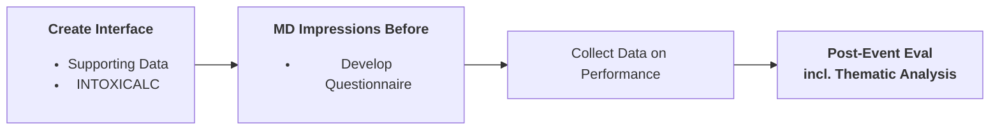

### INTOXICATE (Laibah's Branch)

> TODO:
> - [ ] [HICSS](https://hicss.hawaii.edu/) abstract, which is a 9-page paper, due mid-June. Link to [manuscripr](https://www.overleaf.com/project/67f82b5ed81d8c776569db87). Is RMD -> LaTeX more transparent?
> - [ ] Re-familiarize with code (Laibah)
> - [ ] Learn [Krippendorf's &alpha;](https://en.wikipedia.org/wiki/Krippendorff%27s_alpha) (Laibah)
> - [ ] Run code with sample data set (MAC gives data set)
> - [ ] INTOXICALC user ready by <u> Dec 1 </u>

**Purpose** 
Many scoring systes prognosticate the severity of a poisoning from initial presentation in the ER, just like INTOXICATE does. 

1. [Persson et al. (2007)](https://www.tandfonline.com/doi/abs/10.3109/15563659809028940) developed the Poisoning Severity Score, initially published in 2000, to standadrize describing the severity of an exposure across xenobiotics and showed that the grading agreed with the assessments of poison center specialists in a retrospective study. [Casey et al (2009)](https://www.tandfonline.com/doi/abs/10.3109/15563659809028941) found that an initial PSS of 0 or 1 (out of 3) was 94% accurate in predicting no need for medical intervention. [Wax et al (2017)](https://link.springer.com/article/10.1007/s13181-017-0609-5) found that over the 40 years since its publication only 40 studies used PSS and 16 (40%) misapplied the tool. 
2. Scores specific to [carbon monoxide exposure](https://www.tandfonline.com/doi/full/10.1080/15563650.2023.2226817), 

**Why don't people use these tools?**
1. Tools aren't fully validated
2. Physicians not familiar with tools.
3. No app to calculate the score easily.

**Barrier to _Knowledge Translation_** These tools are only useful if experts use them and find them acceptable. 
1. We want to identify the barriers that prevent physicians from using these tools.

**Approach**:

**Methods**
1. Creation of Data Set
2. Design of Questionnaire
3. Design of Game
4. Analysis of Questionnaire responses (maybe swap (3) and (4)?)

**Anticipated Results**
1. Description of Data Set
2. Barrier to use.
3. Exposure to Game.
4. Change in Perceptions
   - What is the acceptance?
   - What would be needed for toxicologists to use INTOXICATE?

### From main branch README
This repository contains supporting material for the INTOXICATE-US project, which aims to develop and validate a clinical decision support tool to predict which poisoned patients need intensive care unit (ICU) admission. See my lab's [project page](https://charylab.github.io/projects/intoxicate/) for more information. 

Our [article](https://www.tandfonline.com/doi/abs/10.1080/15563650.2025.2547885) validating the original INTOXICATE model in a US healthcare system is published in _Clinical Toxicology_. We found that in patients admitted to the ICU, the INTOXICATE model performed in our cohort comparably to the derivation cohort and agreed with clinical judgement. However, it performed poorly in patients in the ER, suggesting tha the current model can downgrade patients in the ICU but not safely identify patients in the ER who do not need ICU admission.

Citations 

APA: 
> Peleg, A., Ross, S., House, C., Zemla, R., & Chary, M. (2025). INTOXICATE-US: validation of the INTOXICATE model in an American health care system. Clinical Toxicology, 1–9. https://doi.org/10.1080/15563650.2025.2547885

BibTeX:
>@article{peleg2025intoxicate,
  title={INTOXICATE-US: validation of the INTOXICATE model in an American health care system},
  author={Peleg, Adi and Ross, Samuel and House, Christopher and Zemla, Robert and Chary, Michael},
  journal={Clinical Toxicology},
  pages={1--9},
  year={2025},
  publisher={Taylor \& Francis}
}
