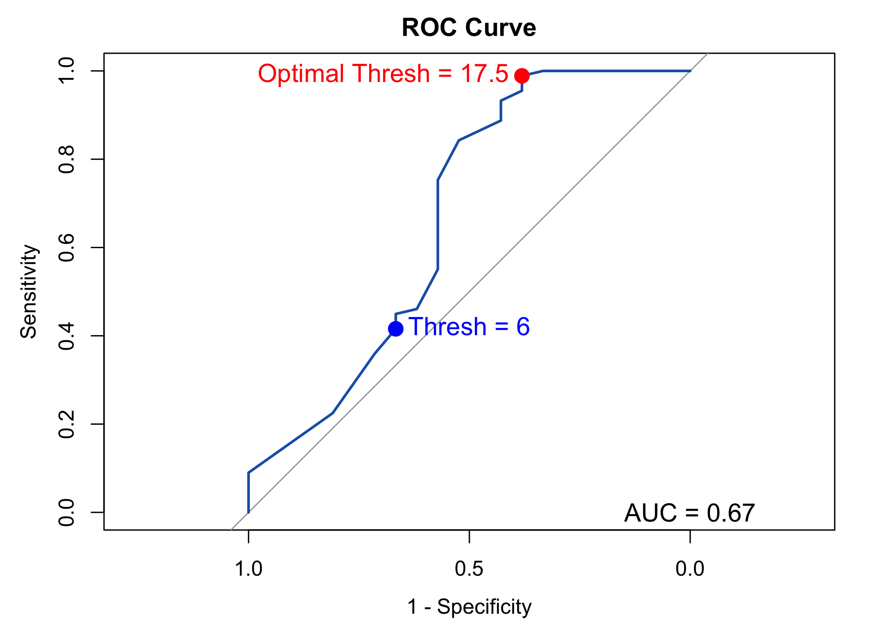

```{=html}
<div id="mgiukbhzgl" style="padding-left:0px;padding-right:0px;padding-top:10px;padding-bottom:10px;overflow-x:auto;overflow-y:auto;width:auto;height:auto;">
<style>#mgiukbhzgl table {
  font-family: system-ui, 'Segoe UI', Roboto, Helvetica, Arial, sans-serif, 'Apple Color Emoji', 'Segoe UI Emoji', 'Segoe UI Symbol', 'Noto Color Emoji';
  -webkit-font-smoothing: antialiased;
  -moz-osx-font-smoothing: grayscale;
}

#mgiukbhzgl thead, #mgiukbhzgl tbody, #mgiukbhzgl tfoot, #mgiukbhzgl tr, #mgiukbhzgl td, #mgiukbhzgl th {
  border-style: none;
}

#mgiukbhzgl p {
  margin: 0;
  padding: 0;
}

#mgiukbhzgl .gt_table {
  display: table;
  border-collapse: collapse;
  line-height: normal;
  margin-left: auto;
  margin-right: auto;
  color: #333333;
  font-size: 16px;
  font-weight: normal;
  font-style: normal;
  background-color: #FFFFFF;
  width: auto;
  border-top-style: solid;
  border-top-width: 2px;
  border-top-color: #A8A8A8;
  border-right-style: none;
  border-right-width: 2px;
  border-right-color: #D3D3D3;
  border-bottom-style: solid;
  border-bottom-width: 2px;
  border-bottom-color: #A8A8A8;
  border-left-style: none;
  border-left-width: 2px;
  border-left-color: #D3D3D3;
}

#mgiukbhzgl .gt_caption {
  padding-top: 4px;
  padding-bottom: 4px;
}

#mgiukbhzgl .gt_title {
  color: #333333;
  font-size: 125%;
  font-weight: initial;
  padding-top: 4px;
  padding-bottom: 4px;
  padding-left: 5px;
  padding-right: 5px;
  border-bottom-color: #FFFFFF;
  border-bottom-width: 0;
}

#mgiukbhzgl .gt_subtitle {
  color: #333333;
  font-size: 85%;
  font-weight: initial;
  padding-top: 3px;
  padding-bottom: 5px;
  padding-left: 5px;
  padding-right: 5px;
  border-top-color: #FFFFFF;
  border-top-width: 0;
}

#mgiukbhzgl .gt_heading {
  background-color: #FFFFFF;
  text-align: center;
  border-bottom-color: #FFFFFF;
  border-left-style: none;
  border-left-width: 1px;
  border-left-color: #D3D3D3;
  border-right-style: none;
  border-right-width: 1px;
  border-right-color: #D3D3D3;
}

#mgiukbhzgl .gt_bottom_border {
  border-bottom-style: solid;
  border-bottom-width: 2px;
  border-bottom-color: #D3D3D3;
}

#mgiukbhzgl .gt_col_headings {
  border-top-style: solid;
  border-top-width: 2px;
  border-top-color: #D3D3D3;
  border-bottom-style: solid;
  border-bottom-width: 2px;
  border-bottom-color: #D3D3D3;
  border-left-style: none;
  border-left-width: 1px;
  border-left-color: #D3D3D3;
  border-right-style: none;
  border-right-width: 1px;
  border-right-color: #D3D3D3;
}

#mgiukbhzgl .gt_col_heading {
  color: #333333;
  background-color: #FFFFFF;
  font-size: 100%;
  font-weight: normal;
  text-transform: inherit;
  border-left-style: none;
  border-left-width: 1px;
  border-left-color: #D3D3D3;
  border-right-style: none;
  border-right-width: 1px;
  border-right-color: #D3D3D3;
  vertical-align: bottom;
  padding-top: 5px;
  padding-bottom: 6px;
  padding-left: 5px;
  padding-right: 5px;
  overflow-x: hidden;
}

#mgiukbhzgl .gt_column_spanner_outer {
  color: #333333;
  background-color: #FFFFFF;
  font-size: 100%;
  font-weight: normal;
  text-transform: inherit;
  padding-top: 0;
  padding-bottom: 0;
  padding-left: 4px;
  padding-right: 4px;
}

#mgiukbhzgl .gt_column_spanner_outer:first-child {
  padding-left: 0;
}

#mgiukbhzgl .gt_column_spanner_outer:last-child {
  padding-right: 0;
}

#mgiukbhzgl .gt_column_spanner {
  border-bottom-style: solid;
  border-bottom-width: 2px;
  border-bottom-color: #D3D3D3;
  vertical-align: bottom;
  padding-top: 5px;
  padding-bottom: 5px;
  overflow-x: hidden;
  display: inline-block;
  width: 100%;
}

#mgiukbhzgl .gt_spanner_row {
  border-bottom-style: hidden;
}

#mgiukbhzgl .gt_group_heading {
  padding-top: 8px;
  padding-bottom: 8px;
  padding-left: 5px;
  padding-right: 5px;
  color: #333333;
  background-color: #FFFFFF;
  font-size: 100%;
  font-weight: initial;
  text-transform: inherit;
  border-top-style: solid;
  border-top-width: 2px;
  border-top-color: #D3D3D3;
  border-bottom-style: solid;
  border-bottom-width: 2px;
  border-bottom-color: #D3D3D3;
  border-left-style: none;
  border-left-width: 1px;
  border-left-color: #D3D3D3;
  border-right-style: none;
  border-right-width: 1px;
  border-right-color: #D3D3D3;
  vertical-align: middle;
  text-align: left;
}

#mgiukbhzgl .gt_empty_group_heading {
  padding: 0.5px;
  color: #333333;
  background-color: #FFFFFF;
  font-size: 100%;
  font-weight: initial;
  border-top-style: solid;
  border-top-width: 2px;
  border-top-color: #D3D3D3;
  border-bottom-style: solid;
  border-bottom-width: 2px;
  border-bottom-color: #D3D3D3;
  vertical-align: middle;
}

#mgiukbhzgl .gt_from_md > :first-child {
  margin-top: 0;
}

#mgiukbhzgl .gt_from_md > :last-child {
  margin-bottom: 0;
}

#mgiukbhzgl .gt_row {
  padding-top: 8px;
  padding-bottom: 8px;
  padding-left: 5px;
  padding-right: 5px;
  margin: 10px;
  border-top-style: solid;
  border-top-width: 1px;
  border-top-color: #D3D3D3;
  border-left-style: none;
  border-left-width: 1px;
  border-left-color: #D3D3D3;
  border-right-style: none;
  border-right-width: 1px;
  border-right-color: #D3D3D3;
  vertical-align: middle;
  overflow-x: hidden;
}

#mgiukbhzgl .gt_stub {
  color: #333333;
  background-color: #FFFFFF;
  font-size: 100%;
  font-weight: initial;
  text-transform: inherit;
  border-right-style: solid;
  border-right-width: 2px;
  border-right-color: #D3D3D3;
  padding-left: 5px;
  padding-right: 5px;
}

#mgiukbhzgl .gt_stub_row_group {
  color: #333333;
  background-color: #FFFFFF;
  font-size: 100%;
  font-weight: initial;
  text-transform: inherit;
  border-right-style: solid;
  border-right-width: 2px;
  border-right-color: #D3D3D3;
  padding-left: 5px;
  padding-right: 5px;
  vertical-align: top;
}

#mgiukbhzgl .gt_row_group_first td {
  border-top-width: 2px;
}

#mgiukbhzgl .gt_row_group_first th {
  border-top-width: 2px;
}

#mgiukbhzgl .gt_summary_row {
  color: #333333;
  background-color: #FFFFFF;
  text-transform: inherit;
  padding-top: 8px;
  padding-bottom: 8px;
  padding-left: 5px;
  padding-right: 5px;
}

#mgiukbhzgl .gt_first_summary_row {
  border-top-style: solid;
  border-top-color: #D3D3D3;
}

#mgiukbhzgl .gt_first_summary_row.thick {
  border-top-width: 2px;
}

#mgiukbhzgl .gt_last_summary_row {
  padding-top: 8px;
  padding-bottom: 8px;
  padding-left: 5px;
  padding-right: 5px;
  border-bottom-style: solid;
  border-bottom-width: 2px;
  border-bottom-color: #D3D3D3;
}

#mgiukbhzgl .gt_grand_summary_row {
  color: #333333;
  background-color: #FFFFFF;
  text-transform: inherit;
  padding-top: 8px;
  padding-bottom: 8px;
  padding-left: 5px;
  padding-right: 5px;
}

#mgiukbhzgl .gt_first_grand_summary_row {
  padding-top: 8px;
  padding-bottom: 8px;
  padding-left: 5px;
  padding-right: 5px;
  border-top-style: double;
  border-top-width: 6px;
  border-top-color: #D3D3D3;
}

#mgiukbhzgl .gt_last_grand_summary_row_top {
  padding-top: 8px;
  padding-bottom: 8px;
  padding-left: 5px;
  padding-right: 5px;
  border-bottom-style: double;
  border-bottom-width: 6px;
  border-bottom-color: #D3D3D3;
}

#mgiukbhzgl .gt_striped {
  background-color: rgba(128, 128, 128, 0.05);
}

#mgiukbhzgl .gt_table_body {
  border-top-style: solid;
  border-top-width: 2px;
  border-top-color: #D3D3D3;
  border-bottom-style: solid;
  border-bottom-width: 2px;
  border-bottom-color: #D3D3D3;
}

#mgiukbhzgl .gt_footnotes {
  color: #333333;
  background-color: #FFFFFF;
  border-bottom-style: none;
  border-bottom-width: 2px;
  border-bottom-color: #D3D3D3;
  border-left-style: none;
  border-left-width: 2px;
  border-left-color: #D3D3D3;
  border-right-style: none;
  border-right-width: 2px;
  border-right-color: #D3D3D3;
}

#mgiukbhzgl .gt_footnote {
  margin: 0px;
  font-size: 90%;
  padding-top: 4px;
  padding-bottom: 4px;
  padding-left: 5px;
  padding-right: 5px;
}

#mgiukbhzgl .gt_sourcenotes {
  color: #333333;
  background-color: #FFFFFF;
  border-bottom-style: none;
  border-bottom-width: 2px;
  border-bottom-color: #D3D3D3;
  border-left-style: none;
  border-left-width: 2px;
  border-left-color: #D3D3D3;
  border-right-style: none;
  border-right-width: 2px;
  border-right-color: #D3D3D3;
}

#mgiukbhzgl .gt_sourcenote {
  font-size: 90%;
  padding-top: 4px;
  padding-bottom: 4px;
  padding-left: 5px;
  padding-right: 5px;
}

#mgiukbhzgl .gt_left {
  text-align: left;
}

#mgiukbhzgl .gt_center {
  text-align: center;
}

#mgiukbhzgl .gt_right {
  text-align: right;
  font-variant-numeric: tabular-nums;
}

#mgiukbhzgl .gt_font_normal {
  font-weight: normal;
}

#mgiukbhzgl .gt_font_bold {
  font-weight: bold;
}

#mgiukbhzgl .gt_font_italic {
  font-style: italic;
}

#mgiukbhzgl .gt_super {
  font-size: 65%;
}

#mgiukbhzgl .gt_footnote_marks {
  font-size: 75%;
  vertical-align: 0.4em;
  position: initial;
}

#mgiukbhzgl .gt_asterisk {
  font-size: 100%;
  vertical-align: 0;
}

#mgiukbhzgl .gt_indent_1 {
  text-indent: 5px;
}

#mgiukbhzgl .gt_indent_2 {
  text-indent: 10px;
}

#mgiukbhzgl .gt_indent_3 {
  text-indent: 15px;
}

#mgiukbhzgl .gt_indent_4 {
  text-indent: 20px;
}

#mgiukbhzgl .gt_indent_5 {
  text-indent: 25px;
}
</style>
<table class="gt_table" data-quarto-disable-processing="false" data-quarto-bootstrap="false">
  <thead>
    <tr class="gt_col_headings">
      <th class="gt_col_heading gt_columns_bottom_border gt_left" rowspan="1" colspan="1" scope="col" id="&lt;strong&gt;Characteristic&lt;/strong&gt;"><strong>Characteristic</strong></th>
      <th class="gt_col_heading gt_columns_bottom_border gt_center" rowspan="1" colspan="1" scope="col" id="&lt;strong&gt;Adolescent&lt;/strong&gt;, N = 24&lt;span class=&quot;gt_footnote_marks&quot; style=&quot;white-space:nowrap;font-style:italic;font-weight:normal;&quot;&gt;&lt;sup&gt;1&lt;/sup&gt;&lt;/span&gt;"><strong>Adolescent</strong>, N = 24<span class="gt_footnote_marks" style="white-space:nowrap;font-style:italic;font-weight:normal;"><sup>1</sup></span></th>
      <th class="gt_col_heading gt_columns_bottom_border gt_center" rowspan="1" colspan="1" scope="col" id="&lt;strong&gt;Adult&lt;/strong&gt;, N = 77&lt;span class=&quot;gt_footnote_marks&quot; style=&quot;white-space:nowrap;font-style:italic;font-weight:normal;&quot;&gt;&lt;sup&gt;1&lt;/sup&gt;&lt;/span&gt;"><strong>Adult</strong>, N = 77<span class="gt_footnote_marks" style="white-space:nowrap;font-style:italic;font-weight:normal;"><sup>1</sup></span></th>
      <th class="gt_col_heading gt_columns_bottom_border gt_center" rowspan="1" colspan="1" scope="col" id="&lt;strong&gt;p-value&lt;/strong&gt;&lt;span class=&quot;gt_footnote_marks&quot; style=&quot;white-space:nowrap;font-style:italic;font-weight:normal;&quot;&gt;&lt;sup&gt;2&lt;/sup&gt;&lt;/span&gt;"><strong>p-value</strong><span class="gt_footnote_marks" style="white-space:nowrap;font-style:italic;font-weight:normal;"><sup>2</sup></span></th>
    </tr>
  </thead>
  <tbody class="gt_table_body">
    <tr><td headers="label" class="gt_row gt_left" style="font-weight: bold;">Age</td>
<td headers="stat_1" class="gt_row gt_center">15 (14, 16)</td>
<td headers="stat_2" class="gt_row gt_center">35 (27, 50)</td>
<td headers="p.value" class="gt_row gt_center"><0.001</td></tr>
    <tr><td headers="label" class="gt_row gt_left" style="font-weight: bold;">Gender</td>
<td headers="stat_1" class="gt_row gt_center"><br /></td>
<td headers="stat_2" class="gt_row gt_center"><br /></td>
<td headers="p.value" class="gt_row gt_center">0.3</td></tr>
    <tr><td headers="label" class="gt_row gt_left">    F</td>
<td headers="stat_1" class="gt_row gt_center">13 (54%)</td>
<td headers="stat_2" class="gt_row gt_center">39 (51%)</td>
<td headers="p.value" class="gt_row gt_center"><br /></td></tr>
    <tr><td headers="label" class="gt_row gt_left">    M</td>
<td headers="stat_1" class="gt_row gt_center">10 (42%)</td>
<td headers="stat_2" class="gt_row gt_center">38 (49%)</td>
<td headers="p.value" class="gt_row gt_center"><br /></td></tr>
    <tr><td headers="label" class="gt_row gt_left">    NB</td>
<td headers="stat_1" class="gt_row gt_center">1 (4.2%)</td>
<td headers="stat_2" class="gt_row gt_center">0 (0%)</td>
<td headers="p.value" class="gt_row gt_center"><br /></td></tr>
    <tr><td headers="label" class="gt_row gt_left" style="font-weight: bold;">Actual Disposition</td>
<td headers="stat_1" class="gt_row gt_center"><br /></td>
<td headers="stat_2" class="gt_row gt_center"><br /></td>
<td headers="p.value" class="gt_row gt_center">0.5</td></tr>
    <tr><td headers="label" class="gt_row gt_left">    Discharge</td>
<td headers="stat_1" class="gt_row gt_center">18 (75%)</td>
<td headers="stat_2" class="gt_row gt_center">48 (62%)</td>
<td headers="p.value" class="gt_row gt_center"><br /></td></tr>
    <tr><td headers="label" class="gt_row gt_left">    GMF</td>
<td headers="stat_1" class="gt_row gt_center">2 (8.3%)</td>
<td headers="stat_2" class="gt_row gt_center">14 (18%)</td>
<td headers="p.value" class="gt_row gt_center"><br /></td></tr>
    <tr><td headers="label" class="gt_row gt_left">    ICU</td>
<td headers="stat_1" class="gt_row gt_center">4 (17%)</td>
<td headers="stat_2" class="gt_row gt_center">15 (19%)</td>
<td headers="p.value" class="gt_row gt_center"><br /></td></tr>
    <tr><td headers="label" class="gt_row gt_left" style="font-weight: bold;">Respiratory Insufficiency</td>
<td headers="stat_1" class="gt_row gt_center">2 (8.3%)</td>
<td headers="stat_2" class="gt_row gt_center">16 (21%)</td>
<td headers="p.value" class="gt_row gt_center">0.2</td></tr>
    <tr><td headers="label" class="gt_row gt_left" style="font-weight: bold;">Cirrhosis</td>
<td headers="stat_1" class="gt_row gt_center">0 (0%)</td>
<td headers="stat_2" class="gt_row gt_center">2 (2.6%)</td>
<td headers="p.value" class="gt_row gt_center">>0.9</td></tr>
    <tr><td headers="label" class="gt_row gt_left" style="font-weight: bold;">Dysrhythmia</td>
<td headers="stat_1" class="gt_row gt_center">12 (50%)</td>
<td headers="stat_2" class="gt_row gt_center">28 (37%)</td>
<td headers="p.value" class="gt_row gt_center">0.3</td></tr>
    <tr><td headers="label" class="gt_row gt_left" style="font-weight: bold;">Secondary Reason for ICU Admission</td>
<td headers="stat_1" class="gt_row gt_center">0 (0%)</td>
<td headers="stat_2" class="gt_row gt_center">1 (1.3%)</td>
<td headers="p.value" class="gt_row gt_center">>0.9</td></tr>
    <tr><td headers="label" class="gt_row gt_left" style="font-weight: bold;">GCS</td>
<td headers="stat_1" class="gt_row gt_center"><br /></td>
<td headers="stat_2" class="gt_row gt_center"><br /></td>
<td headers="p.value" class="gt_row gt_center">0.027</td></tr>
    <tr><td headers="label" class="gt_row gt_left">    3</td>
<td headers="stat_1" class="gt_row gt_center">0 (0%)</td>
<td headers="stat_2" class="gt_row gt_center">3 (3.9%)</td>
<td headers="p.value" class="gt_row gt_center"><br /></td></tr>
    <tr><td headers="label" class="gt_row gt_left">    5</td>
<td headers="stat_1" class="gt_row gt_center">0 (0%)</td>
<td headers="stat_2" class="gt_row gt_center">1 (1.3%)</td>
<td headers="p.value" class="gt_row gt_center"><br /></td></tr>
    <tr><td headers="label" class="gt_row gt_left">    10</td>
<td headers="stat_1" class="gt_row gt_center">3 (13%)</td>
<td headers="stat_2" class="gt_row gt_center">0 (0%)</td>
<td headers="p.value" class="gt_row gt_center"><br /></td></tr>
    <tr><td headers="label" class="gt_row gt_left">    11</td>
<td headers="stat_1" class="gt_row gt_center">0 (0%)</td>
<td headers="stat_2" class="gt_row gt_center">1 (1.3%)</td>
<td headers="p.value" class="gt_row gt_center"><br /></td></tr>
    <tr><td headers="label" class="gt_row gt_left">    12</td>
<td headers="stat_1" class="gt_row gt_center">0 (0%)</td>
<td headers="stat_2" class="gt_row gt_center">1 (1.3%)</td>
<td headers="p.value" class="gt_row gt_center"><br /></td></tr>
    <tr><td headers="label" class="gt_row gt_left">    13</td>
<td headers="stat_1" class="gt_row gt_center">0 (0%)</td>
<td headers="stat_2" class="gt_row gt_center">2 (2.6%)</td>
<td headers="p.value" class="gt_row gt_center"><br /></td></tr>
    <tr><td headers="label" class="gt_row gt_left">    14</td>
<td headers="stat_1" class="gt_row gt_center">3 (13%)</td>
<td headers="stat_2" class="gt_row gt_center">2 (2.6%)</td>
<td headers="p.value" class="gt_row gt_center"><br /></td></tr>
    <tr><td headers="label" class="gt_row gt_left">    15</td>
<td headers="stat_1" class="gt_row gt_center">18 (75%)</td>
<td headers="stat_2" class="gt_row gt_center">67 (87%)</td>
<td headers="p.value" class="gt_row gt_center"><br /></td></tr>
    <tr><td headers="label" class="gt_row gt_left" style="font-weight: bold;">Exposure Category</td>
<td headers="stat_1" class="gt_row gt_center"><br /></td>
<td headers="stat_2" class="gt_row gt_center"><br /></td>
<td headers="p.value" class="gt_row gt_center">0.11</td></tr>
    <tr><td headers="label" class="gt_row gt_left">    Alcohol</td>
<td headers="stat_1" class="gt_row gt_center">2 (8.3%)</td>
<td headers="stat_2" class="gt_row gt_center">4 (5.2%)</td>
<td headers="p.value" class="gt_row gt_center"><br /></td></tr>
    <tr><td headers="label" class="gt_row gt_left">    Analgesic</td>
<td headers="stat_1" class="gt_row gt_center">6 (25%)</td>
<td headers="stat_2" class="gt_row gt_center">11 (14%)</td>
<td headers="p.value" class="gt_row gt_center"><br /></td></tr>
    <tr><td headers="label" class="gt_row gt_left">    Antidepressants</td>
<td headers="stat_1" class="gt_row gt_center">6 (25%)</td>
<td headers="stat_2" class="gt_row gt_center">11 (14%)</td>
<td headers="p.value" class="gt_row gt_center"><br /></td></tr>
    <tr><td headers="label" class="gt_row gt_left">    CO, As, CN</td>
<td headers="stat_1" class="gt_row gt_center">0 (0%)</td>
<td headers="stat_2" class="gt_row gt_center">9 (12%)</td>
<td headers="p.value" class="gt_row gt_center"><br /></td></tr>
    <tr><td headers="label" class="gt_row gt_left">    Combination</td>
<td headers="stat_1" class="gt_row gt_center">1 (4.2%)</td>
<td headers="stat_2" class="gt_row gt_center">15 (19%)</td>
<td headers="p.value" class="gt_row gt_center"><br /></td></tr>
    <tr><td headers="label" class="gt_row gt_left">    Sedatives</td>
<td headers="stat_1" class="gt_row gt_center">0 (0%)</td>
<td headers="stat_2" class="gt_row gt_center">6 (7.8%)</td>
<td headers="p.value" class="gt_row gt_center"><br /></td></tr>
    <tr><td headers="label" class="gt_row gt_left">    Street Drugs</td>
<td headers="stat_1" class="gt_row gt_center">5 (21%)</td>
<td headers="stat_2" class="gt_row gt_center">10 (13%)</td>
<td headers="p.value" class="gt_row gt_center"><br /></td></tr>
    <tr><td headers="label" class="gt_row gt_left">    Unknown</td>
<td headers="stat_1" class="gt_row gt_center">4 (17%)</td>
<td headers="stat_2" class="gt_row gt_center">11 (14%)</td>
<td headers="p.value" class="gt_row gt_center"><br /></td></tr>
    <tr><td headers="label" class="gt_row gt_left" style="font-weight: bold;">Confirmed Exposure</td>
<td headers="stat_1" class="gt_row gt_center"><br /></td>
<td headers="stat_2" class="gt_row gt_center"><br /></td>
<td headers="p.value" class="gt_row gt_center">0.4</td></tr>
    <tr><td headers="label" class="gt_row gt_left">    Confirmed -Yes</td>
<td headers="stat_1" class="gt_row gt_center">15 (63%)</td>
<td headers="stat_2" class="gt_row gt_center">48 (62%)</td>
<td headers="p.value" class="gt_row gt_center"><br /></td></tr>
    <tr><td headers="label" class="gt_row gt_left">    Confirmed- No</td>
<td headers="stat_1" class="gt_row gt_center">1 (4.2%)</td>
<td headers="stat_2" class="gt_row gt_center">11 (14%)</td>
<td headers="p.value" class="gt_row gt_center"><br /></td></tr>
    <tr><td headers="label" class="gt_row gt_left">    Unconfirmed</td>
<td headers="stat_1" class="gt_row gt_center">8 (33%)</td>
<td headers="stat_2" class="gt_row gt_center">18 (23%)</td>
<td headers="p.value" class="gt_row gt_center"><br /></td></tr>
  </tbody>
  
  <tfoot class="gt_footnotes">
    <tr>
      <td class="gt_footnote" colspan="4"><span class="gt_footnote_marks" style="white-space:nowrap;font-style:italic;font-weight:normal;"><sup>1</sup></span> Median (IQR); n (%)</td>
    </tr>
    <tr>
      <td class="gt_footnote" colspan="4"><span class="gt_footnote_marks" style="white-space:nowrap;font-style:italic;font-weight:normal;"><sup>2</sup></span> Wilcoxon rank sum test; Fisher’s exact test; Pearson’s Chi-squared test</td>
    </tr>
  </tfoot>
</table>
</div>
```


```{=html}
<div id="cnrjyotrbv" style="padding-left:0px;padding-right:0px;padding-top:10px;padding-bottom:10px;overflow-x:auto;overflow-y:auto;width:auto;height:auto;">
<style>#cnrjyotrbv table {
  font-family: system-ui, 'Segoe UI', Roboto, Helvetica, Arial, sans-serif, 'Apple Color Emoji', 'Segoe UI Emoji', 'Segoe UI Symbol', 'Noto Color Emoji';
  -webkit-font-smoothing: antialiased;
  -moz-osx-font-smoothing: grayscale;
}

#cnrjyotrbv thead, #cnrjyotrbv tbody, #cnrjyotrbv tfoot, #cnrjyotrbv tr, #cnrjyotrbv td, #cnrjyotrbv th {
  border-style: none;
}

#cnrjyotrbv p {
  margin: 0;
  padding: 0;
}

#cnrjyotrbv .gt_table {
  display: table;
  border-collapse: collapse;
  line-height: normal;
  margin-left: auto;
  margin-right: auto;
  color: #333333;
  font-size: 16px;
  font-weight: normal;
  font-style: normal;
  background-color: #FFFFFF;
  width: auto;
  border-top-style: solid;
  border-top-width: 2px;
  border-top-color: #A8A8A8;
  border-right-style: none;
  border-right-width: 2px;
  border-right-color: #D3D3D3;
  border-bottom-style: solid;
  border-bottom-width: 2px;
  border-bottom-color: #A8A8A8;
  border-left-style: none;
  border-left-width: 2px;
  border-left-color: #D3D3D3;
}

#cnrjyotrbv .gt_caption {
  padding-top: 4px;
  padding-bottom: 4px;
}

#cnrjyotrbv .gt_title {
  color: #333333;
  font-size: 125%;
  font-weight: initial;
  padding-top: 4px;
  padding-bottom: 4px;
  padding-left: 5px;
  padding-right: 5px;
  border-bottom-color: #FFFFFF;
  border-bottom-width: 0;
}

#cnrjyotrbv .gt_subtitle {
  color: #333333;
  font-size: 85%;
  font-weight: initial;
  padding-top: 3px;
  padding-bottom: 5px;
  padding-left: 5px;
  padding-right: 5px;
  border-top-color: #FFFFFF;
  border-top-width: 0;
}

#cnrjyotrbv .gt_heading {
  background-color: #FFFFFF;
  text-align: center;
  border-bottom-color: #FFFFFF;
  border-left-style: none;
  border-left-width: 1px;
  border-left-color: #D3D3D3;
  border-right-style: none;
  border-right-width: 1px;
  border-right-color: #D3D3D3;
}

#cnrjyotrbv .gt_bottom_border {
  border-bottom-style: solid;
  border-bottom-width: 2px;
  border-bottom-color: #D3D3D3;
}

#cnrjyotrbv .gt_col_headings {
  border-top-style: solid;
  border-top-width: 2px;
  border-top-color: #D3D3D3;
  border-bottom-style: solid;
  border-bottom-width: 2px;
  border-bottom-color: #D3D3D3;
  border-left-style: none;
  border-left-width: 1px;
  border-left-color: #D3D3D3;
  border-right-style: none;
  border-right-width: 1px;
  border-right-color: #D3D3D3;
}

#cnrjyotrbv .gt_col_heading {
  color: #333333;
  background-color: #FFFFFF;
  font-size: 100%;
  font-weight: normal;
  text-transform: inherit;
  border-left-style: none;
  border-left-width: 1px;
  border-left-color: #D3D3D3;
  border-right-style: none;
  border-right-width: 1px;
  border-right-color: #D3D3D3;
  vertical-align: bottom;
  padding-top: 5px;
  padding-bottom: 6px;
  padding-left: 5px;
  padding-right: 5px;
  overflow-x: hidden;
}

#cnrjyotrbv .gt_column_spanner_outer {
  color: #333333;
  background-color: #FFFFFF;
  font-size: 100%;
  font-weight: normal;
  text-transform: inherit;
  padding-top: 0;
  padding-bottom: 0;
  padding-left: 4px;
  padding-right: 4px;
}

#cnrjyotrbv .gt_column_spanner_outer:first-child {
  padding-left: 0;
}

#cnrjyotrbv .gt_column_spanner_outer:last-child {
  padding-right: 0;
}

#cnrjyotrbv .gt_column_spanner {
  border-bottom-style: solid;
  border-bottom-width: 2px;
  border-bottom-color: #D3D3D3;
  vertical-align: bottom;
  padding-top: 5px;
  padding-bottom: 5px;
  overflow-x: hidden;
  display: inline-block;
  width: 100%;
}

#cnrjyotrbv .gt_spanner_row {
  border-bottom-style: hidden;
}

#cnrjyotrbv .gt_group_heading {
  padding-top: 8px;
  padding-bottom: 8px;
  padding-left: 5px;
  padding-right: 5px;
  color: #333333;
  background-color: #FFFFFF;
  font-size: 100%;
  font-weight: initial;
  text-transform: inherit;
  border-top-style: solid;
  border-top-width: 2px;
  border-top-color: #D3D3D3;
  border-bottom-style: solid;
  border-bottom-width: 2px;
  border-bottom-color: #D3D3D3;
  border-left-style: none;
  border-left-width: 1px;
  border-left-color: #D3D3D3;
  border-right-style: none;
  border-right-width: 1px;
  border-right-color: #D3D3D3;
  vertical-align: middle;
  text-align: left;
}

#cnrjyotrbv .gt_empty_group_heading {
  padding: 0.5px;
  color: #333333;
  background-color: #FFFFFF;
  font-size: 100%;
  font-weight: initial;
  border-top-style: solid;
  border-top-width: 2px;
  border-top-color: #D3D3D3;
  border-bottom-style: solid;
  border-bottom-width: 2px;
  border-bottom-color: #D3D3D3;
  vertical-align: middle;
}

#cnrjyotrbv .gt_from_md > :first-child {
  margin-top: 0;
}

#cnrjyotrbv .gt_from_md > :last-child {
  margin-bottom: 0;
}

#cnrjyotrbv .gt_row {
  padding-top: 8px;
  padding-bottom: 8px;
  padding-left: 5px;
  padding-right: 5px;
  margin: 10px;
  border-top-style: solid;
  border-top-width: 1px;
  border-top-color: #D3D3D3;
  border-left-style: none;
  border-left-width: 1px;
  border-left-color: #D3D3D3;
  border-right-style: none;
  border-right-width: 1px;
  border-right-color: #D3D3D3;
  vertical-align: middle;
  overflow-x: hidden;
}

#cnrjyotrbv .gt_stub {
  color: #333333;
  background-color: #FFFFFF;
  font-size: 100%;
  font-weight: initial;
  text-transform: inherit;
  border-right-style: solid;
  border-right-width: 2px;
  border-right-color: #D3D3D3;
  padding-left: 5px;
  padding-right: 5px;
}

#cnrjyotrbv .gt_stub_row_group {
  color: #333333;
  background-color: #FFFFFF;
  font-size: 100%;
  font-weight: initial;
  text-transform: inherit;
  border-right-style: solid;
  border-right-width: 2px;
  border-right-color: #D3D3D3;
  padding-left: 5px;
  padding-right: 5px;
  vertical-align: top;
}

#cnrjyotrbv .gt_row_group_first td {
  border-top-width: 2px;
}

#cnrjyotrbv .gt_row_group_first th {
  border-top-width: 2px;
}

#cnrjyotrbv .gt_summary_row {
  color: #333333;
  background-color: #FFFFFF;
  text-transform: inherit;
  padding-top: 8px;
  padding-bottom: 8px;
  padding-left: 5px;
  padding-right: 5px;
}

#cnrjyotrbv .gt_first_summary_row {
  border-top-style: solid;
  border-top-color: #D3D3D3;
}

#cnrjyotrbv .gt_first_summary_row.thick {
  border-top-width: 2px;
}

#cnrjyotrbv .gt_last_summary_row {
  padding-top: 8px;
  padding-bottom: 8px;
  padding-left: 5px;
  padding-right: 5px;
  border-bottom-style: solid;
  border-bottom-width: 2px;
  border-bottom-color: #D3D3D3;
}

#cnrjyotrbv .gt_grand_summary_row {
  color: #333333;
  background-color: #FFFFFF;
  text-transform: inherit;
  padding-top: 8px;
  padding-bottom: 8px;
  padding-left: 5px;
  padding-right: 5px;
}

#cnrjyotrbv .gt_first_grand_summary_row {
  padding-top: 8px;
  padding-bottom: 8px;
  padding-left: 5px;
  padding-right: 5px;
  border-top-style: double;
  border-top-width: 6px;
  border-top-color: #D3D3D3;
}

#cnrjyotrbv .gt_last_grand_summary_row_top {
  padding-top: 8px;
  padding-bottom: 8px;
  padding-left: 5px;
  padding-right: 5px;
  border-bottom-style: double;
  border-bottom-width: 6px;
  border-bottom-color: #D3D3D3;
}

#cnrjyotrbv .gt_striped {
  background-color: rgba(128, 128, 128, 0.05);
}

#cnrjyotrbv .gt_table_body {
  border-top-style: solid;
  border-top-width: 2px;
  border-top-color: #D3D3D3;
  border-bottom-style: solid;
  border-bottom-width: 2px;
  border-bottom-color: #D3D3D3;
}

#cnrjyotrbv .gt_footnotes {
  color: #333333;
  background-color: #FFFFFF;
  border-bottom-style: none;
  border-bottom-width: 2px;
  border-bottom-color: #D3D3D3;
  border-left-style: none;
  border-left-width: 2px;
  border-left-color: #D3D3D3;
  border-right-style: none;
  border-right-width: 2px;
  border-right-color: #D3D3D3;
}

#cnrjyotrbv .gt_footnote {
  margin: 0px;
  font-size: 90%;
  padding-top: 4px;
  padding-bottom: 4px;
  padding-left: 5px;
  padding-right: 5px;
}

#cnrjyotrbv .gt_sourcenotes {
  color: #333333;
  background-color: #FFFFFF;
  border-bottom-style: none;
  border-bottom-width: 2px;
  border-bottom-color: #D3D3D3;
  border-left-style: none;
  border-left-width: 2px;
  border-left-color: #D3D3D3;
  border-right-style: none;
  border-right-width: 2px;
  border-right-color: #D3D3D3;
}

#cnrjyotrbv .gt_sourcenote {
  font-size: 90%;
  padding-top: 4px;
  padding-bottom: 4px;
  padding-left: 5px;
  padding-right: 5px;
}

#cnrjyotrbv .gt_left {
  text-align: left;
}

#cnrjyotrbv .gt_center {
  text-align: center;
}

#cnrjyotrbv .gt_right {
  text-align: right;
  font-variant-numeric: tabular-nums;
}

#cnrjyotrbv .gt_font_normal {
  font-weight: normal;
}

#cnrjyotrbv .gt_font_bold {
  font-weight: bold;
}

#cnrjyotrbv .gt_font_italic {
  font-style: italic;
}

#cnrjyotrbv .gt_super {
  font-size: 65%;
}

#cnrjyotrbv .gt_footnote_marks {
  font-size: 75%;
  vertical-align: 0.4em;
  position: initial;
}

#cnrjyotrbv .gt_asterisk {
  font-size: 100%;
  vertical-align: 0;
}

#cnrjyotrbv .gt_indent_1 {
  text-indent: 5px;
}

#cnrjyotrbv .gt_indent_2 {
  text-indent: 10px;
}

#cnrjyotrbv .gt_indent_3 {
  text-indent: 15px;
}

#cnrjyotrbv .gt_indent_4 {
  text-indent: 20px;
}

#cnrjyotrbv .gt_indent_5 {
  text-indent: 25px;
}
</style>
<table class="gt_table" data-quarto-disable-processing="false" data-quarto-bootstrap="false">
  <thead>
    <tr class="gt_col_headings gt_spanner_row">
      <th class="gt_col_heading gt_columns_bottom_border gt_left" rowspan="2" colspan="1" scope="col" id=""></th>
      <th class="gt_center gt_columns_top_border gt_column_spanner_outer" rowspan="1" colspan="3" scope="colgroup" id="&lt;strong&gt;Adolescent&lt;/strong&gt;">
        <span class="gt_column_spanner"><strong>Adolescent</strong></span>
      </th>
      <th class="gt_center gt_columns_top_border gt_column_spanner_outer" rowspan="1" colspan="3" scope="colgroup" id="&lt;strong&gt;Adult&lt;/strong&gt;">
        <span class="gt_column_spanner"><strong>Adult</strong></span>
      </th>
    </tr>
    <tr class="gt_col_headings">
      <th class="gt_col_heading gt_columns_bottom_border gt_center" rowspan="1" colspan="1" scope="col" id="ICU">ICU</th>
      <th class="gt_col_heading gt_columns_bottom_border gt_center" rowspan="1" colspan="1" scope="col" id="Not ICU">Not ICU</th>
      <th class="gt_col_heading gt_columns_bottom_border gt_center" rowspan="1" colspan="1" scope="col" id="Total">Total</th>
      <th class="gt_col_heading gt_columns_bottom_border gt_center" rowspan="1" colspan="1" scope="col" id="ICU">ICU</th>
      <th class="gt_col_heading gt_columns_bottom_border gt_center" rowspan="1" colspan="1" scope="col" id="Not ICU">Not ICU</th>
      <th class="gt_col_heading gt_columns_bottom_border gt_center" rowspan="1" colspan="1" scope="col" id="Total">Total</th>
    </tr>
  </thead>
  <tbody class="gt_table_body">
    <tr><td headers="label" class="gt_row gt_left">Actual Disposition</td>
<td headers="stat_1_1" class="gt_row gt_center"><br /></td>
<td headers="stat_2_1" class="gt_row gt_center"><br /></td>
<td headers="stat_0_1" class="gt_row gt_center"><br /></td>
<td headers="stat_1_2" class="gt_row gt_center"><br /></td>
<td headers="stat_2_2" class="gt_row gt_center"><br /></td>
<td headers="stat_0_2" class="gt_row gt_center"><br /></td></tr>
    <tr><td headers="label" class="gt_row gt_left">    ICU</td>
<td headers="stat_1_1" class="gt_row gt_center">2</td>
<td headers="stat_2_1" class="gt_row gt_center">2</td>
<td headers="stat_0_1" class="gt_row gt_center">4</td>
<td headers="stat_1_2" class="gt_row gt_center">11</td>
<td headers="stat_2_2" class="gt_row gt_center">4</td>
<td headers="stat_0_2" class="gt_row gt_center">15</td></tr>
    <tr><td headers="label" class="gt_row gt_left">    Not ICU</td>
<td headers="stat_1_1" class="gt_row gt_center">9</td>
<td headers="stat_2_1" class="gt_row gt_center">11</td>
<td headers="stat_0_1" class="gt_row gt_center">20</td>
<td headers="stat_1_2" class="gt_row gt_center">39</td>
<td headers="stat_2_2" class="gt_row gt_center">23</td>
<td headers="stat_0_2" class="gt_row gt_center">62</td></tr>
    <tr><td headers="label" class="gt_row gt_left">Total</td>
<td headers="stat_1_1" class="gt_row gt_center">11</td>
<td headers="stat_2_1" class="gt_row gt_center">13</td>
<td headers="stat_0_1" class="gt_row gt_center">24</td>
<td headers="stat_1_2" class="gt_row gt_center">50</td>
<td headers="stat_2_2" class="gt_row gt_center">27</td>
<td headers="stat_0_2" class="gt_row gt_center">77</td></tr>
  </tbody>
  
  
</table>
</div>
```


```
## There was an error in 'add_p()/add_difference()' for variable 'Cirrhosis', p-value omitted:
## Error in stats::fisher.test(c("No", "No", "No", "No", "No", "No", "No", : 'x' and 'y' must have at least 2 levels
```

```
## There was an error in 'add_p()/add_difference()' for variable 'age_category', p-value omitted:
## Error in stats::fisher.test(c("Adult", "Adult", "Adult", "Adult", "Adult", : 'x' and 'y' must have at least 2 levels
```

```
## Warning for variable 'Pulse':
## simpleWarning in wilcox.test.default(x = DATA[[1L]], y = DATA[[2L]], ...): cannot compute exact p-value with ties
```

```
## Warning for variable 'SBP':
## simpleWarning in wilcox.test.default(x = DATA[[1L]], y = DATA[[2L]], ...): cannot compute exact p-value with ties
```

```
## Warning for variable 'Age':
## simpleWarning in wilcox.test.default(x = DATA[[1L]], y = DATA[[2L]], ...): cannot compute exact p-value with ties
```

```
## There was an error in 'add_p()/add_difference()' for variable 'Secondary Reason for ICU Admission', p-value omitted:
## Error in stats::chisq.test(x = c("No", "No", "No", "No", "No", "No", "No", : 'x' and 'y' must have at least 2 levels
```

```
## There was an error in 'add_p()/add_difference()' for variable 'age_category', p-value omitted:
## Error in stats::chisq.test(x = c("Adult", "Adult", "Adult", "Adult", "Adult", : 'x' and 'y' must have at least 2 levels
```

```
## Warning for variable 'Pulse':
## simpleWarning in wilcox.test.default(x = DATA[[1L]], y = DATA[[2L]], ...): cannot compute exact p-value with ties
```

```
## Warning for variable 'SBP':
## simpleWarning in wilcox.test.default(x = DATA[[1L]], y = DATA[[2L]], ...): cannot compute exact p-value with ties
```

```
## Warning for variable 'Age':
## simpleWarning in wilcox.test.default(x = DATA[[1L]], y = DATA[[2L]], ...): cannot compute exact p-value with ties
```

```{=html}
<div id="kblqhbselg" style="padding-left:0px;padding-right:0px;padding-top:10px;padding-bottom:10px;overflow-x:auto;overflow-y:auto;width:auto;height:auto;">
<style>#kblqhbselg table {
  font-family: system-ui, 'Segoe UI', Roboto, Helvetica, Arial, sans-serif, 'Apple Color Emoji', 'Segoe UI Emoji', 'Segoe UI Symbol', 'Noto Color Emoji';
  -webkit-font-smoothing: antialiased;
  -moz-osx-font-smoothing: grayscale;
}

#kblqhbselg thead, #kblqhbselg tbody, #kblqhbselg tfoot, #kblqhbselg tr, #kblqhbselg td, #kblqhbselg th {
  border-style: none;
}

#kblqhbselg p {
  margin: 0;
  padding: 0;
}

#kblqhbselg .gt_table {
  display: table;
  border-collapse: collapse;
  line-height: normal;
  margin-left: auto;
  margin-right: auto;
  color: #333333;
  font-size: 16px;
  font-weight: normal;
  font-style: normal;
  background-color: #FFFFFF;
  width: auto;
  border-top-style: solid;
  border-top-width: 2px;
  border-top-color: #A8A8A8;
  border-right-style: none;
  border-right-width: 2px;
  border-right-color: #D3D3D3;
  border-bottom-style: solid;
  border-bottom-width: 2px;
  border-bottom-color: #A8A8A8;
  border-left-style: none;
  border-left-width: 2px;
  border-left-color: #D3D3D3;
}

#kblqhbselg .gt_caption {
  padding-top: 4px;
  padding-bottom: 4px;
}

#kblqhbselg .gt_title {
  color: #333333;
  font-size: 125%;
  font-weight: initial;
  padding-top: 4px;
  padding-bottom: 4px;
  padding-left: 5px;
  padding-right: 5px;
  border-bottom-color: #FFFFFF;
  border-bottom-width: 0;
}

#kblqhbselg .gt_subtitle {
  color: #333333;
  font-size: 85%;
  font-weight: initial;
  padding-top: 3px;
  padding-bottom: 5px;
  padding-left: 5px;
  padding-right: 5px;
  border-top-color: #FFFFFF;
  border-top-width: 0;
}

#kblqhbselg .gt_heading {
  background-color: #FFFFFF;
  text-align: center;
  border-bottom-color: #FFFFFF;
  border-left-style: none;
  border-left-width: 1px;
  border-left-color: #D3D3D3;
  border-right-style: none;
  border-right-width: 1px;
  border-right-color: #D3D3D3;
}

#kblqhbselg .gt_bottom_border {
  border-bottom-style: solid;
  border-bottom-width: 2px;
  border-bottom-color: #D3D3D3;
}

#kblqhbselg .gt_col_headings {
  border-top-style: solid;
  border-top-width: 2px;
  border-top-color: #D3D3D3;
  border-bottom-style: solid;
  border-bottom-width: 2px;
  border-bottom-color: #D3D3D3;
  border-left-style: none;
  border-left-width: 1px;
  border-left-color: #D3D3D3;
  border-right-style: none;
  border-right-width: 1px;
  border-right-color: #D3D3D3;
}

#kblqhbselg .gt_col_heading {
  color: #333333;
  background-color: #FFFFFF;
  font-size: 100%;
  font-weight: normal;
  text-transform: inherit;
  border-left-style: none;
  border-left-width: 1px;
  border-left-color: #D3D3D3;
  border-right-style: none;
  border-right-width: 1px;
  border-right-color: #D3D3D3;
  vertical-align: bottom;
  padding-top: 5px;
  padding-bottom: 6px;
  padding-left: 5px;
  padding-right: 5px;
  overflow-x: hidden;
}

#kblqhbselg .gt_column_spanner_outer {
  color: #333333;
  background-color: #FFFFFF;
  font-size: 100%;
  font-weight: normal;
  text-transform: inherit;
  padding-top: 0;
  padding-bottom: 0;
  padding-left: 4px;
  padding-right: 4px;
}

#kblqhbselg .gt_column_spanner_outer:first-child {
  padding-left: 0;
}

#kblqhbselg .gt_column_spanner_outer:last-child {
  padding-right: 0;
}

#kblqhbselg .gt_column_spanner {
  border-bottom-style: solid;
  border-bottom-width: 2px;
  border-bottom-color: #D3D3D3;
  vertical-align: bottom;
  padding-top: 5px;
  padding-bottom: 5px;
  overflow-x: hidden;
  display: inline-block;
  width: 100%;
}

#kblqhbselg .gt_spanner_row {
  border-bottom-style: hidden;
}

#kblqhbselg .gt_group_heading {
  padding-top: 8px;
  padding-bottom: 8px;
  padding-left: 5px;
  padding-right: 5px;
  color: #333333;
  background-color: #FFFFFF;
  font-size: 100%;
  font-weight: initial;
  text-transform: inherit;
  border-top-style: solid;
  border-top-width: 2px;
  border-top-color: #D3D3D3;
  border-bottom-style: solid;
  border-bottom-width: 2px;
  border-bottom-color: #D3D3D3;
  border-left-style: none;
  border-left-width: 1px;
  border-left-color: #D3D3D3;
  border-right-style: none;
  border-right-width: 1px;
  border-right-color: #D3D3D3;
  vertical-align: middle;
  text-align: left;
}

#kblqhbselg .gt_empty_group_heading {
  padding: 0.5px;
  color: #333333;
  background-color: #FFFFFF;
  font-size: 100%;
  font-weight: initial;
  border-top-style: solid;
  border-top-width: 2px;
  border-top-color: #D3D3D3;
  border-bottom-style: solid;
  border-bottom-width: 2px;
  border-bottom-color: #D3D3D3;
  vertical-align: middle;
}

#kblqhbselg .gt_from_md > :first-child {
  margin-top: 0;
}

#kblqhbselg .gt_from_md > :last-child {
  margin-bottom: 0;
}

#kblqhbselg .gt_row {
  padding-top: 8px;
  padding-bottom: 8px;
  padding-left: 5px;
  padding-right: 5px;
  margin: 10px;
  border-top-style: solid;
  border-top-width: 1px;
  border-top-color: #D3D3D3;
  border-left-style: none;
  border-left-width: 1px;
  border-left-color: #D3D3D3;
  border-right-style: none;
  border-right-width: 1px;
  border-right-color: #D3D3D3;
  vertical-align: middle;
  overflow-x: hidden;
}

#kblqhbselg .gt_stub {
  color: #333333;
  background-color: #FFFFFF;
  font-size: 100%;
  font-weight: initial;
  text-transform: inherit;
  border-right-style: solid;
  border-right-width: 2px;
  border-right-color: #D3D3D3;
  padding-left: 5px;
  padding-right: 5px;
}

#kblqhbselg .gt_stub_row_group {
  color: #333333;
  background-color: #FFFFFF;
  font-size: 100%;
  font-weight: initial;
  text-transform: inherit;
  border-right-style: solid;
  border-right-width: 2px;
  border-right-color: #D3D3D3;
  padding-left: 5px;
  padding-right: 5px;
  vertical-align: top;
}

#kblqhbselg .gt_row_group_first td {
  border-top-width: 2px;
}

#kblqhbselg .gt_row_group_first th {
  border-top-width: 2px;
}

#kblqhbselg .gt_summary_row {
  color: #333333;
  background-color: #FFFFFF;
  text-transform: inherit;
  padding-top: 8px;
  padding-bottom: 8px;
  padding-left: 5px;
  padding-right: 5px;
}

#kblqhbselg .gt_first_summary_row {
  border-top-style: solid;
  border-top-color: #D3D3D3;
}

#kblqhbselg .gt_first_summary_row.thick {
  border-top-width: 2px;
}

#kblqhbselg .gt_last_summary_row {
  padding-top: 8px;
  padding-bottom: 8px;
  padding-left: 5px;
  padding-right: 5px;
  border-bottom-style: solid;
  border-bottom-width: 2px;
  border-bottom-color: #D3D3D3;
}

#kblqhbselg .gt_grand_summary_row {
  color: #333333;
  background-color: #FFFFFF;
  text-transform: inherit;
  padding-top: 8px;
  padding-bottom: 8px;
  padding-left: 5px;
  padding-right: 5px;
}

#kblqhbselg .gt_first_grand_summary_row {
  padding-top: 8px;
  padding-bottom: 8px;
  padding-left: 5px;
  padding-right: 5px;
  border-top-style: double;
  border-top-width: 6px;
  border-top-color: #D3D3D3;
}

#kblqhbselg .gt_last_grand_summary_row_top {
  padding-top: 8px;
  padding-bottom: 8px;
  padding-left: 5px;
  padding-right: 5px;
  border-bottom-style: double;
  border-bottom-width: 6px;
  border-bottom-color: #D3D3D3;
}

#kblqhbselg .gt_striped {
  background-color: rgba(128, 128, 128, 0.05);
}

#kblqhbselg .gt_table_body {
  border-top-style: solid;
  border-top-width: 2px;
  border-top-color: #D3D3D3;
  border-bottom-style: solid;
  border-bottom-width: 2px;
  border-bottom-color: #D3D3D3;
}

#kblqhbselg .gt_footnotes {
  color: #333333;
  background-color: #FFFFFF;
  border-bottom-style: none;
  border-bottom-width: 2px;
  border-bottom-color: #D3D3D3;
  border-left-style: none;
  border-left-width: 2px;
  border-left-color: #D3D3D3;
  border-right-style: none;
  border-right-width: 2px;
  border-right-color: #D3D3D3;
}

#kblqhbselg .gt_footnote {
  margin: 0px;
  font-size: 90%;
  padding-top: 4px;
  padding-bottom: 4px;
  padding-left: 5px;
  padding-right: 5px;
}

#kblqhbselg .gt_sourcenotes {
  color: #333333;
  background-color: #FFFFFF;
  border-bottom-style: none;
  border-bottom-width: 2px;
  border-bottom-color: #D3D3D3;
  border-left-style: none;
  border-left-width: 2px;
  border-left-color: #D3D3D3;
  border-right-style: none;
  border-right-width: 2px;
  border-right-color: #D3D3D3;
}

#kblqhbselg .gt_sourcenote {
  font-size: 90%;
  padding-top: 4px;
  padding-bottom: 4px;
  padding-left: 5px;
  padding-right: 5px;
}

#kblqhbselg .gt_left {
  text-align: left;
}

#kblqhbselg .gt_center {
  text-align: center;
}

#kblqhbselg .gt_right {
  text-align: right;
  font-variant-numeric: tabular-nums;
}

#kblqhbselg .gt_font_normal {
  font-weight: normal;
}

#kblqhbselg .gt_font_bold {
  font-weight: bold;
}

#kblqhbselg .gt_font_italic {
  font-style: italic;
}

#kblqhbselg .gt_super {
  font-size: 65%;
}

#kblqhbselg .gt_footnote_marks {
  font-size: 75%;
  vertical-align: 0.4em;
  position: initial;
}

#kblqhbselg .gt_asterisk {
  font-size: 100%;
  vertical-align: 0;
}

#kblqhbselg .gt_indent_1 {
  text-indent: 5px;
}

#kblqhbselg .gt_indent_2 {
  text-indent: 10px;
}

#kblqhbselg .gt_indent_3 {
  text-indent: 15px;
}

#kblqhbselg .gt_indent_4 {
  text-indent: 20px;
}

#kblqhbselg .gt_indent_5 {
  text-indent: 25px;
}
</style>
<table class="gt_table" data-quarto-disable-processing="false" data-quarto-bootstrap="false">
  <thead>
    <tr class="gt_col_headings gt_spanner_row">
      <th class="gt_col_heading gt_columns_bottom_border gt_left" rowspan="2" colspan="1" scope="col" id="&lt;strong&gt;Characteristic&lt;/strong&gt;"><strong>Characteristic</strong></th>
      <th class="gt_center gt_columns_top_border gt_column_spanner_outer" rowspan="1" colspan="3" scope="colgroup" id="&lt;strong&gt;ICU&lt;/strong&gt;">
        <span class="gt_column_spanner"><strong>ICU</strong></span>
      </th>
      <th class="gt_center gt_columns_top_border gt_column_spanner_outer" rowspan="1" colspan="3" scope="colgroup" id="&lt;strong&gt;Not ICU&lt;/strong&gt;">
        <span class="gt_column_spanner"><strong>Not ICU</strong></span>
      </th>
    </tr>
    <tr class="gt_col_headings">
      <th class="gt_col_heading gt_columns_bottom_border gt_center" rowspan="1" colspan="1" scope="col" id="&lt;strong&gt;ICU&lt;/strong&gt;, N = 11&lt;span class=&quot;gt_footnote_marks&quot; style=&quot;white-space:nowrap;font-style:italic;font-weight:normal;&quot;&gt;&lt;sup&gt;1&lt;/sup&gt;&lt;/span&gt;"><strong>ICU</strong>, N = 11<span class="gt_footnote_marks" style="white-space:nowrap;font-style:italic;font-weight:normal;"><sup>1</sup></span></th>
      <th class="gt_col_heading gt_columns_bottom_border gt_center" rowspan="1" colspan="1" scope="col" id="&lt;strong&gt;Not ICU&lt;/strong&gt;, N = 4&lt;span class=&quot;gt_footnote_marks&quot; style=&quot;white-space:nowrap;font-style:italic;font-weight:normal;&quot;&gt;&lt;sup&gt;1&lt;/sup&gt;&lt;/span&gt;"><strong>Not ICU</strong>, N = 4<span class="gt_footnote_marks" style="white-space:nowrap;font-style:italic;font-weight:normal;"><sup>1</sup></span></th>
      <th class="gt_col_heading gt_columns_bottom_border gt_center" rowspan="1" colspan="1" scope="col" id="&lt;strong&gt;p-value&lt;/strong&gt;&lt;span class=&quot;gt_footnote_marks&quot; style=&quot;white-space:nowrap;font-style:italic;font-weight:normal;&quot;&gt;&lt;sup&gt;2&lt;/sup&gt;&lt;/span&gt;"><strong>p-value</strong><span class="gt_footnote_marks" style="white-space:nowrap;font-style:italic;font-weight:normal;"><sup>2</sup></span></th>
      <th class="gt_col_heading gt_columns_bottom_border gt_center" rowspan="1" colspan="1" scope="col" id="&lt;strong&gt;ICU&lt;/strong&gt;, N = 39&lt;span class=&quot;gt_footnote_marks&quot; style=&quot;white-space:nowrap;font-style:italic;font-weight:normal;&quot;&gt;&lt;sup&gt;1&lt;/sup&gt;&lt;/span&gt;"><strong>ICU</strong>, N = 39<span class="gt_footnote_marks" style="white-space:nowrap;font-style:italic;font-weight:normal;"><sup>1</sup></span></th>
      <th class="gt_col_heading gt_columns_bottom_border gt_center" rowspan="1" colspan="1" scope="col" id="&lt;strong&gt;Not ICU&lt;/strong&gt;, N = 23&lt;span class=&quot;gt_footnote_marks&quot; style=&quot;white-space:nowrap;font-style:italic;font-weight:normal;&quot;&gt;&lt;sup&gt;1&lt;/sup&gt;&lt;/span&gt;"><strong>Not ICU</strong>, N = 23<span class="gt_footnote_marks" style="white-space:nowrap;font-style:italic;font-weight:normal;"><sup>1</sup></span></th>
      <th class="gt_col_heading gt_columns_bottom_border gt_center" rowspan="1" colspan="1" scope="col" id="&lt;strong&gt;p-value&lt;/strong&gt;&lt;span class=&quot;gt_footnote_marks&quot; style=&quot;white-space:nowrap;font-style:italic;font-weight:normal;&quot;&gt;&lt;sup&gt;3&lt;/sup&gt;&lt;/span&gt;"><strong>p-value</strong><span class="gt_footnote_marks" style="white-space:nowrap;font-style:italic;font-weight:normal;"><sup>3</sup></span></th>
    </tr>
  </thead>
  <tbody class="gt_table_body">
    <tr><td headers="label" class="gt_row gt_left" style="font-weight: bold;">Respiratory Insufficiency</td>
<td headers="stat_1_1" class="gt_row gt_center">6 (55%)</td>
<td headers="stat_2_1" class="gt_row gt_center">2 (50%)</td>
<td headers="p.value_1" class="gt_row gt_center">>0.9</td>
<td headers="stat_1_2" class="gt_row gt_center">7 (18%)</td>
<td headers="stat_2_2" class="gt_row gt_center">1 (4.3%)</td>
<td headers="p.value_2" class="gt_row gt_center">0.2</td></tr>
    <tr><td headers="label" class="gt_row gt_left" style="font-weight: bold;">Cirrhosis</td>
<td headers="stat_1_1" class="gt_row gt_center"><br /></td>
<td headers="stat_2_1" class="gt_row gt_center"><br /></td>
<td headers="p.value_1" class="gt_row gt_center"><br /></td>
<td headers="stat_1_2" class="gt_row gt_center">2 (5.1%)</td>
<td headers="stat_2_2" class="gt_row gt_center">0 (0%)</td>
<td headers="p.value_2" class="gt_row gt_center">0.5</td></tr>
    <tr><td headers="label" class="gt_row gt_left">    No</td>
<td headers="stat_1_1" class="gt_row gt_center">11 (100%)</td>
<td headers="stat_2_1" class="gt_row gt_center">4 (100%)</td>
<td headers="p.value_1" class="gt_row gt_center"><br /></td>
<td headers="stat_1_2" class="gt_row gt_center"><br /></td>
<td headers="stat_2_2" class="gt_row gt_center"><br /></td>
<td headers="p.value_2" class="gt_row gt_center"><br /></td></tr>
    <tr><td headers="label" class="gt_row gt_left" style="font-weight: bold;">Dysrhythmia</td>
<td headers="stat_1_1" class="gt_row gt_center">5 (50%)</td>
<td headers="stat_2_1" class="gt_row gt_center">0 (0%)</td>
<td headers="p.value_1" class="gt_row gt_center">0.2</td>
<td headers="stat_1_2" class="gt_row gt_center">22 (56%)</td>
<td headers="stat_2_2" class="gt_row gt_center">1 (4.3%)</td>
<td headers="p.value_2" class="gt_row gt_center"><0.001</td></tr>
    <tr><td headers="label" class="gt_row gt_left">    Unknown</td>
<td headers="stat_1_1" class="gt_row gt_center">1</td>
<td headers="stat_2_1" class="gt_row gt_center">0</td>
<td headers="p.value_1" class="gt_row gt_center"><br /></td>
<td headers="stat_1_2" class="gt_row gt_center"><br /></td>
<td headers="stat_2_2" class="gt_row gt_center"><br /></td>
<td headers="p.value_2" class="gt_row gt_center"><br /></td></tr>
    <tr><td headers="label" class="gt_row gt_left" style="font-weight: bold;">Secondary Reason for ICU Admission</td>
<td headers="stat_1_1" class="gt_row gt_center">1 (9.1%)</td>
<td headers="stat_2_1" class="gt_row gt_center">0 (0%)</td>
<td headers="p.value_1" class="gt_row gt_center">>0.9</td>
<td headers="stat_1_2" class="gt_row gt_center"><br /></td>
<td headers="stat_2_2" class="gt_row gt_center"><br /></td>
<td headers="p.value_2" class="gt_row gt_center"><br /></td></tr>
    <tr><td headers="label" class="gt_row gt_left">    No</td>
<td headers="stat_1_1" class="gt_row gt_center"><br /></td>
<td headers="stat_2_1" class="gt_row gt_center"><br /></td>
<td headers="p.value_1" class="gt_row gt_center"><br /></td>
<td headers="stat_1_2" class="gt_row gt_center">39 (100%)</td>
<td headers="stat_2_2" class="gt_row gt_center">23 (100%)</td>
<td headers="p.value_2" class="gt_row gt_center"><br /></td></tr>
    <tr><td headers="label" class="gt_row gt_left" style="font-weight: bold;">GCS</td>
<td headers="stat_1_1" class="gt_row gt_center"><br /></td>
<td headers="stat_2_1" class="gt_row gt_center"><br /></td>
<td headers="p.value_1" class="gt_row gt_center">0.5</td>
<td headers="stat_1_2" class="gt_row gt_center"><br /></td>
<td headers="stat_2_2" class="gt_row gt_center"><br /></td>
<td headers="p.value_2" class="gt_row gt_center">0.7</td></tr>
    <tr><td headers="label" class="gt_row gt_left">    3</td>
<td headers="stat_1_1" class="gt_row gt_center">3 (27%)</td>
<td headers="stat_2_1" class="gt_row gt_center">0 (0%)</td>
<td headers="p.value_1" class="gt_row gt_center"><br /></td>
<td headers="stat_1_2" class="gt_row gt_center">0 (0%)</td>
<td headers="stat_2_2" class="gt_row gt_center">0 (0%)</td>
<td headers="p.value_2" class="gt_row gt_center"><br /></td></tr>
    <tr><td headers="label" class="gt_row gt_left">    5</td>
<td headers="stat_1_1" class="gt_row gt_center">1 (9.1%)</td>
<td headers="stat_2_1" class="gt_row gt_center">0 (0%)</td>
<td headers="p.value_1" class="gt_row gt_center"><br /></td>
<td headers="stat_1_2" class="gt_row gt_center">0 (0%)</td>
<td headers="stat_2_2" class="gt_row gt_center">0 (0%)</td>
<td headers="p.value_2" class="gt_row gt_center"><br /></td></tr>
    <tr><td headers="label" class="gt_row gt_left">    11</td>
<td headers="stat_1_1" class="gt_row gt_center">0 (0%)</td>
<td headers="stat_2_1" class="gt_row gt_center">0 (0%)</td>
<td headers="p.value_1" class="gt_row gt_center"><br /></td>
<td headers="stat_1_2" class="gt_row gt_center">1 (2.6%)</td>
<td headers="stat_2_2" class="gt_row gt_center">0 (0%)</td>
<td headers="p.value_2" class="gt_row gt_center"><br /></td></tr>
    <tr><td headers="label" class="gt_row gt_left">    12</td>
<td headers="stat_1_1" class="gt_row gt_center">1 (9.1%)</td>
<td headers="stat_2_1" class="gt_row gt_center">0 (0%)</td>
<td headers="p.value_1" class="gt_row gt_center"><br /></td>
<td headers="stat_1_2" class="gt_row gt_center">0 (0%)</td>
<td headers="stat_2_2" class="gt_row gt_center">0 (0%)</td>
<td headers="p.value_2" class="gt_row gt_center"><br /></td></tr>
    <tr><td headers="label" class="gt_row gt_left">    13</td>
<td headers="stat_1_1" class="gt_row gt_center">2 (18%)</td>
<td headers="stat_2_1" class="gt_row gt_center">0 (0%)</td>
<td headers="p.value_1" class="gt_row gt_center"><br /></td>
<td headers="stat_1_2" class="gt_row gt_center">0 (0%)</td>
<td headers="stat_2_2" class="gt_row gt_center">0 (0%)</td>
<td headers="p.value_2" class="gt_row gt_center"><br /></td></tr>
    <tr><td headers="label" class="gt_row gt_left">    14</td>
<td headers="stat_1_1" class="gt_row gt_center">0 (0%)</td>
<td headers="stat_2_1" class="gt_row gt_center">0 (0%)</td>
<td headers="p.value_1" class="gt_row gt_center"><br /></td>
<td headers="stat_1_2" class="gt_row gt_center">2 (5.1%)</td>
<td headers="stat_2_2" class="gt_row gt_center">0 (0%)</td>
<td headers="p.value_2" class="gt_row gt_center"><br /></td></tr>
    <tr><td headers="label" class="gt_row gt_left">    15</td>
<td headers="stat_1_1" class="gt_row gt_center">4 (36%)</td>
<td headers="stat_2_1" class="gt_row gt_center">4 (100%)</td>
<td headers="p.value_1" class="gt_row gt_center"><br /></td>
<td headers="stat_1_2" class="gt_row gt_center">36 (92%)</td>
<td headers="stat_2_2" class="gt_row gt_center">23 (100%)</td>
<td headers="p.value_2" class="gt_row gt_center"><br /></td></tr>
    <tr><td headers="label" class="gt_row gt_left" style="font-weight: bold;">age_category</td>
<td headers="stat_1_1" class="gt_row gt_center"><br /></td>
<td headers="stat_2_1" class="gt_row gt_center"><br /></td>
<td headers="p.value_1" class="gt_row gt_center"><br /></td>
<td headers="stat_1_2" class="gt_row gt_center"><br /></td>
<td headers="stat_2_2" class="gt_row gt_center"><br /></td>
<td headers="p.value_2" class="gt_row gt_center"><br /></td></tr>
    <tr><td headers="label" class="gt_row gt_left">    Adult</td>
<td headers="stat_1_1" class="gt_row gt_center">11 (100%)</td>
<td headers="stat_2_1" class="gt_row gt_center">4 (100%)</td>
<td headers="p.value_1" class="gt_row gt_center"><br /></td>
<td headers="stat_1_2" class="gt_row gt_center">39 (100%)</td>
<td headers="stat_2_2" class="gt_row gt_center">23 (100%)</td>
<td headers="p.value_2" class="gt_row gt_center"><br /></td></tr>
    <tr><td headers="label" class="gt_row gt_left" style="font-weight: bold;">Exposure Category</td>
<td headers="stat_1_1" class="gt_row gt_center"><br /></td>
<td headers="stat_2_1" class="gt_row gt_center"><br /></td>
<td headers="p.value_1" class="gt_row gt_center">0.11</td>
<td headers="stat_1_2" class="gt_row gt_center"><br /></td>
<td headers="stat_2_2" class="gt_row gt_center"><br /></td>
<td headers="p.value_2" class="gt_row gt_center">0.11</td></tr>
    <tr><td headers="label" class="gt_row gt_left">    Analgesic</td>
<td headers="stat_1_1" class="gt_row gt_center">1 (9.1%)</td>
<td headers="stat_2_1" class="gt_row gt_center">2 (50%)</td>
<td headers="p.value_1" class="gt_row gt_center"><br /></td>
<td headers="stat_1_2" class="gt_row gt_center">2 (5.1%)</td>
<td headers="stat_2_2" class="gt_row gt_center">6 (26%)</td>
<td headers="p.value_2" class="gt_row gt_center"><br /></td></tr>
    <tr><td headers="label" class="gt_row gt_left">    CO, As, CN</td>
<td headers="stat_1_1" class="gt_row gt_center">1 (9.1%)</td>
<td headers="stat_2_1" class="gt_row gt_center">2 (50%)</td>
<td headers="p.value_1" class="gt_row gt_center"><br /></td>
<td headers="stat_1_2" class="gt_row gt_center">5 (13%)</td>
<td headers="stat_2_2" class="gt_row gt_center">1 (4.3%)</td>
<td headers="p.value_2" class="gt_row gt_center"><br /></td></tr>
    <tr><td headers="label" class="gt_row gt_left">    Combination</td>
<td headers="stat_1_1" class="gt_row gt_center">3 (27%)</td>
<td headers="stat_2_1" class="gt_row gt_center">0 (0%)</td>
<td headers="p.value_1" class="gt_row gt_center"><br /></td>
<td headers="stat_1_2" class="gt_row gt_center">8 (21%)</td>
<td headers="stat_2_2" class="gt_row gt_center">4 (17%)</td>
<td headers="p.value_2" class="gt_row gt_center"><br /></td></tr>
    <tr><td headers="label" class="gt_row gt_left">    Street Drugs</td>
<td headers="stat_1_1" class="gt_row gt_center">3 (27%)</td>
<td headers="stat_2_1" class="gt_row gt_center">0 (0%)</td>
<td headers="p.value_1" class="gt_row gt_center"><br /></td>
<td headers="stat_1_2" class="gt_row gt_center">5 (13%)</td>
<td headers="stat_2_2" class="gt_row gt_center">2 (8.7%)</td>
<td headers="p.value_2" class="gt_row gt_center"><br /></td></tr>
    <tr><td headers="label" class="gt_row gt_left">    Unknown</td>
<td headers="stat_1_1" class="gt_row gt_center">3 (27%)</td>
<td headers="stat_2_1" class="gt_row gt_center">0 (0%)</td>
<td headers="p.value_1" class="gt_row gt_center"><br /></td>
<td headers="stat_1_2" class="gt_row gt_center">7 (18%)</td>
<td headers="stat_2_2" class="gt_row gt_center">1 (4.3%)</td>
<td headers="p.value_2" class="gt_row gt_center"><br /></td></tr>
    <tr><td headers="label" class="gt_row gt_left">    Alcohol</td>
<td headers="stat_1_1" class="gt_row gt_center"><br /></td>
<td headers="stat_2_1" class="gt_row gt_center"><br /></td>
<td headers="p.value_1" class="gt_row gt_center"><br /></td>
<td headers="stat_1_2" class="gt_row gt_center">1 (2.6%)</td>
<td headers="stat_2_2" class="gt_row gt_center">3 (13%)</td>
<td headers="p.value_2" class="gt_row gt_center"><br /></td></tr>
    <tr><td headers="label" class="gt_row gt_left">    Antidepressants</td>
<td headers="stat_1_1" class="gt_row gt_center"><br /></td>
<td headers="stat_2_1" class="gt_row gt_center"><br /></td>
<td headers="p.value_1" class="gt_row gt_center"><br /></td>
<td headers="stat_1_2" class="gt_row gt_center">6 (15%)</td>
<td headers="stat_2_2" class="gt_row gt_center">5 (22%)</td>
<td headers="p.value_2" class="gt_row gt_center"><br /></td></tr>
    <tr><td headers="label" class="gt_row gt_left">    Sedatives</td>
<td headers="stat_1_1" class="gt_row gt_center"><br /></td>
<td headers="stat_2_1" class="gt_row gt_center"><br /></td>
<td headers="p.value_1" class="gt_row gt_center"><br /></td>
<td headers="stat_1_2" class="gt_row gt_center">5 (13%)</td>
<td headers="stat_2_2" class="gt_row gt_center">1 (4.3%)</td>
<td headers="p.value_2" class="gt_row gt_center"><br /></td></tr>
    <tr><td headers="label" class="gt_row gt_left" style="font-weight: bold;">Pulse</td>
<td headers="stat_1_1" class="gt_row gt_center">87 (76, 104)</td>
<td headers="stat_2_1" class="gt_row gt_center">68 (65, 71)</td>
<td headers="p.value_1" class="gt_row gt_center">0.057</td>
<td headers="stat_1_2" class="gt_row gt_center">101 (80, 115)</td>
<td headers="stat_2_2" class="gt_row gt_center">83 (72, 91)</td>
<td headers="p.value_2" class="gt_row gt_center">0.003</td></tr>
    <tr><td headers="label" class="gt_row gt_left" style="font-weight: bold;">SBP</td>
<td headers="stat_1_1" class="gt_row gt_center">113 (91, 149)</td>
<td headers="stat_2_1" class="gt_row gt_center">109 (104, 117)</td>
<td headers="p.value_1" class="gt_row gt_center">>0.9</td>
<td headers="stat_1_2" class="gt_row gt_center">120 (114, 146)</td>
<td headers="stat_2_2" class="gt_row gt_center">123 (115, 130)</td>
<td headers="p.value_2" class="gt_row gt_center">0.7</td></tr>
    <tr><td headers="label" class="gt_row gt_left" style="font-weight: bold;">Age</td>
<td headers="stat_1_1" class="gt_row gt_center">38 (30, 53)</td>
<td headers="stat_2_1" class="gt_row gt_center">28 (24, 32)</td>
<td headers="p.value_1" class="gt_row gt_center">0.13</td>
<td headers="stat_1_2" class="gt_row gt_center">47 (34, 59)</td>
<td headers="stat_2_2" class="gt_row gt_center">27 (20, 33)</td>
<td headers="p.value_2" class="gt_row gt_center"><0.001</td></tr>
  </tbody>
  
  <tfoot class="gt_footnotes">
    <tr>
      <td class="gt_footnote" colspan="7"><span class="gt_footnote_marks" style="white-space:nowrap;font-style:italic;font-weight:normal;"><sup>1</sup></span> n (%); Median (IQR)</td>
    </tr>
    <tr>
      <td class="gt_footnote" colspan="7"><span class="gt_footnote_marks" style="white-space:nowrap;font-style:italic;font-weight:normal;"><sup>2</sup></span> Fisher’s exact test; Wilcoxon rank sum test</td>
    </tr>
    <tr>
      <td class="gt_footnote" colspan="7"><span class="gt_footnote_marks" style="white-space:nowrap;font-style:italic;font-weight:normal;"><sup>3</sup></span> Fisher’s exact test; Pearson’s Chi-squared test; Wilcoxon rank sum test</td>
    </tr>
  </tfoot>
</table>
</div>
```


```{=html}
<div id="jlmqyryqxu" style="padding-left:0px;padding-right:0px;padding-top:10px;padding-bottom:10px;overflow-x:auto;overflow-y:auto;width:auto;height:auto;">
<style>#jlmqyryqxu table {
  font-family: system-ui, 'Segoe UI', Roboto, Helvetica, Arial, sans-serif, 'Apple Color Emoji', 'Segoe UI Emoji', 'Segoe UI Symbol', 'Noto Color Emoji';
  -webkit-font-smoothing: antialiased;
  -moz-osx-font-smoothing: grayscale;
}

#jlmqyryqxu thead, #jlmqyryqxu tbody, #jlmqyryqxu tfoot, #jlmqyryqxu tr, #jlmqyryqxu td, #jlmqyryqxu th {
  border-style: none;
}

#jlmqyryqxu p {
  margin: 0;
  padding: 0;
}

#jlmqyryqxu .gt_table {
  display: table;
  border-collapse: collapse;
  line-height: normal;
  margin-left: auto;
  margin-right: auto;
  color: #333333;
  font-size: 16px;
  font-weight: normal;
  font-style: normal;
  background-color: #FFFFFF;
  width: auto;
  border-top-style: solid;
  border-top-width: 2px;
  border-top-color: #A8A8A8;
  border-right-style: none;
  border-right-width: 2px;
  border-right-color: #D3D3D3;
  border-bottom-style: solid;
  border-bottom-width: 2px;
  border-bottom-color: #A8A8A8;
  border-left-style: none;
  border-left-width: 2px;
  border-left-color: #D3D3D3;
}

#jlmqyryqxu .gt_caption {
  padding-top: 4px;
  padding-bottom: 4px;
}

#jlmqyryqxu .gt_title {
  color: #333333;
  font-size: 125%;
  font-weight: initial;
  padding-top: 4px;
  padding-bottom: 4px;
  padding-left: 5px;
  padding-right: 5px;
  border-bottom-color: #FFFFFF;
  border-bottom-width: 0;
}

#jlmqyryqxu .gt_subtitle {
  color: #333333;
  font-size: 85%;
  font-weight: initial;
  padding-top: 3px;
  padding-bottom: 5px;
  padding-left: 5px;
  padding-right: 5px;
  border-top-color: #FFFFFF;
  border-top-width: 0;
}

#jlmqyryqxu .gt_heading {
  background-color: #FFFFFF;
  text-align: center;
  border-bottom-color: #FFFFFF;
  border-left-style: none;
  border-left-width: 1px;
  border-left-color: #D3D3D3;
  border-right-style: none;
  border-right-width: 1px;
  border-right-color: #D3D3D3;
}

#jlmqyryqxu .gt_bottom_border {
  border-bottom-style: solid;
  border-bottom-width: 2px;
  border-bottom-color: #D3D3D3;
}

#jlmqyryqxu .gt_col_headings {
  border-top-style: solid;
  border-top-width: 2px;
  border-top-color: #D3D3D3;
  border-bottom-style: solid;
  border-bottom-width: 2px;
  border-bottom-color: #D3D3D3;
  border-left-style: none;
  border-left-width: 1px;
  border-left-color: #D3D3D3;
  border-right-style: none;
  border-right-width: 1px;
  border-right-color: #D3D3D3;
}

#jlmqyryqxu .gt_col_heading {
  color: #333333;
  background-color: #FFFFFF;
  font-size: 100%;
  font-weight: normal;
  text-transform: inherit;
  border-left-style: none;
  border-left-width: 1px;
  border-left-color: #D3D3D3;
  border-right-style: none;
  border-right-width: 1px;
  border-right-color: #D3D3D3;
  vertical-align: bottom;
  padding-top: 5px;
  padding-bottom: 6px;
  padding-left: 5px;
  padding-right: 5px;
  overflow-x: hidden;
}

#jlmqyryqxu .gt_column_spanner_outer {
  color: #333333;
  background-color: #FFFFFF;
  font-size: 100%;
  font-weight: normal;
  text-transform: inherit;
  padding-top: 0;
  padding-bottom: 0;
  padding-left: 4px;
  padding-right: 4px;
}

#jlmqyryqxu .gt_column_spanner_outer:first-child {
  padding-left: 0;
}

#jlmqyryqxu .gt_column_spanner_outer:last-child {
  padding-right: 0;
}

#jlmqyryqxu .gt_column_spanner {
  border-bottom-style: solid;
  border-bottom-width: 2px;
  border-bottom-color: #D3D3D3;
  vertical-align: bottom;
  padding-top: 5px;
  padding-bottom: 5px;
  overflow-x: hidden;
  display: inline-block;
  width: 100%;
}

#jlmqyryqxu .gt_spanner_row {
  border-bottom-style: hidden;
}

#jlmqyryqxu .gt_group_heading {
  padding-top: 8px;
  padding-bottom: 8px;
  padding-left: 5px;
  padding-right: 5px;
  color: #333333;
  background-color: #FFFFFF;
  font-size: 100%;
  font-weight: initial;
  text-transform: inherit;
  border-top-style: solid;
  border-top-width: 2px;
  border-top-color: #D3D3D3;
  border-bottom-style: solid;
  border-bottom-width: 2px;
  border-bottom-color: #D3D3D3;
  border-left-style: none;
  border-left-width: 1px;
  border-left-color: #D3D3D3;
  border-right-style: none;
  border-right-width: 1px;
  border-right-color: #D3D3D3;
  vertical-align: middle;
  text-align: left;
}

#jlmqyryqxu .gt_empty_group_heading {
  padding: 0.5px;
  color: #333333;
  background-color: #FFFFFF;
  font-size: 100%;
  font-weight: initial;
  border-top-style: solid;
  border-top-width: 2px;
  border-top-color: #D3D3D3;
  border-bottom-style: solid;
  border-bottom-width: 2px;
  border-bottom-color: #D3D3D3;
  vertical-align: middle;
}

#jlmqyryqxu .gt_from_md > :first-child {
  margin-top: 0;
}

#jlmqyryqxu .gt_from_md > :last-child {
  margin-bottom: 0;
}

#jlmqyryqxu .gt_row {
  padding-top: 8px;
  padding-bottom: 8px;
  padding-left: 5px;
  padding-right: 5px;
  margin: 10px;
  border-top-style: solid;
  border-top-width: 1px;
  border-top-color: #D3D3D3;
  border-left-style: none;
  border-left-width: 1px;
  border-left-color: #D3D3D3;
  border-right-style: none;
  border-right-width: 1px;
  border-right-color: #D3D3D3;
  vertical-align: middle;
  overflow-x: hidden;
}

#jlmqyryqxu .gt_stub {
  color: #333333;
  background-color: #FFFFFF;
  font-size: 100%;
  font-weight: initial;
  text-transform: inherit;
  border-right-style: solid;
  border-right-width: 2px;
  border-right-color: #D3D3D3;
  padding-left: 5px;
  padding-right: 5px;
}

#jlmqyryqxu .gt_stub_row_group {
  color: #333333;
  background-color: #FFFFFF;
  font-size: 100%;
  font-weight: initial;
  text-transform: inherit;
  border-right-style: solid;
  border-right-width: 2px;
  border-right-color: #D3D3D3;
  padding-left: 5px;
  padding-right: 5px;
  vertical-align: top;
}

#jlmqyryqxu .gt_row_group_first td {
  border-top-width: 2px;
}

#jlmqyryqxu .gt_row_group_first th {
  border-top-width: 2px;
}

#jlmqyryqxu .gt_summary_row {
  color: #333333;
  background-color: #FFFFFF;
  text-transform: inherit;
  padding-top: 8px;
  padding-bottom: 8px;
  padding-left: 5px;
  padding-right: 5px;
}

#jlmqyryqxu .gt_first_summary_row {
  border-top-style: solid;
  border-top-color: #D3D3D3;
}

#jlmqyryqxu .gt_first_summary_row.thick {
  border-top-width: 2px;
}

#jlmqyryqxu .gt_last_summary_row {
  padding-top: 8px;
  padding-bottom: 8px;
  padding-left: 5px;
  padding-right: 5px;
  border-bottom-style: solid;
  border-bottom-width: 2px;
  border-bottom-color: #D3D3D3;
}

#jlmqyryqxu .gt_grand_summary_row {
  color: #333333;
  background-color: #FFFFFF;
  text-transform: inherit;
  padding-top: 8px;
  padding-bottom: 8px;
  padding-left: 5px;
  padding-right: 5px;
}

#jlmqyryqxu .gt_first_grand_summary_row {
  padding-top: 8px;
  padding-bottom: 8px;
  padding-left: 5px;
  padding-right: 5px;
  border-top-style: double;
  border-top-width: 6px;
  border-top-color: #D3D3D3;
}

#jlmqyryqxu .gt_last_grand_summary_row_top {
  padding-top: 8px;
  padding-bottom: 8px;
  padding-left: 5px;
  padding-right: 5px;
  border-bottom-style: double;
  border-bottom-width: 6px;
  border-bottom-color: #D3D3D3;
}

#jlmqyryqxu .gt_striped {
  background-color: rgba(128, 128, 128, 0.05);
}

#jlmqyryqxu .gt_table_body {
  border-top-style: solid;
  border-top-width: 2px;
  border-top-color: #D3D3D3;
  border-bottom-style: solid;
  border-bottom-width: 2px;
  border-bottom-color: #D3D3D3;
}

#jlmqyryqxu .gt_footnotes {
  color: #333333;
  background-color: #FFFFFF;
  border-bottom-style: none;
  border-bottom-width: 2px;
  border-bottom-color: #D3D3D3;
  border-left-style: none;
  border-left-width: 2px;
  border-left-color: #D3D3D3;
  border-right-style: none;
  border-right-width: 2px;
  border-right-color: #D3D3D3;
}

#jlmqyryqxu .gt_footnote {
  margin: 0px;
  font-size: 90%;
  padding-top: 4px;
  padding-bottom: 4px;
  padding-left: 5px;
  padding-right: 5px;
}

#jlmqyryqxu .gt_sourcenotes {
  color: #333333;
  background-color: #FFFFFF;
  border-bottom-style: none;
  border-bottom-width: 2px;
  border-bottom-color: #D3D3D3;
  border-left-style: none;
  border-left-width: 2px;
  border-left-color: #D3D3D3;
  border-right-style: none;
  border-right-width: 2px;
  border-right-color: #D3D3D3;
}

#jlmqyryqxu .gt_sourcenote {
  font-size: 90%;
  padding-top: 4px;
  padding-bottom: 4px;
  padding-left: 5px;
  padding-right: 5px;
}

#jlmqyryqxu .gt_left {
  text-align: left;
}

#jlmqyryqxu .gt_center {
  text-align: center;
}

#jlmqyryqxu .gt_right {
  text-align: right;
  font-variant-numeric: tabular-nums;
}

#jlmqyryqxu .gt_font_normal {
  font-weight: normal;
}

#jlmqyryqxu .gt_font_bold {
  font-weight: bold;
}

#jlmqyryqxu .gt_font_italic {
  font-style: italic;
}

#jlmqyryqxu .gt_super {
  font-size: 65%;
}

#jlmqyryqxu .gt_footnote_marks {
  font-size: 75%;
  vertical-align: 0.4em;
  position: initial;
}

#jlmqyryqxu .gt_asterisk {
  font-size: 100%;
  vertical-align: 0;
}

#jlmqyryqxu .gt_indent_1 {
  text-indent: 5px;
}

#jlmqyryqxu .gt_indent_2 {
  text-indent: 10px;
}

#jlmqyryqxu .gt_indent_3 {
  text-indent: 15px;
}

#jlmqyryqxu .gt_indent_4 {
  text-indent: 20px;
}

#jlmqyryqxu .gt_indent_5 {
  text-indent: 25px;
}
</style>
<table class="gt_table" data-quarto-disable-processing="false" data-quarto-bootstrap="false">
  <thead>
    <tr class="gt_col_headings gt_spanner_row">
      <th class="gt_col_heading gt_columns_bottom_border gt_left" rowspan="2" colspan="1" scope="col" id="&lt;strong&gt;Predicted Disposition&lt;/strong&gt;"><strong>Predicted Disposition</strong></th>
      <th class="gt_center gt_columns_top_border gt_column_spanner_outer" rowspan="1" colspan="1" scope="col" id="&lt;strong&gt;No&lt;/strong&gt;">
        <span class="gt_column_spanner"><strong>No</strong></span>
      </th>
      <th class="gt_center gt_columns_top_border gt_column_spanner_outer" rowspan="1" colspan="1" scope="col" id="&lt;strong&gt;Yes&lt;/strong&gt;">
        <span class="gt_column_spanner"><strong>Yes</strong></span>
      </th>
    </tr>
    <tr class="gt_col_headings">
      <th class="gt_col_heading gt_columns_bottom_border gt_center" rowspan="1" colspan="1" scope="col" id="&lt;strong&gt;ICU&lt;/strong&gt;, N = 35&lt;span class=&quot;gt_footnote_marks&quot; style=&quot;white-space:nowrap;font-style:italic;font-weight:normal;&quot;&gt;&lt;sup&gt;1&lt;/sup&gt;&lt;/span&gt;"><strong>ICU</strong>, N = 35<span class="gt_footnote_marks" style="white-space:nowrap;font-style:italic;font-weight:normal;"><sup>1</sup></span></th>
      <th class="gt_col_heading gt_columns_bottom_border gt_center" rowspan="1" colspan="1" scope="col" id="&lt;strong&gt;ICU&lt;/strong&gt;, N = 11&lt;span class=&quot;gt_footnote_marks&quot; style=&quot;white-space:nowrap;font-style:italic;font-weight:normal;&quot;&gt;&lt;sup&gt;1&lt;/sup&gt;&lt;/span&gt;"><strong>ICU</strong>, N = 11<span class="gt_footnote_marks" style="white-space:nowrap;font-style:italic;font-weight:normal;"><sup>1</sup></span></th>
    </tr>
  </thead>
  <tbody class="gt_table_body">
    <tr><td headers="label" class="gt_row gt_left" style="font-weight: bold;">Actual Disposition</td>
<td headers="stat_1_1" class="gt_row gt_center"><br /></td>
<td headers="stat_1_2" class="gt_row gt_center"><br /></td></tr>
    <tr><td headers="label" class="gt_row gt_left">    Not ICU</td>
<td headers="stat_1_1" class="gt_row gt_center">35 (100%)</td>
<td headers="stat_1_2" class="gt_row gt_center">1 (9.1%)</td></tr>
    <tr><td headers="label" class="gt_row gt_left">    ICU</td>
<td headers="stat_1_1" class="gt_row gt_center"><br /></td>
<td headers="stat_1_2" class="gt_row gt_center">10 (91%)</td></tr>
  </tbody>
  
  <tfoot class="gt_footnotes">
    <tr>
      <td class="gt_footnote" colspan="3"><span class="gt_footnote_marks" style="white-space:nowrap;font-style:italic;font-weight:normal;"><sup>1</sup></span> n (%)</td>
    </tr>
  </tfoot>
</table>
</div>
```


```
## Setting levels: control = ICU, case = Not ICU
```

```
## Setting direction: controls > cases
```

```
## Warning in geom_point(aes(x = 1 - as.numeric(opt_spec), y = as.numeric(opt_sens)), : All aesthetics have length 1, but the data has 28 rows.
## ℹ Did you mean to use `annotate()`?
```

```
## Warning in geom_point(aes(x = 1 - predef_spec, y = predef_sens), shape = 19, : All aesthetics have length 1, but the data has 28 rows.
## ℹ Did you mean to use `annotate()`?
```

<!-- -->

