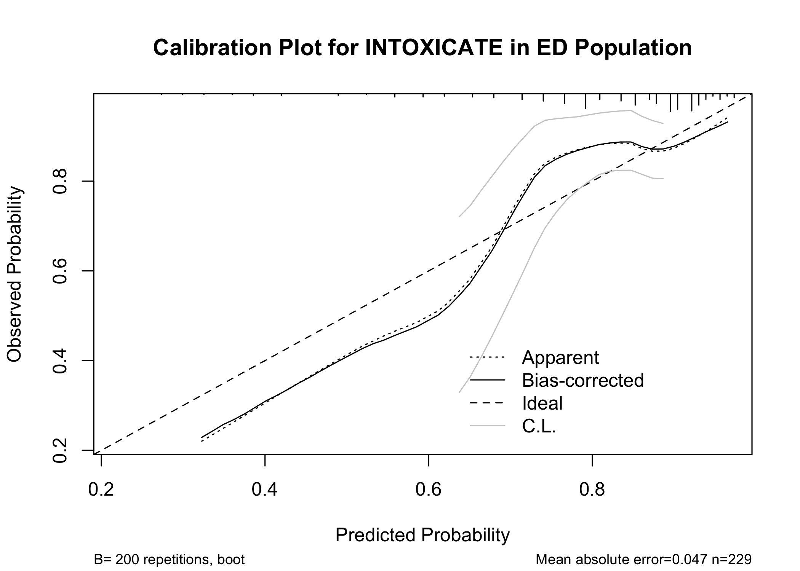
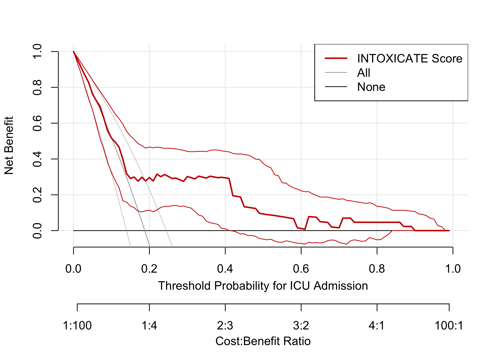
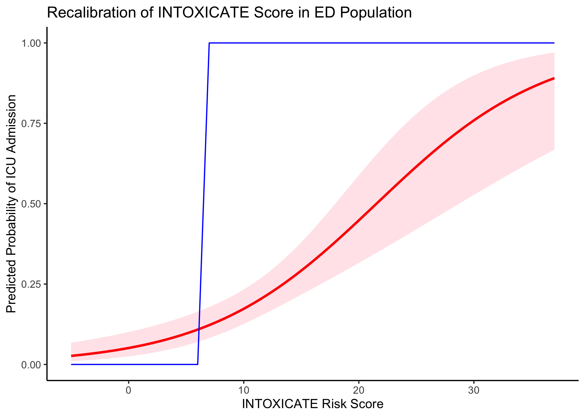

```{=html}
<div id="nncrusoylb" style="padding-left:0px;padding-right:0px;padding-top:10px;padding-bottom:10px;overflow-x:auto;overflow-y:auto;width:auto;height:auto;">
<style>#nncrusoylb table {
  font-family: system-ui, 'Segoe UI', Roboto, Helvetica, Arial, sans-serif, 'Apple Color Emoji', 'Segoe UI Emoji', 'Segoe UI Symbol', 'Noto Color Emoji';
  -webkit-font-smoothing: antialiased;
  -moz-osx-font-smoothing: grayscale;
}

#nncrusoylb thead, #nncrusoylb tbody, #nncrusoylb tfoot, #nncrusoylb tr, #nncrusoylb td, #nncrusoylb th {
  border-style: none;
}

#nncrusoylb p {
  margin: 0;
  padding: 0;
}

#nncrusoylb .gt_table {
  display: table;
  border-collapse: collapse;
  line-height: normal;
  margin-left: auto;
  margin-right: auto;
  color: #333333;
  font-size: 16px;
  font-weight: normal;
  font-style: normal;
  background-color: #FFFFFF;
  width: auto;
  border-top-style: solid;
  border-top-width: 2px;
  border-top-color: #A8A8A8;
  border-right-style: none;
  border-right-width: 2px;
  border-right-color: #D3D3D3;
  border-bottom-style: solid;
  border-bottom-width: 2px;
  border-bottom-color: #A8A8A8;
  border-left-style: none;
  border-left-width: 2px;
  border-left-color: #D3D3D3;
}

#nncrusoylb .gt_caption {
  padding-top: 4px;
  padding-bottom: 4px;
}

#nncrusoylb .gt_title {
  color: #333333;
  font-size: 125%;
  font-weight: initial;
  padding-top: 4px;
  padding-bottom: 4px;
  padding-left: 5px;
  padding-right: 5px;
  border-bottom-color: #FFFFFF;
  border-bottom-width: 0;
}

#nncrusoylb .gt_subtitle {
  color: #333333;
  font-size: 85%;
  font-weight: initial;
  padding-top: 3px;
  padding-bottom: 5px;
  padding-left: 5px;
  padding-right: 5px;
  border-top-color: #FFFFFF;
  border-top-width: 0;
}

#nncrusoylb .gt_heading {
  background-color: #FFFFFF;
  text-align: center;
  border-bottom-color: #FFFFFF;
  border-left-style: none;
  border-left-width: 1px;
  border-left-color: #D3D3D3;
  border-right-style: none;
  border-right-width: 1px;
  border-right-color: #D3D3D3;
}

#nncrusoylb .gt_bottom_border {
  border-bottom-style: solid;
  border-bottom-width: 2px;
  border-bottom-color: #D3D3D3;
}

#nncrusoylb .gt_col_headings {
  border-top-style: solid;
  border-top-width: 2px;
  border-top-color: #D3D3D3;
  border-bottom-style: solid;
  border-bottom-width: 2px;
  border-bottom-color: #D3D3D3;
  border-left-style: none;
  border-left-width: 1px;
  border-left-color: #D3D3D3;
  border-right-style: none;
  border-right-width: 1px;
  border-right-color: #D3D3D3;
}

#nncrusoylb .gt_col_heading {
  color: #333333;
  background-color: #FFFFFF;
  font-size: 100%;
  font-weight: normal;
  text-transform: inherit;
  border-left-style: none;
  border-left-width: 1px;
  border-left-color: #D3D3D3;
  border-right-style: none;
  border-right-width: 1px;
  border-right-color: #D3D3D3;
  vertical-align: bottom;
  padding-top: 5px;
  padding-bottom: 6px;
  padding-left: 5px;
  padding-right: 5px;
  overflow-x: hidden;
}

#nncrusoylb .gt_column_spanner_outer {
  color: #333333;
  background-color: #FFFFFF;
  font-size: 100%;
  font-weight: normal;
  text-transform: inherit;
  padding-top: 0;
  padding-bottom: 0;
  padding-left: 4px;
  padding-right: 4px;
}

#nncrusoylb .gt_column_spanner_outer:first-child {
  padding-left: 0;
}

#nncrusoylb .gt_column_spanner_outer:last-child {
  padding-right: 0;
}

#nncrusoylb .gt_column_spanner {
  border-bottom-style: solid;
  border-bottom-width: 2px;
  border-bottom-color: #D3D3D3;
  vertical-align: bottom;
  padding-top: 5px;
  padding-bottom: 5px;
  overflow-x: hidden;
  display: inline-block;
  width: 100%;
}

#nncrusoylb .gt_spanner_row {
  border-bottom-style: hidden;
}

#nncrusoylb .gt_group_heading {
  padding-top: 8px;
  padding-bottom: 8px;
  padding-left: 5px;
  padding-right: 5px;
  color: #333333;
  background-color: #FFFFFF;
  font-size: 100%;
  font-weight: initial;
  text-transform: inherit;
  border-top-style: solid;
  border-top-width: 2px;
  border-top-color: #D3D3D3;
  border-bottom-style: solid;
  border-bottom-width: 2px;
  border-bottom-color: #D3D3D3;
  border-left-style: none;
  border-left-width: 1px;
  border-left-color: #D3D3D3;
  border-right-style: none;
  border-right-width: 1px;
  border-right-color: #D3D3D3;
  vertical-align: middle;
  text-align: left;
}

#nncrusoylb .gt_empty_group_heading {
  padding: 0.5px;
  color: #333333;
  background-color: #FFFFFF;
  font-size: 100%;
  font-weight: initial;
  border-top-style: solid;
  border-top-width: 2px;
  border-top-color: #D3D3D3;
  border-bottom-style: solid;
  border-bottom-width: 2px;
  border-bottom-color: #D3D3D3;
  vertical-align: middle;
}

#nncrusoylb .gt_from_md > :first-child {
  margin-top: 0;
}

#nncrusoylb .gt_from_md > :last-child {
  margin-bottom: 0;
}

#nncrusoylb .gt_row {
  padding-top: 8px;
  padding-bottom: 8px;
  padding-left: 5px;
  padding-right: 5px;
  margin: 10px;
  border-top-style: solid;
  border-top-width: 1px;
  border-top-color: #D3D3D3;
  border-left-style: none;
  border-left-width: 1px;
  border-left-color: #D3D3D3;
  border-right-style: none;
  border-right-width: 1px;
  border-right-color: #D3D3D3;
  vertical-align: middle;
  overflow-x: hidden;
}

#nncrusoylb .gt_stub {
  color: #333333;
  background-color: #FFFFFF;
  font-size: 100%;
  font-weight: initial;
  text-transform: inherit;
  border-right-style: solid;
  border-right-width: 2px;
  border-right-color: #D3D3D3;
  padding-left: 5px;
  padding-right: 5px;
}

#nncrusoylb .gt_stub_row_group {
  color: #333333;
  background-color: #FFFFFF;
  font-size: 100%;
  font-weight: initial;
  text-transform: inherit;
  border-right-style: solid;
  border-right-width: 2px;
  border-right-color: #D3D3D3;
  padding-left: 5px;
  padding-right: 5px;
  vertical-align: top;
}

#nncrusoylb .gt_row_group_first td {
  border-top-width: 2px;
}

#nncrusoylb .gt_row_group_first th {
  border-top-width: 2px;
}

#nncrusoylb .gt_summary_row {
  color: #333333;
  background-color: #FFFFFF;
  text-transform: inherit;
  padding-top: 8px;
  padding-bottom: 8px;
  padding-left: 5px;
  padding-right: 5px;
}

#nncrusoylb .gt_first_summary_row {
  border-top-style: solid;
  border-top-color: #D3D3D3;
}

#nncrusoylb .gt_first_summary_row.thick {
  border-top-width: 2px;
}

#nncrusoylb .gt_last_summary_row {
  padding-top: 8px;
  padding-bottom: 8px;
  padding-left: 5px;
  padding-right: 5px;
  border-bottom-style: solid;
  border-bottom-width: 2px;
  border-bottom-color: #D3D3D3;
}

#nncrusoylb .gt_grand_summary_row {
  color: #333333;
  background-color: #FFFFFF;
  text-transform: inherit;
  padding-top: 8px;
  padding-bottom: 8px;
  padding-left: 5px;
  padding-right: 5px;
}

#nncrusoylb .gt_first_grand_summary_row {
  padding-top: 8px;
  padding-bottom: 8px;
  padding-left: 5px;
  padding-right: 5px;
  border-top-style: double;
  border-top-width: 6px;
  border-top-color: #D3D3D3;
}

#nncrusoylb .gt_last_grand_summary_row_top {
  padding-top: 8px;
  padding-bottom: 8px;
  padding-left: 5px;
  padding-right: 5px;
  border-bottom-style: double;
  border-bottom-width: 6px;
  border-bottom-color: #D3D3D3;
}

#nncrusoylb .gt_striped {
  background-color: rgba(128, 128, 128, 0.05);
}

#nncrusoylb .gt_table_body {
  border-top-style: solid;
  border-top-width: 2px;
  border-top-color: #D3D3D3;
  border-bottom-style: solid;
  border-bottom-width: 2px;
  border-bottom-color: #D3D3D3;
}

#nncrusoylb .gt_footnotes {
  color: #333333;
  background-color: #FFFFFF;
  border-bottom-style: none;
  border-bottom-width: 2px;
  border-bottom-color: #D3D3D3;
  border-left-style: none;
  border-left-width: 2px;
  border-left-color: #D3D3D3;
  border-right-style: none;
  border-right-width: 2px;
  border-right-color: #D3D3D3;
}

#nncrusoylb .gt_footnote {
  margin: 0px;
  font-size: 90%;
  padding-top: 4px;
  padding-bottom: 4px;
  padding-left: 5px;
  padding-right: 5px;
}

#nncrusoylb .gt_sourcenotes {
  color: #333333;
  background-color: #FFFFFF;
  border-bottom-style: none;
  border-bottom-width: 2px;
  border-bottom-color: #D3D3D3;
  border-left-style: none;
  border-left-width: 2px;
  border-left-color: #D3D3D3;
  border-right-style: none;
  border-right-width: 2px;
  border-right-color: #D3D3D3;
}

#nncrusoylb .gt_sourcenote {
  font-size: 90%;
  padding-top: 4px;
  padding-bottom: 4px;
  padding-left: 5px;
  padding-right: 5px;
}

#nncrusoylb .gt_left {
  text-align: left;
}

#nncrusoylb .gt_center {
  text-align: center;
}

#nncrusoylb .gt_right {
  text-align: right;
  font-variant-numeric: tabular-nums;
}

#nncrusoylb .gt_font_normal {
  font-weight: normal;
}

#nncrusoylb .gt_font_bold {
  font-weight: bold;
}

#nncrusoylb .gt_font_italic {
  font-style: italic;
}

#nncrusoylb .gt_super {
  font-size: 65%;
}

#nncrusoylb .gt_footnote_marks {
  font-size: 75%;
  vertical-align: 0.4em;
  position: initial;
}

#nncrusoylb .gt_asterisk {
  font-size: 100%;
  vertical-align: 0;
}

#nncrusoylb .gt_indent_1 {
  text-indent: 5px;
}

#nncrusoylb .gt_indent_2 {
  text-indent: 10px;
}

#nncrusoylb .gt_indent_3 {
  text-indent: 15px;
}

#nncrusoylb .gt_indent_4 {
  text-indent: 20px;
}

#nncrusoylb .gt_indent_5 {
  text-indent: 25px;
}

#nncrusoylb .katex-display {
  display: inline-flex !important;
  margin-bottom: 0.75em !important;
}

#nncrusoylb div.Reactable > div.rt-table > div.rt-thead > div.rt-tr.rt-tr-group-header > div.rt-th-group:after {
  height: 0px !important;
}
</style>
<table class="gt_table" data-quarto-disable-processing="false" data-quarto-bootstrap="false">
  <thead>
    <tr class="gt_col_headings">
      <th class="gt_col_heading gt_columns_bottom_border gt_left" rowspan="1" colspan="1" scope="col" id="label"><span class='gt_from_md'><strong>Characteristic</strong></span></th>
      <th class="gt_col_heading gt_columns_bottom_border gt_center" rowspan="1" colspan="1" scope="col" id="n"><span class='gt_from_md'><strong>N</strong></span></th>
      <th class="gt_col_heading gt_columns_bottom_border gt_center" rowspan="1" colspan="1" scope="col" id="stat_0"><span class='gt_from_md'><strong>Overall</strong><br />
N = 229</span><span class="gt_footnote_marks" style="white-space:nowrap;font-style:italic;font-weight:normal;line-height:0;"><sup>1</sup></span></th>
      <th class="gt_col_heading gt_columns_bottom_border gt_center" rowspan="1" colspan="1" scope="col" id="stat_1"><span class='gt_from_md'><strong>F</strong><br />
N = 117</span><span class="gt_footnote_marks" style="white-space:nowrap;font-style:italic;font-weight:normal;line-height:0;"><sup>1</sup></span></th>
      <th class="gt_col_heading gt_columns_bottom_border gt_center" rowspan="1" colspan="1" scope="col" id="stat_2"><span class='gt_from_md'><strong>M</strong><br />
N = 112</span><span class="gt_footnote_marks" style="white-space:nowrap;font-style:italic;font-weight:normal;line-height:0;"><sup>1</sup></span></th>
      <th class="gt_col_heading gt_columns_bottom_border gt_center" rowspan="1" colspan="1" scope="col" id="p.value"><span class='gt_from_md'><strong>p-value</strong></span><span class="gt_footnote_marks" style="white-space:nowrap;font-style:italic;font-weight:normal;line-height:0;"><sup>2</sup></span></th>
    </tr>
  </thead>
  <tbody class="gt_table_body">
    <tr><td headers="label" class="gt_row gt_left">Age</td>
<td headers="n" class="gt_row gt_center">229</td>
<td headers="stat_0" class="gt_row gt_center">34 (26, 56)</td>
<td headers="stat_1" class="gt_row gt_center">30 (21, 55)</td>
<td headers="stat_2" class="gt_row gt_center">38 (28, 63)</td>
<td headers="p.value" class="gt_row gt_center">0.051</td></tr>
    <tr><td headers="label" class="gt_row gt_left">Exposure Category</td>
<td headers="n" class="gt_row gt_center">229</td>
<td headers="stat_0" class="gt_row gt_center"><br /></td>
<td headers="stat_1" class="gt_row gt_center"><br /></td>
<td headers="stat_2" class="gt_row gt_center"><br /></td>
<td headers="p.value" class="gt_row gt_center">0.020</td></tr>
    <tr><td headers="label" class="gt_row gt_left">    Alcohol</td>
<td headers="n" class="gt_row gt_center"><br /></td>
<td headers="stat_0" class="gt_row gt_center">16 (7.0%)</td>
<td headers="stat_1" class="gt_row gt_center">6 (5.1%)</td>
<td headers="stat_2" class="gt_row gt_center">10 (8.9%)</td>
<td headers="p.value" class="gt_row gt_center"><br /></td></tr>
    <tr><td headers="label" class="gt_row gt_left">    Analgesic</td>
<td headers="n" class="gt_row gt_center"><br /></td>
<td headers="stat_0" class="gt_row gt_center">31 (14%)</td>
<td headers="stat_1" class="gt_row gt_center">18 (15%)</td>
<td headers="stat_2" class="gt_row gt_center">13 (12%)</td>
<td headers="p.value" class="gt_row gt_center"><br /></td></tr>
    <tr><td headers="label" class="gt_row gt_left">    Antidepressants</td>
<td headers="n" class="gt_row gt_center"><br /></td>
<td headers="stat_0" class="gt_row gt_center">29 (13%)</td>
<td headers="stat_1" class="gt_row gt_center">21 (18%)</td>
<td headers="stat_2" class="gt_row gt_center">8 (7.1%)</td>
<td headers="p.value" class="gt_row gt_center"><br /></td></tr>
    <tr><td headers="label" class="gt_row gt_left">    CO, As, CN</td>
<td headers="n" class="gt_row gt_center"><br /></td>
<td headers="stat_0" class="gt_row gt_center">26 (11%)</td>
<td headers="stat_1" class="gt_row gt_center">10 (8.5%)</td>
<td headers="stat_2" class="gt_row gt_center">16 (14%)</td>
<td headers="p.value" class="gt_row gt_center"><br /></td></tr>
    <tr><td headers="label" class="gt_row gt_left">    Combination</td>
<td headers="n" class="gt_row gt_center"><br /></td>
<td headers="stat_0" class="gt_row gt_center">56 (24%)</td>
<td headers="stat_1" class="gt_row gt_center">24 (21%)</td>
<td headers="stat_2" class="gt_row gt_center">32 (29%)</td>
<td headers="p.value" class="gt_row gt_center"><br /></td></tr>
    <tr><td headers="label" class="gt_row gt_left">    Not Classified</td>
<td headers="n" class="gt_row gt_center"><br /></td>
<td headers="stat_0" class="gt_row gt_center">11 (4.8%)</td>
<td headers="stat_1" class="gt_row gt_center">6 (5.1%)</td>
<td headers="stat_2" class="gt_row gt_center">5 (4.5%)</td>
<td headers="p.value" class="gt_row gt_center"><br /></td></tr>
    <tr><td headers="label" class="gt_row gt_left">    Sedatives</td>
<td headers="n" class="gt_row gt_center"><br /></td>
<td headers="stat_0" class="gt_row gt_center">13 (5.7%)</td>
<td headers="stat_1" class="gt_row gt_center">11 (9.4%)</td>
<td headers="stat_2" class="gt_row gt_center">2 (1.8%)</td>
<td headers="p.value" class="gt_row gt_center"><br /></td></tr>
    <tr><td headers="label" class="gt_row gt_left">    Street Drugs</td>
<td headers="n" class="gt_row gt_center"><br /></td>
<td headers="stat_0" class="gt_row gt_center">20 (8.7%)</td>
<td headers="stat_1" class="gt_row gt_center">7 (6.0%)</td>
<td headers="stat_2" class="gt_row gt_center">13 (12%)</td>
<td headers="p.value" class="gt_row gt_center"><br /></td></tr>
    <tr><td headers="label" class="gt_row gt_left">    Unknown</td>
<td headers="n" class="gt_row gt_center"><br /></td>
<td headers="stat_0" class="gt_row gt_center">27 (12%)</td>
<td headers="stat_1" class="gt_row gt_center">14 (12%)</td>
<td headers="stat_2" class="gt_row gt_center">13 (12%)</td>
<td headers="p.value" class="gt_row gt_center"><br /></td></tr>
    <tr><td headers="label" class="gt_row gt_left">INTOXICATE SCORE</td>
<td headers="n" class="gt_row gt_center">229</td>
<td headers="stat_0" class="gt_row gt_center">8 (4, 13)</td>
<td headers="stat_1" class="gt_row gt_center">7 (4, 12)</td>
<td headers="stat_2" class="gt_row gt_center">9 (5, 13)</td>
<td headers="p.value" class="gt_row gt_center">0.4</td></tr>
    <tr><td headers="label" class="gt_row gt_left">Actual Disposition</td>
<td headers="n" class="gt_row gt_center">229</td>
<td headers="stat_0" class="gt_row gt_center"><br /></td>
<td headers="stat_1" class="gt_row gt_center"><br /></td>
<td headers="stat_2" class="gt_row gt_center"><br /></td>
<td headers="p.value" class="gt_row gt_center">0.002</td></tr>
    <tr><td headers="label" class="gt_row gt_left">    ICU</td>
<td headers="n" class="gt_row gt_center"><br /></td>
<td headers="stat_0" class="gt_row gt_center">43 (19%)</td>
<td headers="stat_1" class="gt_row gt_center">13 (11%)</td>
<td headers="stat_2" class="gt_row gt_center">30 (27%)</td>
<td headers="p.value" class="gt_row gt_center"><br /></td></tr>
    <tr><td headers="label" class="gt_row gt_left">    Not ICU</td>
<td headers="n" class="gt_row gt_center"><br /></td>
<td headers="stat_0" class="gt_row gt_center">186 (81%)</td>
<td headers="stat_1" class="gt_row gt_center">104 (89%)</td>
<td headers="stat_2" class="gt_row gt_center">82 (73%)</td>
<td headers="p.value" class="gt_row gt_center"><br /></td></tr>
    <tr><td headers="label" class="gt_row gt_left">Predicted Disposition</td>
<td headers="n" class="gt_row gt_center">229</td>
<td headers="stat_0" class="gt_row gt_center"><br /></td>
<td headers="stat_1" class="gt_row gt_center"><br /></td>
<td headers="stat_2" class="gt_row gt_center"><br /></td>
<td headers="p.value" class="gt_row gt_center">0.5</td></tr>
    <tr><td headers="label" class="gt_row gt_left">    ICU</td>
<td headers="n" class="gt_row gt_center"><br /></td>
<td headers="stat_0" class="gt_row gt_center">128 (56%)</td>
<td headers="stat_1" class="gt_row gt_center">63 (54%)</td>
<td headers="stat_2" class="gt_row gt_center">65 (58%)</td>
<td headers="p.value" class="gt_row gt_center"><br /></td></tr>
    <tr><td headers="label" class="gt_row gt_left">    Not ICU</td>
<td headers="n" class="gt_row gt_center"><br /></td>
<td headers="stat_0" class="gt_row gt_center">101 (44%)</td>
<td headers="stat_1" class="gt_row gt_center">54 (46%)</td>
<td headers="stat_2" class="gt_row gt_center">47 (42%)</td>
<td headers="p.value" class="gt_row gt_center"><br /></td></tr>
  </tbody>
  <tfoot>
    <tr class="gt_footnotes">
      <td class="gt_footnote" colspan="6"><span class="gt_footnote_marks" style="white-space:nowrap;font-style:italic;font-weight:normal;line-height:0;"><sup>1</sup></span> <span class='gt_from_md'>Median (Q1, Q3); n (%)</span></td>
    </tr>
    <tr class="gt_footnotes">
      <td class="gt_footnote" colspan="6"><span class="gt_footnote_marks" style="white-space:nowrap;font-style:italic;font-weight:normal;line-height:0;"><sup>2</sup></span> <span class='gt_from_md'>Wilcoxon rank sum test; Pearson’s Chi-squared test</span></td>
    </tr>
  </tfoot>
</table>
</div>
```

<!-- -->

```
## 
## n=229   Mean absolute error=0.047   Mean squared error=0.00314
## 0.9 Quantile of absolute error=0.093
```

<!-- -->

```
## 
## Call:
## glm(formula = icu_admit ~ `INTOXICATE SCORE`, family = binomial(link = "logit"), 
##     data = xf %>% filter(Age > 12))
## 
## Coefficients:
##                    Estimate Std. Error z value Pr(>|z|)    
## (Intercept)        -2.91962    0.37396  -7.807 5.84e-15 ***
## `INTOXICATE SCORE`  0.13559    0.02744   4.941 7.76e-07 ***
## ---
## Signif. codes:  0 '***' 0.001 '**' 0.01 '*' 0.05 '.' 0.1 ' ' 1
## 
## (Dispersion parameter for binomial family taken to be 1)
## 
##     Null deviance: 221.20  on 228  degrees of freedom
## Residual deviance: 191.46  on 227  degrees of freedom
## AIC: 195.46
## 
## Number of Fisher Scoring iterations: 5
```

```
## `geom_smooth()` using formula = 'y ~ x'
```

<!-- -->
```{=html}
<div id="clbbjvetpd" style="padding-left:0px;padding-right:0px;padding-top:10px;padding-bottom:10px;overflow-x:auto;overflow-y:auto;width:auto;height:auto;">
<style>#clbbjvetpd table {
  font-family: system-ui, 'Segoe UI', Roboto, Helvetica, Arial, sans-serif, 'Apple Color Emoji', 'Segoe UI Emoji', 'Segoe UI Symbol', 'Noto Color Emoji';
  -webkit-font-smoothing: antialiased;
  -moz-osx-font-smoothing: grayscale;
}

#clbbjvetpd thead, #clbbjvetpd tbody, #clbbjvetpd tfoot, #clbbjvetpd tr, #clbbjvetpd td, #clbbjvetpd th {
  border-style: none;
}

#clbbjvetpd p {
  margin: 0;
  padding: 0;
}

#clbbjvetpd .gt_table {
  display: table;
  border-collapse: collapse;
  line-height: normal;
  margin-left: auto;
  margin-right: auto;
  color: #333333;
  font-size: 16px;
  font-weight: normal;
  font-style: normal;
  background-color: #FFFFFF;
  width: auto;
  border-top-style: solid;
  border-top-width: 2px;
  border-top-color: #A8A8A8;
  border-right-style: none;
  border-right-width: 2px;
  border-right-color: #D3D3D3;
  border-bottom-style: solid;
  border-bottom-width: 2px;
  border-bottom-color: #A8A8A8;
  border-left-style: none;
  border-left-width: 2px;
  border-left-color: #D3D3D3;
}

#clbbjvetpd .gt_caption {
  padding-top: 4px;
  padding-bottom: 4px;
}

#clbbjvetpd .gt_title {
  color: #333333;
  font-size: 125%;
  font-weight: initial;
  padding-top: 4px;
  padding-bottom: 4px;
  padding-left: 5px;
  padding-right: 5px;
  border-bottom-color: #FFFFFF;
  border-bottom-width: 0;
}

#clbbjvetpd .gt_subtitle {
  color: #333333;
  font-size: 85%;
  font-weight: initial;
  padding-top: 3px;
  padding-bottom: 5px;
  padding-left: 5px;
  padding-right: 5px;
  border-top-color: #FFFFFF;
  border-top-width: 0;
}

#clbbjvetpd .gt_heading {
  background-color: #FFFFFF;
  text-align: center;
  border-bottom-color: #FFFFFF;
  border-left-style: none;
  border-left-width: 1px;
  border-left-color: #D3D3D3;
  border-right-style: none;
  border-right-width: 1px;
  border-right-color: #D3D3D3;
}

#clbbjvetpd .gt_bottom_border {
  border-bottom-style: solid;
  border-bottom-width: 2px;
  border-bottom-color: #D3D3D3;
}

#clbbjvetpd .gt_col_headings {
  border-top-style: solid;
  border-top-width: 2px;
  border-top-color: #D3D3D3;
  border-bottom-style: solid;
  border-bottom-width: 2px;
  border-bottom-color: #D3D3D3;
  border-left-style: none;
  border-left-width: 1px;
  border-left-color: #D3D3D3;
  border-right-style: none;
  border-right-width: 1px;
  border-right-color: #D3D3D3;
}

#clbbjvetpd .gt_col_heading {
  color: #333333;
  background-color: #FFFFFF;
  font-size: 100%;
  font-weight: normal;
  text-transform: inherit;
  border-left-style: none;
  border-left-width: 1px;
  border-left-color: #D3D3D3;
  border-right-style: none;
  border-right-width: 1px;
  border-right-color: #D3D3D3;
  vertical-align: bottom;
  padding-top: 5px;
  padding-bottom: 6px;
  padding-left: 5px;
  padding-right: 5px;
  overflow-x: hidden;
}

#clbbjvetpd .gt_column_spanner_outer {
  color: #333333;
  background-color: #FFFFFF;
  font-size: 100%;
  font-weight: normal;
  text-transform: inherit;
  padding-top: 0;
  padding-bottom: 0;
  padding-left: 4px;
  padding-right: 4px;
}

#clbbjvetpd .gt_column_spanner_outer:first-child {
  padding-left: 0;
}

#clbbjvetpd .gt_column_spanner_outer:last-child {
  padding-right: 0;
}

#clbbjvetpd .gt_column_spanner {
  border-bottom-style: solid;
  border-bottom-width: 2px;
  border-bottom-color: #D3D3D3;
  vertical-align: bottom;
  padding-top: 5px;
  padding-bottom: 5px;
  overflow-x: hidden;
  display: inline-block;
  width: 100%;
}

#clbbjvetpd .gt_spanner_row {
  border-bottom-style: hidden;
}

#clbbjvetpd .gt_group_heading {
  padding-top: 8px;
  padding-bottom: 8px;
  padding-left: 5px;
  padding-right: 5px;
  color: #333333;
  background-color: #FFFFFF;
  font-size: 100%;
  font-weight: initial;
  text-transform: inherit;
  border-top-style: solid;
  border-top-width: 2px;
  border-top-color: #D3D3D3;
  border-bottom-style: solid;
  border-bottom-width: 2px;
  border-bottom-color: #D3D3D3;
  border-left-style: none;
  border-left-width: 1px;
  border-left-color: #D3D3D3;
  border-right-style: none;
  border-right-width: 1px;
  border-right-color: #D3D3D3;
  vertical-align: middle;
  text-align: left;
}

#clbbjvetpd .gt_empty_group_heading {
  padding: 0.5px;
  color: #333333;
  background-color: #FFFFFF;
  font-size: 100%;
  font-weight: initial;
  border-top-style: solid;
  border-top-width: 2px;
  border-top-color: #D3D3D3;
  border-bottom-style: solid;
  border-bottom-width: 2px;
  border-bottom-color: #D3D3D3;
  vertical-align: middle;
}

#clbbjvetpd .gt_from_md > :first-child {
  margin-top: 0;
}

#clbbjvetpd .gt_from_md > :last-child {
  margin-bottom: 0;
}

#clbbjvetpd .gt_row {
  padding-top: 8px;
  padding-bottom: 8px;
  padding-left: 5px;
  padding-right: 5px;
  margin: 10px;
  border-top-style: solid;
  border-top-width: 1px;
  border-top-color: #D3D3D3;
  border-left-style: none;
  border-left-width: 1px;
  border-left-color: #D3D3D3;
  border-right-style: none;
  border-right-width: 1px;
  border-right-color: #D3D3D3;
  vertical-align: middle;
  overflow-x: hidden;
}

#clbbjvetpd .gt_stub {
  color: #333333;
  background-color: #FFFFFF;
  font-size: 100%;
  font-weight: initial;
  text-transform: inherit;
  border-right-style: solid;
  border-right-width: 2px;
  border-right-color: #D3D3D3;
  padding-left: 5px;
  padding-right: 5px;
}

#clbbjvetpd .gt_stub_row_group {
  color: #333333;
  background-color: #FFFFFF;
  font-size: 100%;
  font-weight: initial;
  text-transform: inherit;
  border-right-style: solid;
  border-right-width: 2px;
  border-right-color: #D3D3D3;
  padding-left: 5px;
  padding-right: 5px;
  vertical-align: top;
}

#clbbjvetpd .gt_row_group_first td {
  border-top-width: 2px;
}

#clbbjvetpd .gt_row_group_first th {
  border-top-width: 2px;
}

#clbbjvetpd .gt_summary_row {
  color: #333333;
  background-color: #FFFFFF;
  text-transform: inherit;
  padding-top: 8px;
  padding-bottom: 8px;
  padding-left: 5px;
  padding-right: 5px;
}

#clbbjvetpd .gt_first_summary_row {
  border-top-style: solid;
  border-top-color: #D3D3D3;
}

#clbbjvetpd .gt_first_summary_row.thick {
  border-top-width: 2px;
}

#clbbjvetpd .gt_last_summary_row {
  padding-top: 8px;
  padding-bottom: 8px;
  padding-left: 5px;
  padding-right: 5px;
  border-bottom-style: solid;
  border-bottom-width: 2px;
  border-bottom-color: #D3D3D3;
}

#clbbjvetpd .gt_grand_summary_row {
  color: #333333;
  background-color: #FFFFFF;
  text-transform: inherit;
  padding-top: 8px;
  padding-bottom: 8px;
  padding-left: 5px;
  padding-right: 5px;
}

#clbbjvetpd .gt_first_grand_summary_row {
  padding-top: 8px;
  padding-bottom: 8px;
  padding-left: 5px;
  padding-right: 5px;
  border-top-style: double;
  border-top-width: 6px;
  border-top-color: #D3D3D3;
}

#clbbjvetpd .gt_last_grand_summary_row_top {
  padding-top: 8px;
  padding-bottom: 8px;
  padding-left: 5px;
  padding-right: 5px;
  border-bottom-style: double;
  border-bottom-width: 6px;
  border-bottom-color: #D3D3D3;
}

#clbbjvetpd .gt_striped {
  background-color: rgba(128, 128, 128, 0.05);
}

#clbbjvetpd .gt_table_body {
  border-top-style: solid;
  border-top-width: 2px;
  border-top-color: #D3D3D3;
  border-bottom-style: solid;
  border-bottom-width: 2px;
  border-bottom-color: #D3D3D3;
}

#clbbjvetpd .gt_footnotes {
  color: #333333;
  background-color: #FFFFFF;
  border-bottom-style: none;
  border-bottom-width: 2px;
  border-bottom-color: #D3D3D3;
  border-left-style: none;
  border-left-width: 2px;
  border-left-color: #D3D3D3;
  border-right-style: none;
  border-right-width: 2px;
  border-right-color: #D3D3D3;
}

#clbbjvetpd .gt_footnote {
  margin: 0px;
  font-size: 90%;
  padding-top: 4px;
  padding-bottom: 4px;
  padding-left: 5px;
  padding-right: 5px;
}

#clbbjvetpd .gt_sourcenotes {
  color: #333333;
  background-color: #FFFFFF;
  border-bottom-style: none;
  border-bottom-width: 2px;
  border-bottom-color: #D3D3D3;
  border-left-style: none;
  border-left-width: 2px;
  border-left-color: #D3D3D3;
  border-right-style: none;
  border-right-width: 2px;
  border-right-color: #D3D3D3;
}

#clbbjvetpd .gt_sourcenote {
  font-size: 90%;
  padding-top: 4px;
  padding-bottom: 4px;
  padding-left: 5px;
  padding-right: 5px;
}

#clbbjvetpd .gt_left {
  text-align: left;
}

#clbbjvetpd .gt_center {
  text-align: center;
}

#clbbjvetpd .gt_right {
  text-align: right;
  font-variant-numeric: tabular-nums;
}

#clbbjvetpd .gt_font_normal {
  font-weight: normal;
}

#clbbjvetpd .gt_font_bold {
  font-weight: bold;
}

#clbbjvetpd .gt_font_italic {
  font-style: italic;
}

#clbbjvetpd .gt_super {
  font-size: 65%;
}

#clbbjvetpd .gt_footnote_marks {
  font-size: 75%;
  vertical-align: 0.4em;
  position: initial;
}

#clbbjvetpd .gt_asterisk {
  font-size: 100%;
  vertical-align: 0;
}

#clbbjvetpd .gt_indent_1 {
  text-indent: 5px;
}

#clbbjvetpd .gt_indent_2 {
  text-indent: 10px;
}

#clbbjvetpd .gt_indent_3 {
  text-indent: 15px;
}

#clbbjvetpd .gt_indent_4 {
  text-indent: 20px;
}

#clbbjvetpd .gt_indent_5 {
  text-indent: 25px;
}

#clbbjvetpd .katex-display {
  display: inline-flex !important;
  margin-bottom: 0.75em !important;
}

#clbbjvetpd div.Reactable > div.rt-table > div.rt-thead > div.rt-tr.rt-tr-group-header > div.rt-th-group:after {
  height: 0px !important;
}
</style>
<table class="gt_table" data-quarto-disable-processing="false" data-quarto-bootstrap="false">
  <thead>
    <tr class="gt_col_headings gt_spanner_row">
      <th class="gt_col_heading gt_columns_bottom_border gt_left" rowspan="2" colspan="1" scope="col" id="label"><span class='gt_from_md'><strong>Original INTOXICATE</strong></span></th>
      <th class="gt_center gt_columns_top_border gt_column_spanner_outer" rowspan="1" colspan="2" scope="colgroup" id="level 1; stat_1">
        <div class="gt_column_spanner"><span class='gt_from_md'>Actual Disposition</span></div>
      </th>
      <th class="gt_col_heading gt_columns_bottom_border gt_center" rowspan="2" colspan="1" scope="col" id="stat_0"><span class='gt_from_md'>Total</span></th>
    </tr>
    <tr class="gt_col_headings">
      <th class="gt_col_heading gt_columns_bottom_border gt_center" rowspan="1" colspan="1" scope="col" id="stat_1"><span class='gt_from_md'>ICU</span></th>
      <th class="gt_col_heading gt_columns_bottom_border gt_center" rowspan="1" colspan="1" scope="col" id="stat_2"><span class='gt_from_md'>Not ICU</span></th>
    </tr>
  </thead>
  <tbody class="gt_table_body">
    <tr><td headers="label" class="gt_row gt_left">Predicted Disposition</td>
<td headers="stat_1" class="gt_row gt_center"><br /></td>
<td headers="stat_2" class="gt_row gt_center"><br /></td>
<td headers="stat_0" class="gt_row gt_center"><br /></td></tr>
    <tr><td headers="label" class="gt_row gt_left">    ICU</td>
<td headers="stat_1" class="gt_row gt_center">33</td>
<td headers="stat_2" class="gt_row gt_center">95</td>
<td headers="stat_0" class="gt_row gt_center">128</td></tr>
    <tr><td headers="label" class="gt_row gt_left">    Not ICU</td>
<td headers="stat_1" class="gt_row gt_center">10</td>
<td headers="stat_2" class="gt_row gt_center">91</td>
<td headers="stat_0" class="gt_row gt_center">101</td></tr>
    <tr><td headers="label" class="gt_row gt_left">Total</td>
<td headers="stat_1" class="gt_row gt_center">43</td>
<td headers="stat_2" class="gt_row gt_center">186</td>
<td headers="stat_0" class="gt_row gt_center">229</td></tr>
  </tbody>
  
</table>
</div>
```

```{=html}
<div id="pizveuabps" style="padding-left:0px;padding-right:0px;padding-top:10px;padding-bottom:10px;overflow-x:auto;overflow-y:auto;width:auto;height:auto;">
<style>#pizveuabps table {
  font-family: system-ui, 'Segoe UI', Roboto, Helvetica, Arial, sans-serif, 'Apple Color Emoji', 'Segoe UI Emoji', 'Segoe UI Symbol', 'Noto Color Emoji';
  -webkit-font-smoothing: antialiased;
  -moz-osx-font-smoothing: grayscale;
}

#pizveuabps thead, #pizveuabps tbody, #pizveuabps tfoot, #pizveuabps tr, #pizveuabps td, #pizveuabps th {
  border-style: none;
}

#pizveuabps p {
  margin: 0;
  padding: 0;
}

#pizveuabps .gt_table {
  display: table;
  border-collapse: collapse;
  line-height: normal;
  margin-left: auto;
  margin-right: auto;
  color: #333333;
  font-size: 16px;
  font-weight: normal;
  font-style: normal;
  background-color: #FFFFFF;
  width: auto;
  border-top-style: solid;
  border-top-width: 2px;
  border-top-color: #A8A8A8;
  border-right-style: none;
  border-right-width: 2px;
  border-right-color: #D3D3D3;
  border-bottom-style: solid;
  border-bottom-width: 2px;
  border-bottom-color: #A8A8A8;
  border-left-style: none;
  border-left-width: 2px;
  border-left-color: #D3D3D3;
}

#pizveuabps .gt_caption {
  padding-top: 4px;
  padding-bottom: 4px;
}

#pizveuabps .gt_title {
  color: #333333;
  font-size: 125%;
  font-weight: initial;
  padding-top: 4px;
  padding-bottom: 4px;
  padding-left: 5px;
  padding-right: 5px;
  border-bottom-color: #FFFFFF;
  border-bottom-width: 0;
}

#pizveuabps .gt_subtitle {
  color: #333333;
  font-size: 85%;
  font-weight: initial;
  padding-top: 3px;
  padding-bottom: 5px;
  padding-left: 5px;
  padding-right: 5px;
  border-top-color: #FFFFFF;
  border-top-width: 0;
}

#pizveuabps .gt_heading {
  background-color: #FFFFFF;
  text-align: center;
  border-bottom-color: #FFFFFF;
  border-left-style: none;
  border-left-width: 1px;
  border-left-color: #D3D3D3;
  border-right-style: none;
  border-right-width: 1px;
  border-right-color: #D3D3D3;
}

#pizveuabps .gt_bottom_border {
  border-bottom-style: solid;
  border-bottom-width: 2px;
  border-bottom-color: #D3D3D3;
}

#pizveuabps .gt_col_headings {
  border-top-style: solid;
  border-top-width: 2px;
  border-top-color: #D3D3D3;
  border-bottom-style: solid;
  border-bottom-width: 2px;
  border-bottom-color: #D3D3D3;
  border-left-style: none;
  border-left-width: 1px;
  border-left-color: #D3D3D3;
  border-right-style: none;
  border-right-width: 1px;
  border-right-color: #D3D3D3;
}

#pizveuabps .gt_col_heading {
  color: #333333;
  background-color: #FFFFFF;
  font-size: 100%;
  font-weight: normal;
  text-transform: inherit;
  border-left-style: none;
  border-left-width: 1px;
  border-left-color: #D3D3D3;
  border-right-style: none;
  border-right-width: 1px;
  border-right-color: #D3D3D3;
  vertical-align: bottom;
  padding-top: 5px;
  padding-bottom: 6px;
  padding-left: 5px;
  padding-right: 5px;
  overflow-x: hidden;
}

#pizveuabps .gt_column_spanner_outer {
  color: #333333;
  background-color: #FFFFFF;
  font-size: 100%;
  font-weight: normal;
  text-transform: inherit;
  padding-top: 0;
  padding-bottom: 0;
  padding-left: 4px;
  padding-right: 4px;
}

#pizveuabps .gt_column_spanner_outer:first-child {
  padding-left: 0;
}

#pizveuabps .gt_column_spanner_outer:last-child {
  padding-right: 0;
}

#pizveuabps .gt_column_spanner {
  border-bottom-style: solid;
  border-bottom-width: 2px;
  border-bottom-color: #D3D3D3;
  vertical-align: bottom;
  padding-top: 5px;
  padding-bottom: 5px;
  overflow-x: hidden;
  display: inline-block;
  width: 100%;
}

#pizveuabps .gt_spanner_row {
  border-bottom-style: hidden;
}

#pizveuabps .gt_group_heading {
  padding-top: 8px;
  padding-bottom: 8px;
  padding-left: 5px;
  padding-right: 5px;
  color: #333333;
  background-color: #FFFFFF;
  font-size: 100%;
  font-weight: initial;
  text-transform: inherit;
  border-top-style: solid;
  border-top-width: 2px;
  border-top-color: #D3D3D3;
  border-bottom-style: solid;
  border-bottom-width: 2px;
  border-bottom-color: #D3D3D3;
  border-left-style: none;
  border-left-width: 1px;
  border-left-color: #D3D3D3;
  border-right-style: none;
  border-right-width: 1px;
  border-right-color: #D3D3D3;
  vertical-align: middle;
  text-align: left;
}

#pizveuabps .gt_empty_group_heading {
  padding: 0.5px;
  color: #333333;
  background-color: #FFFFFF;
  font-size: 100%;
  font-weight: initial;
  border-top-style: solid;
  border-top-width: 2px;
  border-top-color: #D3D3D3;
  border-bottom-style: solid;
  border-bottom-width: 2px;
  border-bottom-color: #D3D3D3;
  vertical-align: middle;
}

#pizveuabps .gt_from_md > :first-child {
  margin-top: 0;
}

#pizveuabps .gt_from_md > :last-child {
  margin-bottom: 0;
}

#pizveuabps .gt_row {
  padding-top: 8px;
  padding-bottom: 8px;
  padding-left: 5px;
  padding-right: 5px;
  margin: 10px;
  border-top-style: solid;
  border-top-width: 1px;
  border-top-color: #D3D3D3;
  border-left-style: none;
  border-left-width: 1px;
  border-left-color: #D3D3D3;
  border-right-style: none;
  border-right-width: 1px;
  border-right-color: #D3D3D3;
  vertical-align: middle;
  overflow-x: hidden;
}

#pizveuabps .gt_stub {
  color: #333333;
  background-color: #FFFFFF;
  font-size: 100%;
  font-weight: initial;
  text-transform: inherit;
  border-right-style: solid;
  border-right-width: 2px;
  border-right-color: #D3D3D3;
  padding-left: 5px;
  padding-right: 5px;
}

#pizveuabps .gt_stub_row_group {
  color: #333333;
  background-color: #FFFFFF;
  font-size: 100%;
  font-weight: initial;
  text-transform: inherit;
  border-right-style: solid;
  border-right-width: 2px;
  border-right-color: #D3D3D3;
  padding-left: 5px;
  padding-right: 5px;
  vertical-align: top;
}

#pizveuabps .gt_row_group_first td {
  border-top-width: 2px;
}

#pizveuabps .gt_row_group_first th {
  border-top-width: 2px;
}

#pizveuabps .gt_summary_row {
  color: #333333;
  background-color: #FFFFFF;
  text-transform: inherit;
  padding-top: 8px;
  padding-bottom: 8px;
  padding-left: 5px;
  padding-right: 5px;
}

#pizveuabps .gt_first_summary_row {
  border-top-style: solid;
  border-top-color: #D3D3D3;
}

#pizveuabps .gt_first_summary_row.thick {
  border-top-width: 2px;
}

#pizveuabps .gt_last_summary_row {
  padding-top: 8px;
  padding-bottom: 8px;
  padding-left: 5px;
  padding-right: 5px;
  border-bottom-style: solid;
  border-bottom-width: 2px;
  border-bottom-color: #D3D3D3;
}

#pizveuabps .gt_grand_summary_row {
  color: #333333;
  background-color: #FFFFFF;
  text-transform: inherit;
  padding-top: 8px;
  padding-bottom: 8px;
  padding-left: 5px;
  padding-right: 5px;
}

#pizveuabps .gt_first_grand_summary_row {
  padding-top: 8px;
  padding-bottom: 8px;
  padding-left: 5px;
  padding-right: 5px;
  border-top-style: double;
  border-top-width: 6px;
  border-top-color: #D3D3D3;
}

#pizveuabps .gt_last_grand_summary_row_top {
  padding-top: 8px;
  padding-bottom: 8px;
  padding-left: 5px;
  padding-right: 5px;
  border-bottom-style: double;
  border-bottom-width: 6px;
  border-bottom-color: #D3D3D3;
}

#pizveuabps .gt_striped {
  background-color: rgba(128, 128, 128, 0.05);
}

#pizveuabps .gt_table_body {
  border-top-style: solid;
  border-top-width: 2px;
  border-top-color: #D3D3D3;
  border-bottom-style: solid;
  border-bottom-width: 2px;
  border-bottom-color: #D3D3D3;
}

#pizveuabps .gt_footnotes {
  color: #333333;
  background-color: #FFFFFF;
  border-bottom-style: none;
  border-bottom-width: 2px;
  border-bottom-color: #D3D3D3;
  border-left-style: none;
  border-left-width: 2px;
  border-left-color: #D3D3D3;
  border-right-style: none;
  border-right-width: 2px;
  border-right-color: #D3D3D3;
}

#pizveuabps .gt_footnote {
  margin: 0px;
  font-size: 90%;
  padding-top: 4px;
  padding-bottom: 4px;
  padding-left: 5px;
  padding-right: 5px;
}

#pizveuabps .gt_sourcenotes {
  color: #333333;
  background-color: #FFFFFF;
  border-bottom-style: none;
  border-bottom-width: 2px;
  border-bottom-color: #D3D3D3;
  border-left-style: none;
  border-left-width: 2px;
  border-left-color: #D3D3D3;
  border-right-style: none;
  border-right-width: 2px;
  border-right-color: #D3D3D3;
}

#pizveuabps .gt_sourcenote {
  font-size: 90%;
  padding-top: 4px;
  padding-bottom: 4px;
  padding-left: 5px;
  padding-right: 5px;
}

#pizveuabps .gt_left {
  text-align: left;
}

#pizveuabps .gt_center {
  text-align: center;
}

#pizveuabps .gt_right {
  text-align: right;
  font-variant-numeric: tabular-nums;
}

#pizveuabps .gt_font_normal {
  font-weight: normal;
}

#pizveuabps .gt_font_bold {
  font-weight: bold;
}

#pizveuabps .gt_font_italic {
  font-style: italic;
}

#pizveuabps .gt_super {
  font-size: 65%;
}

#pizveuabps .gt_footnote_marks {
  font-size: 75%;
  vertical-align: 0.4em;
  position: initial;
}

#pizveuabps .gt_asterisk {
  font-size: 100%;
  vertical-align: 0;
}

#pizveuabps .gt_indent_1 {
  text-indent: 5px;
}

#pizveuabps .gt_indent_2 {
  text-indent: 10px;
}

#pizveuabps .gt_indent_3 {
  text-indent: 15px;
}

#pizveuabps .gt_indent_4 {
  text-indent: 20px;
}

#pizveuabps .gt_indent_5 {
  text-indent: 25px;
}

#pizveuabps .katex-display {
  display: inline-flex !important;
  margin-bottom: 0.75em !important;
}

#pizveuabps div.Reactable > div.rt-table > div.rt-thead > div.rt-tr.rt-tr-group-header > div.rt-th-group:after {
  height: 0px !important;
}
</style>
<table class="gt_table" data-quarto-disable-processing="false" data-quarto-bootstrap="false">
  <thead>
    <tr class="gt_col_headings gt_spanner_row">
      <th class="gt_col_heading gt_columns_bottom_border gt_left" rowspan="2" colspan="1" scope="col" id="label"><span class='gt_from_md'><strong>Recalibrated ED</strong></span></th>
      <th class="gt_center gt_columns_top_border gt_column_spanner_outer" rowspan="1" colspan="2" scope="colgroup" id="level 1; stat_1">
        <div class="gt_column_spanner"><span class='gt_from_md'>Actual Disposition</span></div>
      </th>
      <th class="gt_col_heading gt_columns_bottom_border gt_center" rowspan="2" colspan="1" scope="col" id="stat_0"><span class='gt_from_md'>Total</span></th>
    </tr>
    <tr class="gt_col_headings">
      <th class="gt_col_heading gt_columns_bottom_border gt_center" rowspan="1" colspan="1" scope="col" id="stat_1"><span class='gt_from_md'>ICU</span></th>
      <th class="gt_col_heading gt_columns_bottom_border gt_center" rowspan="1" colspan="1" scope="col" id="stat_2"><span class='gt_from_md'>Not ICU</span></th>
    </tr>
  </thead>
  <tbody class="gt_table_body">
    <tr><td headers="label" class="gt_row gt_left">ed_pred_disp</td>
<td headers="stat_1" class="gt_row gt_center"><br /></td>
<td headers="stat_2" class="gt_row gt_center"><br /></td>
<td headers="stat_0" class="gt_row gt_center"><br /></td></tr>
    <tr><td headers="label" class="gt_row gt_left">    ICU</td>
<td headers="stat_1" class="gt_row gt_center">26</td>
<td headers="stat_2" class="gt_row gt_center">69</td>
<td headers="stat_0" class="gt_row gt_center">95</td></tr>
    <tr><td headers="label" class="gt_row gt_left">    Not ICU</td>
<td headers="stat_1" class="gt_row gt_center">17</td>
<td headers="stat_2" class="gt_row gt_center">117</td>
<td headers="stat_0" class="gt_row gt_center">134</td></tr>
    <tr><td headers="label" class="gt_row gt_left">Total</td>
<td headers="stat_1" class="gt_row gt_center">43</td>
<td headers="stat_2" class="gt_row gt_center">186</td>
<td headers="stat_0" class="gt_row gt_center">229</td></tr>
  </tbody>
  
</table>
</div>
```

```
## Cannot add an overall column with `add_overall()` when original table is not statified with `tbl_cross(by)`.
## ℹ Returning table unaltered.
```

```{=html}
<div id="tdnaukgqtz" style="padding-left:0px;padding-right:0px;padding-top:10px;padding-bottom:10px;overflow-x:auto;overflow-y:auto;width:auto;height:auto;">
<style>#tdnaukgqtz table {
  font-family: system-ui, 'Segoe UI', Roboto, Helvetica, Arial, sans-serif, 'Apple Color Emoji', 'Segoe UI Emoji', 'Segoe UI Symbol', 'Noto Color Emoji';
  -webkit-font-smoothing: antialiased;
  -moz-osx-font-smoothing: grayscale;
}

#tdnaukgqtz thead, #tdnaukgqtz tbody, #tdnaukgqtz tfoot, #tdnaukgqtz tr, #tdnaukgqtz td, #tdnaukgqtz th {
  border-style: none;
}

#tdnaukgqtz p {
  margin: 0;
  padding: 0;
}

#tdnaukgqtz .gt_table {
  display: table;
  border-collapse: collapse;
  line-height: normal;
  margin-left: auto;
  margin-right: auto;
  color: #333333;
  font-size: 16px;
  font-weight: normal;
  font-style: normal;
  background-color: #FFFFFF;
  width: auto;
  border-top-style: solid;
  border-top-width: 2px;
  border-top-color: #A8A8A8;
  border-right-style: none;
  border-right-width: 2px;
  border-right-color: #D3D3D3;
  border-bottom-style: solid;
  border-bottom-width: 2px;
  border-bottom-color: #A8A8A8;
  border-left-style: none;
  border-left-width: 2px;
  border-left-color: #D3D3D3;
}

#tdnaukgqtz .gt_caption {
  padding-top: 4px;
  padding-bottom: 4px;
}

#tdnaukgqtz .gt_title {
  color: #333333;
  font-size: 125%;
  font-weight: initial;
  padding-top: 4px;
  padding-bottom: 4px;
  padding-left: 5px;
  padding-right: 5px;
  border-bottom-color: #FFFFFF;
  border-bottom-width: 0;
}

#tdnaukgqtz .gt_subtitle {
  color: #333333;
  font-size: 85%;
  font-weight: initial;
  padding-top: 3px;
  padding-bottom: 5px;
  padding-left: 5px;
  padding-right: 5px;
  border-top-color: #FFFFFF;
  border-top-width: 0;
}

#tdnaukgqtz .gt_heading {
  background-color: #FFFFFF;
  text-align: center;
  border-bottom-color: #FFFFFF;
  border-left-style: none;
  border-left-width: 1px;
  border-left-color: #D3D3D3;
  border-right-style: none;
  border-right-width: 1px;
  border-right-color: #D3D3D3;
}

#tdnaukgqtz .gt_bottom_border {
  border-bottom-style: solid;
  border-bottom-width: 2px;
  border-bottom-color: #D3D3D3;
}

#tdnaukgqtz .gt_col_headings {
  border-top-style: solid;
  border-top-width: 2px;
  border-top-color: #D3D3D3;
  border-bottom-style: solid;
  border-bottom-width: 2px;
  border-bottom-color: #D3D3D3;
  border-left-style: none;
  border-left-width: 1px;
  border-left-color: #D3D3D3;
  border-right-style: none;
  border-right-width: 1px;
  border-right-color: #D3D3D3;
}

#tdnaukgqtz .gt_col_heading {
  color: #333333;
  background-color: #FFFFFF;
  font-size: 100%;
  font-weight: normal;
  text-transform: inherit;
  border-left-style: none;
  border-left-width: 1px;
  border-left-color: #D3D3D3;
  border-right-style: none;
  border-right-width: 1px;
  border-right-color: #D3D3D3;
  vertical-align: bottom;
  padding-top: 5px;
  padding-bottom: 6px;
  padding-left: 5px;
  padding-right: 5px;
  overflow-x: hidden;
}

#tdnaukgqtz .gt_column_spanner_outer {
  color: #333333;
  background-color: #FFFFFF;
  font-size: 100%;
  font-weight: normal;
  text-transform: inherit;
  padding-top: 0;
  padding-bottom: 0;
  padding-left: 4px;
  padding-right: 4px;
}

#tdnaukgqtz .gt_column_spanner_outer:first-child {
  padding-left: 0;
}

#tdnaukgqtz .gt_column_spanner_outer:last-child {
  padding-right: 0;
}

#tdnaukgqtz .gt_column_spanner {
  border-bottom-style: solid;
  border-bottom-width: 2px;
  border-bottom-color: #D3D3D3;
  vertical-align: bottom;
  padding-top: 5px;
  padding-bottom: 5px;
  overflow-x: hidden;
  display: inline-block;
  width: 100%;
}

#tdnaukgqtz .gt_spanner_row {
  border-bottom-style: hidden;
}

#tdnaukgqtz .gt_group_heading {
  padding-top: 8px;
  padding-bottom: 8px;
  padding-left: 5px;
  padding-right: 5px;
  color: #333333;
  background-color: #FFFFFF;
  font-size: 100%;
  font-weight: initial;
  text-transform: inherit;
  border-top-style: solid;
  border-top-width: 2px;
  border-top-color: #D3D3D3;
  border-bottom-style: solid;
  border-bottom-width: 2px;
  border-bottom-color: #D3D3D3;
  border-left-style: none;
  border-left-width: 1px;
  border-left-color: #D3D3D3;
  border-right-style: none;
  border-right-width: 1px;
  border-right-color: #D3D3D3;
  vertical-align: middle;
  text-align: left;
}

#tdnaukgqtz .gt_empty_group_heading {
  padding: 0.5px;
  color: #333333;
  background-color: #FFFFFF;
  font-size: 100%;
  font-weight: initial;
  border-top-style: solid;
  border-top-width: 2px;
  border-top-color: #D3D3D3;
  border-bottom-style: solid;
  border-bottom-width: 2px;
  border-bottom-color: #D3D3D3;
  vertical-align: middle;
}

#tdnaukgqtz .gt_from_md > :first-child {
  margin-top: 0;
}

#tdnaukgqtz .gt_from_md > :last-child {
  margin-bottom: 0;
}

#tdnaukgqtz .gt_row {
  padding-top: 8px;
  padding-bottom: 8px;
  padding-left: 5px;
  padding-right: 5px;
  margin: 10px;
  border-top-style: solid;
  border-top-width: 1px;
  border-top-color: #D3D3D3;
  border-left-style: none;
  border-left-width: 1px;
  border-left-color: #D3D3D3;
  border-right-style: none;
  border-right-width: 1px;
  border-right-color: #D3D3D3;
  vertical-align: middle;
  overflow-x: hidden;
}

#tdnaukgqtz .gt_stub {
  color: #333333;
  background-color: #FFFFFF;
  font-size: 100%;
  font-weight: initial;
  text-transform: inherit;
  border-right-style: solid;
  border-right-width: 2px;
  border-right-color: #D3D3D3;
  padding-left: 5px;
  padding-right: 5px;
}

#tdnaukgqtz .gt_stub_row_group {
  color: #333333;
  background-color: #FFFFFF;
  font-size: 100%;
  font-weight: initial;
  text-transform: inherit;
  border-right-style: solid;
  border-right-width: 2px;
  border-right-color: #D3D3D3;
  padding-left: 5px;
  padding-right: 5px;
  vertical-align: top;
}

#tdnaukgqtz .gt_row_group_first td {
  border-top-width: 2px;
}

#tdnaukgqtz .gt_row_group_first th {
  border-top-width: 2px;
}

#tdnaukgqtz .gt_summary_row {
  color: #333333;
  background-color: #FFFFFF;
  text-transform: inherit;
  padding-top: 8px;
  padding-bottom: 8px;
  padding-left: 5px;
  padding-right: 5px;
}

#tdnaukgqtz .gt_first_summary_row {
  border-top-style: solid;
  border-top-color: #D3D3D3;
}

#tdnaukgqtz .gt_first_summary_row.thick {
  border-top-width: 2px;
}

#tdnaukgqtz .gt_last_summary_row {
  padding-top: 8px;
  padding-bottom: 8px;
  padding-left: 5px;
  padding-right: 5px;
  border-bottom-style: solid;
  border-bottom-width: 2px;
  border-bottom-color: #D3D3D3;
}

#tdnaukgqtz .gt_grand_summary_row {
  color: #333333;
  background-color: #FFFFFF;
  text-transform: inherit;
  padding-top: 8px;
  padding-bottom: 8px;
  padding-left: 5px;
  padding-right: 5px;
}

#tdnaukgqtz .gt_first_grand_summary_row {
  padding-top: 8px;
  padding-bottom: 8px;
  padding-left: 5px;
  padding-right: 5px;
  border-top-style: double;
  border-top-width: 6px;
  border-top-color: #D3D3D3;
}

#tdnaukgqtz .gt_last_grand_summary_row_top {
  padding-top: 8px;
  padding-bottom: 8px;
  padding-left: 5px;
  padding-right: 5px;
  border-bottom-style: double;
  border-bottom-width: 6px;
  border-bottom-color: #D3D3D3;
}

#tdnaukgqtz .gt_striped {
  background-color: rgba(128, 128, 128, 0.05);
}

#tdnaukgqtz .gt_table_body {
  border-top-style: solid;
  border-top-width: 2px;
  border-top-color: #D3D3D3;
  border-bottom-style: solid;
  border-bottom-width: 2px;
  border-bottom-color: #D3D3D3;
}

#tdnaukgqtz .gt_footnotes {
  color: #333333;
  background-color: #FFFFFF;
  border-bottom-style: none;
  border-bottom-width: 2px;
  border-bottom-color: #D3D3D3;
  border-left-style: none;
  border-left-width: 2px;
  border-left-color: #D3D3D3;
  border-right-style: none;
  border-right-width: 2px;
  border-right-color: #D3D3D3;
}

#tdnaukgqtz .gt_footnote {
  margin: 0px;
  font-size: 90%;
  padding-top: 4px;
  padding-bottom: 4px;
  padding-left: 5px;
  padding-right: 5px;
}

#tdnaukgqtz .gt_sourcenotes {
  color: #333333;
  background-color: #FFFFFF;
  border-bottom-style: none;
  border-bottom-width: 2px;
  border-bottom-color: #D3D3D3;
  border-left-style: none;
  border-left-width: 2px;
  border-left-color: #D3D3D3;
  border-right-style: none;
  border-right-width: 2px;
  border-right-color: #D3D3D3;
}

#tdnaukgqtz .gt_sourcenote {
  font-size: 90%;
  padding-top: 4px;
  padding-bottom: 4px;
  padding-left: 5px;
  padding-right: 5px;
}

#tdnaukgqtz .gt_left {
  text-align: left;
}

#tdnaukgqtz .gt_center {
  text-align: center;
}

#tdnaukgqtz .gt_right {
  text-align: right;
  font-variant-numeric: tabular-nums;
}

#tdnaukgqtz .gt_font_normal {
  font-weight: normal;
}

#tdnaukgqtz .gt_font_bold {
  font-weight: bold;
}

#tdnaukgqtz .gt_font_italic {
  font-style: italic;
}

#tdnaukgqtz .gt_super {
  font-size: 65%;
}

#tdnaukgqtz .gt_footnote_marks {
  font-size: 75%;
  vertical-align: 0.4em;
  position: initial;
}

#tdnaukgqtz .gt_asterisk {
  font-size: 100%;
  vertical-align: 0;
}

#tdnaukgqtz .gt_indent_1 {
  text-indent: 5px;
}

#tdnaukgqtz .gt_indent_2 {
  text-indent: 10px;
}

#tdnaukgqtz .gt_indent_3 {
  text-indent: 15px;
}

#tdnaukgqtz .gt_indent_4 {
  text-indent: 20px;
}

#tdnaukgqtz .gt_indent_5 {
  text-indent: 25px;
}

#tdnaukgqtz .katex-display {
  display: inline-flex !important;
  margin-bottom: 0.75em !important;
}

#tdnaukgqtz div.Reactable > div.rt-table > div.rt-thead > div.rt-tr.rt-tr-group-header > div.rt-th-group:after {
  height: 0px !important;
}
</style>
<table class="gt_table" data-quarto-disable-processing="false" data-quarto-bootstrap="false">
  <thead>
    <tr class="gt_col_headings gt_spanner_row">
      <th class="gt_col_heading gt_columns_bottom_border gt_left" rowspan="2" colspan="1" scope="col" id="label"><span class='gt_from_md'><strong>Adjusted Threshold (&gt;17)</strong></span></th>
      <th class="gt_center gt_columns_top_border gt_column_spanner_outer" rowspan="1" colspan="2" scope="colgroup" id="level 1; stat_1">
        <div class="gt_column_spanner"><span class='gt_from_md'>Actual Disposition</span></div>
      </th>
      <th class="gt_col_heading gt_columns_bottom_border gt_center" rowspan="2" colspan="1" scope="col" id="stat_0"><span class='gt_from_md'>Total</span></th>
    </tr>
    <tr class="gt_col_headings">
      <th class="gt_col_heading gt_columns_bottom_border gt_center" rowspan="1" colspan="1" scope="col" id="stat_1"><span class='gt_from_md'>ICU</span></th>
      <th class="gt_col_heading gt_columns_bottom_border gt_center" rowspan="1" colspan="1" scope="col" id="stat_2"><span class='gt_from_md'>Not ICU</span></th>
    </tr>
  </thead>
  <tbody class="gt_table_body">
    <tr><td headers="label" class="gt_row gt_left">adj_pred_disp</td>
<td headers="stat_1" class="gt_row gt_center"><br /></td>
<td headers="stat_2" class="gt_row gt_center"><br /></td>
<td headers="stat_0" class="gt_row gt_center"><br /></td></tr>
    <tr><td headers="label" class="gt_row gt_left">    ICU</td>
<td headers="stat_1" class="gt_row gt_center">17</td>
<td headers="stat_2" class="gt_row gt_center">7</td>
<td headers="stat_0" class="gt_row gt_center">24</td></tr>
    <tr><td headers="label" class="gt_row gt_left">    Not ICU</td>
<td headers="stat_1" class="gt_row gt_center">26</td>
<td headers="stat_2" class="gt_row gt_center">179</td>
<td headers="stat_0" class="gt_row gt_center">205</td></tr>
    <tr><td headers="label" class="gt_row gt_left">Total</td>
<td headers="stat_1" class="gt_row gt_center">43</td>
<td headers="stat_2" class="gt_row gt_center">186</td>
<td headers="stat_0" class="gt_row gt_center">229</td></tr>
  </tbody>
  
</table>
</div>
```

```
## Cannot add an overall column with `add_overall()` when original table is not statified with `tbl_cross(by)`.
## ℹ Returning table unaltered.
```

```{=html}
<div id="jdsnwjcztz" style="padding-left:0px;padding-right:0px;padding-top:10px;padding-bottom:10px;overflow-x:auto;overflow-y:auto;width:auto;height:auto;">
<style>#jdsnwjcztz table {
  font-family: system-ui, 'Segoe UI', Roboto, Helvetica, Arial, sans-serif, 'Apple Color Emoji', 'Segoe UI Emoji', 'Segoe UI Symbol', 'Noto Color Emoji';
  -webkit-font-smoothing: antialiased;
  -moz-osx-font-smoothing: grayscale;
}

#jdsnwjcztz thead, #jdsnwjcztz tbody, #jdsnwjcztz tfoot, #jdsnwjcztz tr, #jdsnwjcztz td, #jdsnwjcztz th {
  border-style: none;
}

#jdsnwjcztz p {
  margin: 0;
  padding: 0;
}

#jdsnwjcztz .gt_table {
  display: table;
  border-collapse: collapse;
  line-height: normal;
  margin-left: auto;
  margin-right: auto;
  color: #333333;
  font-size: 16px;
  font-weight: normal;
  font-style: normal;
  background-color: #FFFFFF;
  width: auto;
  border-top-style: solid;
  border-top-width: 2px;
  border-top-color: #A8A8A8;
  border-right-style: none;
  border-right-width: 2px;
  border-right-color: #D3D3D3;
  border-bottom-style: solid;
  border-bottom-width: 2px;
  border-bottom-color: #A8A8A8;
  border-left-style: none;
  border-left-width: 2px;
  border-left-color: #D3D3D3;
}

#jdsnwjcztz .gt_caption {
  padding-top: 4px;
  padding-bottom: 4px;
}

#jdsnwjcztz .gt_title {
  color: #333333;
  font-size: 125%;
  font-weight: initial;
  padding-top: 4px;
  padding-bottom: 4px;
  padding-left: 5px;
  padding-right: 5px;
  border-bottom-color: #FFFFFF;
  border-bottom-width: 0;
}

#jdsnwjcztz .gt_subtitle {
  color: #333333;
  font-size: 85%;
  font-weight: initial;
  padding-top: 3px;
  padding-bottom: 5px;
  padding-left: 5px;
  padding-right: 5px;
  border-top-color: #FFFFFF;
  border-top-width: 0;
}

#jdsnwjcztz .gt_heading {
  background-color: #FFFFFF;
  text-align: center;
  border-bottom-color: #FFFFFF;
  border-left-style: none;
  border-left-width: 1px;
  border-left-color: #D3D3D3;
  border-right-style: none;
  border-right-width: 1px;
  border-right-color: #D3D3D3;
}

#jdsnwjcztz .gt_bottom_border {
  border-bottom-style: solid;
  border-bottom-width: 2px;
  border-bottom-color: #D3D3D3;
}

#jdsnwjcztz .gt_col_headings {
  border-top-style: solid;
  border-top-width: 2px;
  border-top-color: #D3D3D3;
  border-bottom-style: solid;
  border-bottom-width: 2px;
  border-bottom-color: #D3D3D3;
  border-left-style: none;
  border-left-width: 1px;
  border-left-color: #D3D3D3;
  border-right-style: none;
  border-right-width: 1px;
  border-right-color: #D3D3D3;
}

#jdsnwjcztz .gt_col_heading {
  color: #333333;
  background-color: #FFFFFF;
  font-size: 100%;
  font-weight: normal;
  text-transform: inherit;
  border-left-style: none;
  border-left-width: 1px;
  border-left-color: #D3D3D3;
  border-right-style: none;
  border-right-width: 1px;
  border-right-color: #D3D3D3;
  vertical-align: bottom;
  padding-top: 5px;
  padding-bottom: 6px;
  padding-left: 5px;
  padding-right: 5px;
  overflow-x: hidden;
}

#jdsnwjcztz .gt_column_spanner_outer {
  color: #333333;
  background-color: #FFFFFF;
  font-size: 100%;
  font-weight: normal;
  text-transform: inherit;
  padding-top: 0;
  padding-bottom: 0;
  padding-left: 4px;
  padding-right: 4px;
}

#jdsnwjcztz .gt_column_spanner_outer:first-child {
  padding-left: 0;
}

#jdsnwjcztz .gt_column_spanner_outer:last-child {
  padding-right: 0;
}

#jdsnwjcztz .gt_column_spanner {
  border-bottom-style: solid;
  border-bottom-width: 2px;
  border-bottom-color: #D3D3D3;
  vertical-align: bottom;
  padding-top: 5px;
  padding-bottom: 5px;
  overflow-x: hidden;
  display: inline-block;
  width: 100%;
}

#jdsnwjcztz .gt_spanner_row {
  border-bottom-style: hidden;
}

#jdsnwjcztz .gt_group_heading {
  padding-top: 8px;
  padding-bottom: 8px;
  padding-left: 5px;
  padding-right: 5px;
  color: #333333;
  background-color: #FFFFFF;
  font-size: 100%;
  font-weight: initial;
  text-transform: inherit;
  border-top-style: solid;
  border-top-width: 2px;
  border-top-color: #D3D3D3;
  border-bottom-style: solid;
  border-bottom-width: 2px;
  border-bottom-color: #D3D3D3;
  border-left-style: none;
  border-left-width: 1px;
  border-left-color: #D3D3D3;
  border-right-style: none;
  border-right-width: 1px;
  border-right-color: #D3D3D3;
  vertical-align: middle;
  text-align: left;
}

#jdsnwjcztz .gt_empty_group_heading {
  padding: 0.5px;
  color: #333333;
  background-color: #FFFFFF;
  font-size: 100%;
  font-weight: initial;
  border-top-style: solid;
  border-top-width: 2px;
  border-top-color: #D3D3D3;
  border-bottom-style: solid;
  border-bottom-width: 2px;
  border-bottom-color: #D3D3D3;
  vertical-align: middle;
}

#jdsnwjcztz .gt_from_md > :first-child {
  margin-top: 0;
}

#jdsnwjcztz .gt_from_md > :last-child {
  margin-bottom: 0;
}

#jdsnwjcztz .gt_row {
  padding-top: 8px;
  padding-bottom: 8px;
  padding-left: 5px;
  padding-right: 5px;
  margin: 10px;
  border-top-style: solid;
  border-top-width: 1px;
  border-top-color: #D3D3D3;
  border-left-style: none;
  border-left-width: 1px;
  border-left-color: #D3D3D3;
  border-right-style: none;
  border-right-width: 1px;
  border-right-color: #D3D3D3;
  vertical-align: middle;
  overflow-x: hidden;
}

#jdsnwjcztz .gt_stub {
  color: #333333;
  background-color: #FFFFFF;
  font-size: 100%;
  font-weight: initial;
  text-transform: inherit;
  border-right-style: solid;
  border-right-width: 2px;
  border-right-color: #D3D3D3;
  padding-left: 5px;
  padding-right: 5px;
}

#jdsnwjcztz .gt_stub_row_group {
  color: #333333;
  background-color: #FFFFFF;
  font-size: 100%;
  font-weight: initial;
  text-transform: inherit;
  border-right-style: solid;
  border-right-width: 2px;
  border-right-color: #D3D3D3;
  padding-left: 5px;
  padding-right: 5px;
  vertical-align: top;
}

#jdsnwjcztz .gt_row_group_first td {
  border-top-width: 2px;
}

#jdsnwjcztz .gt_row_group_first th {
  border-top-width: 2px;
}

#jdsnwjcztz .gt_summary_row {
  color: #333333;
  background-color: #FFFFFF;
  text-transform: inherit;
  padding-top: 8px;
  padding-bottom: 8px;
  padding-left: 5px;
  padding-right: 5px;
}

#jdsnwjcztz .gt_first_summary_row {
  border-top-style: solid;
  border-top-color: #D3D3D3;
}

#jdsnwjcztz .gt_first_summary_row.thick {
  border-top-width: 2px;
}

#jdsnwjcztz .gt_last_summary_row {
  padding-top: 8px;
  padding-bottom: 8px;
  padding-left: 5px;
  padding-right: 5px;
  border-bottom-style: solid;
  border-bottom-width: 2px;
  border-bottom-color: #D3D3D3;
}

#jdsnwjcztz .gt_grand_summary_row {
  color: #333333;
  background-color: #FFFFFF;
  text-transform: inherit;
  padding-top: 8px;
  padding-bottom: 8px;
  padding-left: 5px;
  padding-right: 5px;
}

#jdsnwjcztz .gt_first_grand_summary_row {
  padding-top: 8px;
  padding-bottom: 8px;
  padding-left: 5px;
  padding-right: 5px;
  border-top-style: double;
  border-top-width: 6px;
  border-top-color: #D3D3D3;
}

#jdsnwjcztz .gt_last_grand_summary_row_top {
  padding-top: 8px;
  padding-bottom: 8px;
  padding-left: 5px;
  padding-right: 5px;
  border-bottom-style: double;
  border-bottom-width: 6px;
  border-bottom-color: #D3D3D3;
}

#jdsnwjcztz .gt_striped {
  background-color: rgba(128, 128, 128, 0.05);
}

#jdsnwjcztz .gt_table_body {
  border-top-style: solid;
  border-top-width: 2px;
  border-top-color: #D3D3D3;
  border-bottom-style: solid;
  border-bottom-width: 2px;
  border-bottom-color: #D3D3D3;
}

#jdsnwjcztz .gt_footnotes {
  color: #333333;
  background-color: #FFFFFF;
  border-bottom-style: none;
  border-bottom-width: 2px;
  border-bottom-color: #D3D3D3;
  border-left-style: none;
  border-left-width: 2px;
  border-left-color: #D3D3D3;
  border-right-style: none;
  border-right-width: 2px;
  border-right-color: #D3D3D3;
}

#jdsnwjcztz .gt_footnote {
  margin: 0px;
  font-size: 90%;
  padding-top: 4px;
  padding-bottom: 4px;
  padding-left: 5px;
  padding-right: 5px;
}

#jdsnwjcztz .gt_sourcenotes {
  color: #333333;
  background-color: #FFFFFF;
  border-bottom-style: none;
  border-bottom-width: 2px;
  border-bottom-color: #D3D3D3;
  border-left-style: none;
  border-left-width: 2px;
  border-left-color: #D3D3D3;
  border-right-style: none;
  border-right-width: 2px;
  border-right-color: #D3D3D3;
}

#jdsnwjcztz .gt_sourcenote {
  font-size: 90%;
  padding-top: 4px;
  padding-bottom: 4px;
  padding-left: 5px;
  padding-right: 5px;
}

#jdsnwjcztz .gt_left {
  text-align: left;
}

#jdsnwjcztz .gt_center {
  text-align: center;
}

#jdsnwjcztz .gt_right {
  text-align: right;
  font-variant-numeric: tabular-nums;
}

#jdsnwjcztz .gt_font_normal {
  font-weight: normal;
}

#jdsnwjcztz .gt_font_bold {
  font-weight: bold;
}

#jdsnwjcztz .gt_font_italic {
  font-style: italic;
}

#jdsnwjcztz .gt_super {
  font-size: 65%;
}

#jdsnwjcztz .gt_footnote_marks {
  font-size: 75%;
  vertical-align: 0.4em;
  position: initial;
}

#jdsnwjcztz .gt_asterisk {
  font-size: 100%;
  vertical-align: 0;
}

#jdsnwjcztz .gt_indent_1 {
  text-indent: 5px;
}

#jdsnwjcztz .gt_indent_2 {
  text-indent: 10px;
}

#jdsnwjcztz .gt_indent_3 {
  text-indent: 15px;
}

#jdsnwjcztz .gt_indent_4 {
  text-indent: 20px;
}

#jdsnwjcztz .gt_indent_5 {
  text-indent: 25px;
}

#jdsnwjcztz .katex-display {
  display: inline-flex !important;
  margin-bottom: 0.75em !important;
}

#jdsnwjcztz div.Reactable > div.rt-table > div.rt-thead > div.rt-tr.rt-tr-group-header > div.rt-th-group:after {
  height: 0px !important;
}
</style>
<table class="gt_table" data-quarto-disable-processing="false" data-quarto-bootstrap="false">
  <thead>
    <tr class="gt_col_headings gt_spanner_row">
      <th class="gt_col_heading gt_columns_bottom_border gt_left" rowspan="2" colspan="1" scope="col" id="label"><span class='gt_from_md'><strong>Adjusted Threshold (&gt;17) + Gender</strong></span></th>
      <th class="gt_center gt_columns_top_border gt_column_spanner_outer" rowspan="1" colspan="2" scope="colgroup" id="level 1; stat_1">
        <div class="gt_column_spanner"><span class='gt_from_md'>Actual Disposition</span></div>
      </th>
      <th class="gt_col_heading gt_columns_bottom_border gt_center" rowspan="2" colspan="1" scope="col" id="stat_0"><span class='gt_from_md'>Total</span></th>
    </tr>
    <tr class="gt_col_headings">
      <th class="gt_col_heading gt_columns_bottom_border gt_center" rowspan="1" colspan="1" scope="col" id="stat_1"><span class='gt_from_md'>ICU</span></th>
      <th class="gt_col_heading gt_columns_bottom_border gt_center" rowspan="1" colspan="1" scope="col" id="stat_2"><span class='gt_from_md'>Not ICU</span></th>
    </tr>
  </thead>
  <tbody class="gt_table_body">
    <tr><td headers="label" class="gt_row gt_left">adj_pred_disp_sex</td>
<td headers="stat_1" class="gt_row gt_center"><br /></td>
<td headers="stat_2" class="gt_row gt_center"><br /></td>
<td headers="stat_0" class="gt_row gt_center"><br /></td></tr>
    <tr><td headers="label" class="gt_row gt_left">    ICU</td>
<td headers="stat_1" class="gt_row gt_center">17</td>
<td headers="stat_2" class="gt_row gt_center">7</td>
<td headers="stat_0" class="gt_row gt_center">24</td></tr>
    <tr><td headers="label" class="gt_row gt_left">    Not ICU</td>
<td headers="stat_1" class="gt_row gt_center">26</td>
<td headers="stat_2" class="gt_row gt_center">179</td>
<td headers="stat_0" class="gt_row gt_center">205</td></tr>
    <tr><td headers="label" class="gt_row gt_left">Total</td>
<td headers="stat_1" class="gt_row gt_center">43</td>
<td headers="stat_2" class="gt_row gt_center">186</td>
<td headers="stat_0" class="gt_row gt_center">229</td></tr>
  </tbody>
  
</table>
</div>
```

```
## Cannot add an overall column with `add_overall()` when original table is not statified with `tbl_cross(by)`.
## ℹ Returning table unaltered.
```

```{=html}
<div id="cdaavhhqvn" style="padding-left:0px;padding-right:0px;padding-top:10px;padding-bottom:10px;overflow-x:auto;overflow-y:auto;width:auto;height:auto;">
<style>#cdaavhhqvn table {
  font-family: system-ui, 'Segoe UI', Roboto, Helvetica, Arial, sans-serif, 'Apple Color Emoji', 'Segoe UI Emoji', 'Segoe UI Symbol', 'Noto Color Emoji';
  -webkit-font-smoothing: antialiased;
  -moz-osx-font-smoothing: grayscale;
}

#cdaavhhqvn thead, #cdaavhhqvn tbody, #cdaavhhqvn tfoot, #cdaavhhqvn tr, #cdaavhhqvn td, #cdaavhhqvn th {
  border-style: none;
}

#cdaavhhqvn p {
  margin: 0;
  padding: 0;
}

#cdaavhhqvn .gt_table {
  display: table;
  border-collapse: collapse;
  line-height: normal;
  margin-left: auto;
  margin-right: auto;
  color: #333333;
  font-size: 16px;
  font-weight: normal;
  font-style: normal;
  background-color: #FFFFFF;
  width: auto;
  border-top-style: solid;
  border-top-width: 2px;
  border-top-color: #A8A8A8;
  border-right-style: none;
  border-right-width: 2px;
  border-right-color: #D3D3D3;
  border-bottom-style: solid;
  border-bottom-width: 2px;
  border-bottom-color: #A8A8A8;
  border-left-style: none;
  border-left-width: 2px;
  border-left-color: #D3D3D3;
}

#cdaavhhqvn .gt_caption {
  padding-top: 4px;
  padding-bottom: 4px;
}

#cdaavhhqvn .gt_title {
  color: #333333;
  font-size: 125%;
  font-weight: initial;
  padding-top: 4px;
  padding-bottom: 4px;
  padding-left: 5px;
  padding-right: 5px;
  border-bottom-color: #FFFFFF;
  border-bottom-width: 0;
}

#cdaavhhqvn .gt_subtitle {
  color: #333333;
  font-size: 85%;
  font-weight: initial;
  padding-top: 3px;
  padding-bottom: 5px;
  padding-left: 5px;
  padding-right: 5px;
  border-top-color: #FFFFFF;
  border-top-width: 0;
}

#cdaavhhqvn .gt_heading {
  background-color: #FFFFFF;
  text-align: center;
  border-bottom-color: #FFFFFF;
  border-left-style: none;
  border-left-width: 1px;
  border-left-color: #D3D3D3;
  border-right-style: none;
  border-right-width: 1px;
  border-right-color: #D3D3D3;
}

#cdaavhhqvn .gt_bottom_border {
  border-bottom-style: solid;
  border-bottom-width: 2px;
  border-bottom-color: #D3D3D3;
}

#cdaavhhqvn .gt_col_headings {
  border-top-style: solid;
  border-top-width: 2px;
  border-top-color: #D3D3D3;
  border-bottom-style: solid;
  border-bottom-width: 2px;
  border-bottom-color: #D3D3D3;
  border-left-style: none;
  border-left-width: 1px;
  border-left-color: #D3D3D3;
  border-right-style: none;
  border-right-width: 1px;
  border-right-color: #D3D3D3;
}

#cdaavhhqvn .gt_col_heading {
  color: #333333;
  background-color: #FFFFFF;
  font-size: 100%;
  font-weight: normal;
  text-transform: inherit;
  border-left-style: none;
  border-left-width: 1px;
  border-left-color: #D3D3D3;
  border-right-style: none;
  border-right-width: 1px;
  border-right-color: #D3D3D3;
  vertical-align: bottom;
  padding-top: 5px;
  padding-bottom: 6px;
  padding-left: 5px;
  padding-right: 5px;
  overflow-x: hidden;
}

#cdaavhhqvn .gt_column_spanner_outer {
  color: #333333;
  background-color: #FFFFFF;
  font-size: 100%;
  font-weight: normal;
  text-transform: inherit;
  padding-top: 0;
  padding-bottom: 0;
  padding-left: 4px;
  padding-right: 4px;
}

#cdaavhhqvn .gt_column_spanner_outer:first-child {
  padding-left: 0;
}

#cdaavhhqvn .gt_column_spanner_outer:last-child {
  padding-right: 0;
}

#cdaavhhqvn .gt_column_spanner {
  border-bottom-style: solid;
  border-bottom-width: 2px;
  border-bottom-color: #D3D3D3;
  vertical-align: bottom;
  padding-top: 5px;
  padding-bottom: 5px;
  overflow-x: hidden;
  display: inline-block;
  width: 100%;
}

#cdaavhhqvn .gt_spanner_row {
  border-bottom-style: hidden;
}

#cdaavhhqvn .gt_group_heading {
  padding-top: 8px;
  padding-bottom: 8px;
  padding-left: 5px;
  padding-right: 5px;
  color: #333333;
  background-color: #FFFFFF;
  font-size: 100%;
  font-weight: initial;
  text-transform: inherit;
  border-top-style: solid;
  border-top-width: 2px;
  border-top-color: #D3D3D3;
  border-bottom-style: solid;
  border-bottom-width: 2px;
  border-bottom-color: #D3D3D3;
  border-left-style: none;
  border-left-width: 1px;
  border-left-color: #D3D3D3;
  border-right-style: none;
  border-right-width: 1px;
  border-right-color: #D3D3D3;
  vertical-align: middle;
  text-align: left;
}

#cdaavhhqvn .gt_empty_group_heading {
  padding: 0.5px;
  color: #333333;
  background-color: #FFFFFF;
  font-size: 100%;
  font-weight: initial;
  border-top-style: solid;
  border-top-width: 2px;
  border-top-color: #D3D3D3;
  border-bottom-style: solid;
  border-bottom-width: 2px;
  border-bottom-color: #D3D3D3;
  vertical-align: middle;
}

#cdaavhhqvn .gt_from_md > :first-child {
  margin-top: 0;
}

#cdaavhhqvn .gt_from_md > :last-child {
  margin-bottom: 0;
}

#cdaavhhqvn .gt_row {
  padding-top: 8px;
  padding-bottom: 8px;
  padding-left: 5px;
  padding-right: 5px;
  margin: 10px;
  border-top-style: solid;
  border-top-width: 1px;
  border-top-color: #D3D3D3;
  border-left-style: none;
  border-left-width: 1px;
  border-left-color: #D3D3D3;
  border-right-style: none;
  border-right-width: 1px;
  border-right-color: #D3D3D3;
  vertical-align: middle;
  overflow-x: hidden;
}

#cdaavhhqvn .gt_stub {
  color: #333333;
  background-color: #FFFFFF;
  font-size: 100%;
  font-weight: initial;
  text-transform: inherit;
  border-right-style: solid;
  border-right-width: 2px;
  border-right-color: #D3D3D3;
  padding-left: 5px;
  padding-right: 5px;
}

#cdaavhhqvn .gt_stub_row_group {
  color: #333333;
  background-color: #FFFFFF;
  font-size: 100%;
  font-weight: initial;
  text-transform: inherit;
  border-right-style: solid;
  border-right-width: 2px;
  border-right-color: #D3D3D3;
  padding-left: 5px;
  padding-right: 5px;
  vertical-align: top;
}

#cdaavhhqvn .gt_row_group_first td {
  border-top-width: 2px;
}

#cdaavhhqvn .gt_row_group_first th {
  border-top-width: 2px;
}

#cdaavhhqvn .gt_summary_row {
  color: #333333;
  background-color: #FFFFFF;
  text-transform: inherit;
  padding-top: 8px;
  padding-bottom: 8px;
  padding-left: 5px;
  padding-right: 5px;
}

#cdaavhhqvn .gt_first_summary_row {
  border-top-style: solid;
  border-top-color: #D3D3D3;
}

#cdaavhhqvn .gt_first_summary_row.thick {
  border-top-width: 2px;
}

#cdaavhhqvn .gt_last_summary_row {
  padding-top: 8px;
  padding-bottom: 8px;
  padding-left: 5px;
  padding-right: 5px;
  border-bottom-style: solid;
  border-bottom-width: 2px;
  border-bottom-color: #D3D3D3;
}

#cdaavhhqvn .gt_grand_summary_row {
  color: #333333;
  background-color: #FFFFFF;
  text-transform: inherit;
  padding-top: 8px;
  padding-bottom: 8px;
  padding-left: 5px;
  padding-right: 5px;
}

#cdaavhhqvn .gt_first_grand_summary_row {
  padding-top: 8px;
  padding-bottom: 8px;
  padding-left: 5px;
  padding-right: 5px;
  border-top-style: double;
  border-top-width: 6px;
  border-top-color: #D3D3D3;
}

#cdaavhhqvn .gt_last_grand_summary_row_top {
  padding-top: 8px;
  padding-bottom: 8px;
  padding-left: 5px;
  padding-right: 5px;
  border-bottom-style: double;
  border-bottom-width: 6px;
  border-bottom-color: #D3D3D3;
}

#cdaavhhqvn .gt_striped {
  background-color: rgba(128, 128, 128, 0.05);
}

#cdaavhhqvn .gt_table_body {
  border-top-style: solid;
  border-top-width: 2px;
  border-top-color: #D3D3D3;
  border-bottom-style: solid;
  border-bottom-width: 2px;
  border-bottom-color: #D3D3D3;
}

#cdaavhhqvn .gt_footnotes {
  color: #333333;
  background-color: #FFFFFF;
  border-bottom-style: none;
  border-bottom-width: 2px;
  border-bottom-color: #D3D3D3;
  border-left-style: none;
  border-left-width: 2px;
  border-left-color: #D3D3D3;
  border-right-style: none;
  border-right-width: 2px;
  border-right-color: #D3D3D3;
}

#cdaavhhqvn .gt_footnote {
  margin: 0px;
  font-size: 90%;
  padding-top: 4px;
  padding-bottom: 4px;
  padding-left: 5px;
  padding-right: 5px;
}

#cdaavhhqvn .gt_sourcenotes {
  color: #333333;
  background-color: #FFFFFF;
  border-bottom-style: none;
  border-bottom-width: 2px;
  border-bottom-color: #D3D3D3;
  border-left-style: none;
  border-left-width: 2px;
  border-left-color: #D3D3D3;
  border-right-style: none;
  border-right-width: 2px;
  border-right-color: #D3D3D3;
}

#cdaavhhqvn .gt_sourcenote {
  font-size: 90%;
  padding-top: 4px;
  padding-bottom: 4px;
  padding-left: 5px;
  padding-right: 5px;
}

#cdaavhhqvn .gt_left {
  text-align: left;
}

#cdaavhhqvn .gt_center {
  text-align: center;
}

#cdaavhhqvn .gt_right {
  text-align: right;
  font-variant-numeric: tabular-nums;
}

#cdaavhhqvn .gt_font_normal {
  font-weight: normal;
}

#cdaavhhqvn .gt_font_bold {
  font-weight: bold;
}

#cdaavhhqvn .gt_font_italic {
  font-style: italic;
}

#cdaavhhqvn .gt_super {
  font-size: 65%;
}

#cdaavhhqvn .gt_footnote_marks {
  font-size: 75%;
  vertical-align: 0.4em;
  position: initial;
}

#cdaavhhqvn .gt_asterisk {
  font-size: 100%;
  vertical-align: 0;
}

#cdaavhhqvn .gt_indent_1 {
  text-indent: 5px;
}

#cdaavhhqvn .gt_indent_2 {
  text-indent: 10px;
}

#cdaavhhqvn .gt_indent_3 {
  text-indent: 15px;
}

#cdaavhhqvn .gt_indent_4 {
  text-indent: 20px;
}

#cdaavhhqvn .gt_indent_5 {
  text-indent: 25px;
}

#cdaavhhqvn .katex-display {
  display: inline-flex !important;
  margin-bottom: 0.75em !important;
}

#cdaavhhqvn div.Reactable > div.rt-table > div.rt-thead > div.rt-tr.rt-tr-group-header > div.rt-th-group:after {
  height: 0px !important;
}
</style>
<table class="gt_table" data-quarto-disable-processing="false" data-quarto-bootstrap="false">
  <thead>
    <tr class="gt_col_headings gt_spanner_row">
      <th class="gt_col_heading gt_columns_bottom_border gt_left" rowspan="2" colspan="1" scope="col" id="label"><span class='gt_from_md'><strong>Recalibrated ED + Gender</strong></span></th>
      <th class="gt_center gt_columns_top_border gt_column_spanner_outer" rowspan="1" colspan="2" scope="colgroup" id="level 1; stat_1">
        <div class="gt_column_spanner"><span class='gt_from_md'>Actual Disposition</span></div>
      </th>
      <th class="gt_col_heading gt_columns_bottom_border gt_center" rowspan="2" colspan="1" scope="col" id="stat_0"><span class='gt_from_md'>Total</span></th>
    </tr>
    <tr class="gt_col_headings">
      <th class="gt_col_heading gt_columns_bottom_border gt_center" rowspan="1" colspan="1" scope="col" id="stat_1"><span class='gt_from_md'>ICU</span></th>
      <th class="gt_col_heading gt_columns_bottom_border gt_center" rowspan="1" colspan="1" scope="col" id="stat_2"><span class='gt_from_md'>Not ICU</span></th>
    </tr>
  </thead>
  <tbody class="gt_table_body">
    <tr><td headers="label" class="gt_row gt_left">ed_pred_disp_sex</td>
<td headers="stat_1" class="gt_row gt_center"><br /></td>
<td headers="stat_2" class="gt_row gt_center"><br /></td>
<td headers="stat_0" class="gt_row gt_center"><br /></td></tr>
    <tr><td headers="label" class="gt_row gt_left">    ICU</td>
<td headers="stat_1" class="gt_row gt_center">29</td>
<td headers="stat_2" class="gt_row gt_center">65</td>
<td headers="stat_0" class="gt_row gt_center">94</td></tr>
    <tr><td headers="label" class="gt_row gt_left">    Not ICU</td>
<td headers="stat_1" class="gt_row gt_center">14</td>
<td headers="stat_2" class="gt_row gt_center">121</td>
<td headers="stat_0" class="gt_row gt_center">135</td></tr>
    <tr><td headers="label" class="gt_row gt_left">Total</td>
<td headers="stat_1" class="gt_row gt_center">43</td>
<td headers="stat_2" class="gt_row gt_center">186</td>
<td headers="stat_0" class="gt_row gt_center">229</td></tr>
  </tbody>
  
</table>
</div>
```

```{=html}
<div id="npbhkmdpfd" style="padding-left:0px;padding-right:0px;padding-top:10px;padding-bottom:10px;overflow-x:auto;overflow-y:auto;width:auto;height:auto;">
<style>#npbhkmdpfd table {
  font-family: system-ui, 'Segoe UI', Roboto, Helvetica, Arial, sans-serif, 'Apple Color Emoji', 'Segoe UI Emoji', 'Segoe UI Symbol', 'Noto Color Emoji';
  -webkit-font-smoothing: antialiased;
  -moz-osx-font-smoothing: grayscale;
}

#npbhkmdpfd thead, #npbhkmdpfd tbody, #npbhkmdpfd tfoot, #npbhkmdpfd tr, #npbhkmdpfd td, #npbhkmdpfd th {
  border-style: none;
}

#npbhkmdpfd p {
  margin: 0;
  padding: 0;
}

#npbhkmdpfd .gt_table {
  display: table;
  border-collapse: collapse;
  line-height: normal;
  margin-left: auto;
  margin-right: auto;
  color: #333333;
  font-size: 16px;
  font-weight: normal;
  font-style: normal;
  background-color: #FFFFFF;
  width: auto;
  border-top-style: solid;
  border-top-width: 2px;
  border-top-color: #A8A8A8;
  border-right-style: none;
  border-right-width: 2px;
  border-right-color: #D3D3D3;
  border-bottom-style: solid;
  border-bottom-width: 2px;
  border-bottom-color: #A8A8A8;
  border-left-style: none;
  border-left-width: 2px;
  border-left-color: #D3D3D3;
}

#npbhkmdpfd .gt_caption {
  padding-top: 4px;
  padding-bottom: 4px;
}

#npbhkmdpfd .gt_title {
  color: #333333;
  font-size: 125%;
  font-weight: initial;
  padding-top: 4px;
  padding-bottom: 4px;
  padding-left: 5px;
  padding-right: 5px;
  border-bottom-color: #FFFFFF;
  border-bottom-width: 0;
}

#npbhkmdpfd .gt_subtitle {
  color: #333333;
  font-size: 85%;
  font-weight: initial;
  padding-top: 3px;
  padding-bottom: 5px;
  padding-left: 5px;
  padding-right: 5px;
  border-top-color: #FFFFFF;
  border-top-width: 0;
}

#npbhkmdpfd .gt_heading {
  background-color: #FFFFFF;
  text-align: center;
  border-bottom-color: #FFFFFF;
  border-left-style: none;
  border-left-width: 1px;
  border-left-color: #D3D3D3;
  border-right-style: none;
  border-right-width: 1px;
  border-right-color: #D3D3D3;
}

#npbhkmdpfd .gt_bottom_border {
  border-bottom-style: solid;
  border-bottom-width: 2px;
  border-bottom-color: #D3D3D3;
}

#npbhkmdpfd .gt_col_headings {
  border-top-style: solid;
  border-top-width: 2px;
  border-top-color: #D3D3D3;
  border-bottom-style: solid;
  border-bottom-width: 2px;
  border-bottom-color: #D3D3D3;
  border-left-style: none;
  border-left-width: 1px;
  border-left-color: #D3D3D3;
  border-right-style: none;
  border-right-width: 1px;
  border-right-color: #D3D3D3;
}

#npbhkmdpfd .gt_col_heading {
  color: #333333;
  background-color: #FFFFFF;
  font-size: 100%;
  font-weight: normal;
  text-transform: inherit;
  border-left-style: none;
  border-left-width: 1px;
  border-left-color: #D3D3D3;
  border-right-style: none;
  border-right-width: 1px;
  border-right-color: #D3D3D3;
  vertical-align: bottom;
  padding-top: 5px;
  padding-bottom: 6px;
  padding-left: 5px;
  padding-right: 5px;
  overflow-x: hidden;
}

#npbhkmdpfd .gt_column_spanner_outer {
  color: #333333;
  background-color: #FFFFFF;
  font-size: 100%;
  font-weight: normal;
  text-transform: inherit;
  padding-top: 0;
  padding-bottom: 0;
  padding-left: 4px;
  padding-right: 4px;
}

#npbhkmdpfd .gt_column_spanner_outer:first-child {
  padding-left: 0;
}

#npbhkmdpfd .gt_column_spanner_outer:last-child {
  padding-right: 0;
}

#npbhkmdpfd .gt_column_spanner {
  border-bottom-style: solid;
  border-bottom-width: 2px;
  border-bottom-color: #D3D3D3;
  vertical-align: bottom;
  padding-top: 5px;
  padding-bottom: 5px;
  overflow-x: hidden;
  display: inline-block;
  width: 100%;
}

#npbhkmdpfd .gt_spanner_row {
  border-bottom-style: hidden;
}

#npbhkmdpfd .gt_group_heading {
  padding-top: 8px;
  padding-bottom: 8px;
  padding-left: 5px;
  padding-right: 5px;
  color: #333333;
  background-color: #FFFFFF;
  font-size: 100%;
  font-weight: initial;
  text-transform: inherit;
  border-top-style: solid;
  border-top-width: 2px;
  border-top-color: #D3D3D3;
  border-bottom-style: solid;
  border-bottom-width: 2px;
  border-bottom-color: #D3D3D3;
  border-left-style: none;
  border-left-width: 1px;
  border-left-color: #D3D3D3;
  border-right-style: none;
  border-right-width: 1px;
  border-right-color: #D3D3D3;
  vertical-align: middle;
  text-align: left;
}

#npbhkmdpfd .gt_empty_group_heading {
  padding: 0.5px;
  color: #333333;
  background-color: #FFFFFF;
  font-size: 100%;
  font-weight: initial;
  border-top-style: solid;
  border-top-width: 2px;
  border-top-color: #D3D3D3;
  border-bottom-style: solid;
  border-bottom-width: 2px;
  border-bottom-color: #D3D3D3;
  vertical-align: middle;
}

#npbhkmdpfd .gt_from_md > :first-child {
  margin-top: 0;
}

#npbhkmdpfd .gt_from_md > :last-child {
  margin-bottom: 0;
}

#npbhkmdpfd .gt_row {
  padding-top: 8px;
  padding-bottom: 8px;
  padding-left: 5px;
  padding-right: 5px;
  margin: 10px;
  border-top-style: solid;
  border-top-width: 1px;
  border-top-color: #D3D3D3;
  border-left-style: none;
  border-left-width: 1px;
  border-left-color: #D3D3D3;
  border-right-style: none;
  border-right-width: 1px;
  border-right-color: #D3D3D3;
  vertical-align: middle;
  overflow-x: hidden;
}

#npbhkmdpfd .gt_stub {
  color: #333333;
  background-color: #FFFFFF;
  font-size: 100%;
  font-weight: initial;
  text-transform: inherit;
  border-right-style: solid;
  border-right-width: 2px;
  border-right-color: #D3D3D3;
  padding-left: 5px;
  padding-right: 5px;
}

#npbhkmdpfd .gt_stub_row_group {
  color: #333333;
  background-color: #FFFFFF;
  font-size: 100%;
  font-weight: initial;
  text-transform: inherit;
  border-right-style: solid;
  border-right-width: 2px;
  border-right-color: #D3D3D3;
  padding-left: 5px;
  padding-right: 5px;
  vertical-align: top;
}

#npbhkmdpfd .gt_row_group_first td {
  border-top-width: 2px;
}

#npbhkmdpfd .gt_row_group_first th {
  border-top-width: 2px;
}

#npbhkmdpfd .gt_summary_row {
  color: #333333;
  background-color: #FFFFFF;
  text-transform: inherit;
  padding-top: 8px;
  padding-bottom: 8px;
  padding-left: 5px;
  padding-right: 5px;
}

#npbhkmdpfd .gt_first_summary_row {
  border-top-style: solid;
  border-top-color: #D3D3D3;
}

#npbhkmdpfd .gt_first_summary_row.thick {
  border-top-width: 2px;
}

#npbhkmdpfd .gt_last_summary_row {
  padding-top: 8px;
  padding-bottom: 8px;
  padding-left: 5px;
  padding-right: 5px;
  border-bottom-style: solid;
  border-bottom-width: 2px;
  border-bottom-color: #D3D3D3;
}

#npbhkmdpfd .gt_grand_summary_row {
  color: #333333;
  background-color: #FFFFFF;
  text-transform: inherit;
  padding-top: 8px;
  padding-bottom: 8px;
  padding-left: 5px;
  padding-right: 5px;
}

#npbhkmdpfd .gt_first_grand_summary_row {
  padding-top: 8px;
  padding-bottom: 8px;
  padding-left: 5px;
  padding-right: 5px;
  border-top-style: double;
  border-top-width: 6px;
  border-top-color: #D3D3D3;
}

#npbhkmdpfd .gt_last_grand_summary_row_top {
  padding-top: 8px;
  padding-bottom: 8px;
  padding-left: 5px;
  padding-right: 5px;
  border-bottom-style: double;
  border-bottom-width: 6px;
  border-bottom-color: #D3D3D3;
}

#npbhkmdpfd .gt_striped {
  background-color: rgba(128, 128, 128, 0.05);
}

#npbhkmdpfd .gt_table_body {
  border-top-style: solid;
  border-top-width: 2px;
  border-top-color: #D3D3D3;
  border-bottom-style: solid;
  border-bottom-width: 2px;
  border-bottom-color: #D3D3D3;
}

#npbhkmdpfd .gt_footnotes {
  color: #333333;
  background-color: #FFFFFF;
  border-bottom-style: none;
  border-bottom-width: 2px;
  border-bottom-color: #D3D3D3;
  border-left-style: none;
  border-left-width: 2px;
  border-left-color: #D3D3D3;
  border-right-style: none;
  border-right-width: 2px;
  border-right-color: #D3D3D3;
}

#npbhkmdpfd .gt_footnote {
  margin: 0px;
  font-size: 90%;
  padding-top: 4px;
  padding-bottom: 4px;
  padding-left: 5px;
  padding-right: 5px;
}

#npbhkmdpfd .gt_sourcenotes {
  color: #333333;
  background-color: #FFFFFF;
  border-bottom-style: none;
  border-bottom-width: 2px;
  border-bottom-color: #D3D3D3;
  border-left-style: none;
  border-left-width: 2px;
  border-left-color: #D3D3D3;
  border-right-style: none;
  border-right-width: 2px;
  border-right-color: #D3D3D3;
}

#npbhkmdpfd .gt_sourcenote {
  font-size: 90%;
  padding-top: 4px;
  padding-bottom: 4px;
  padding-left: 5px;
  padding-right: 5px;
}

#npbhkmdpfd .gt_left {
  text-align: left;
}

#npbhkmdpfd .gt_center {
  text-align: center;
}

#npbhkmdpfd .gt_right {
  text-align: right;
  font-variant-numeric: tabular-nums;
}

#npbhkmdpfd .gt_font_normal {
  font-weight: normal;
}

#npbhkmdpfd .gt_font_bold {
  font-weight: bold;
}

#npbhkmdpfd .gt_font_italic {
  font-style: italic;
}

#npbhkmdpfd .gt_super {
  font-size: 65%;
}

#npbhkmdpfd .gt_footnote_marks {
  font-size: 75%;
  vertical-align: 0.4em;
  position: initial;
}

#npbhkmdpfd .gt_asterisk {
  font-size: 100%;
  vertical-align: 0;
}

#npbhkmdpfd .gt_indent_1 {
  text-indent: 5px;
}

#npbhkmdpfd .gt_indent_2 {
  text-indent: 10px;
}

#npbhkmdpfd .gt_indent_3 {
  text-indent: 15px;
}

#npbhkmdpfd .gt_indent_4 {
  text-indent: 20px;
}

#npbhkmdpfd .gt_indent_5 {
  text-indent: 25px;
}

#npbhkmdpfd .katex-display {
  display: inline-flex !important;
  margin-bottom: 0.75em !important;
}

#npbhkmdpfd div.Reactable > div.rt-table > div.rt-thead > div.rt-tr.rt-tr-group-header > div.rt-th-group:after {
  height: 0px !important;
}
</style>
<table class="gt_table" data-quarto-disable-processing="false" data-quarto-bootstrap="false">
  <thead>
    <tr class="gt_col_headings">
      <th class="gt_col_heading gt_columns_bottom_border gt_left" rowspan="1" colspan="1" scope="col" id="Model">Model</th>
      <th class="gt_col_heading gt_columns_bottom_border gt_left" rowspan="1" colspan="1" scope="col" id="Sensitivity">Sensitivity</th>
      <th class="gt_col_heading gt_columns_bottom_border gt_left" rowspan="1" colspan="1" scope="col" id="Specificity">Specificity</th>
      <th class="gt_col_heading gt_columns_bottom_border gt_left" rowspan="1" colspan="1" scope="col" id="PPV">PPV</th>
      <th class="gt_col_heading gt_columns_bottom_border gt_left" rowspan="1" colspan="1" scope="col" id="NPV">NPV</th>
      <th class="gt_col_heading gt_columns_bottom_border gt_left" rowspan="1" colspan="1" scope="col" id="Kappa">Kappa</th>
      <th class="gt_col_heading gt_columns_bottom_border gt_left" rowspan="1" colspan="1" scope="col" id="aΔ-Kappa-vs-no-gender">Δ Kappa vs no gender</th>
    </tr>
  </thead>
  <tbody class="gt_table_body">
    <tr><td headers="Model" class="gt_row gt_left">Original</td>
<td headers="Sensitivity" class="gt_row gt_left">0.77 (0.63–0.90)</td>
<td headers="Specificity" class="gt_row gt_left">0.49 (0.42–0.56)</td>
<td headers="PPV" class="gt_row gt_left">0.26 (0.18–0.34)</td>
<td headers="NPV" class="gt_row gt_left">0.90 (0.84–0.96)</td>
<td headers="Kappa" class="gt_row gt_left">0.15 (0.05–0.24)</td>
<td headers="Δ Kappa vs no gender" class="gt_row gt_left">—</td></tr>
    <tr><td headers="Model" class="gt_row gt_left">Original + Gender</td>
<td headers="Sensitivity" class="gt_row gt_left">1.00 (1.00–1.00)</td>
<td headers="Specificity" class="gt_row gt_left">0.04 (0.02–0.08)</td>
<td headers="PPV" class="gt_row gt_left">0.19 (0.14–0.24)</td>
<td headers="NPV" class="gt_row gt_left">1.00 (1.00–1.00)</td>
<td headers="Kappa" class="gt_row gt_left">0.02 (0.01–0.03)</td>
<td headers="Δ Kappa vs no gender" class="gt_row gt_left">-0.13</td></tr>
    <tr><td headers="Model" class="gt_row gt_left">Adjusted</td>
<td headers="Sensitivity" class="gt_row gt_left">0.39 (0.26–0.54)</td>
<td headers="Specificity" class="gt_row gt_left">0.96 (0.93–0.98)</td>
<td headers="PPV" class="gt_row gt_left">0.71 (0.52–0.88)</td>
<td headers="NPV" class="gt_row gt_left">0.87 (0.83–0.91)</td>
<td headers="Kappa" class="gt_row gt_left">0.43 (0.28–0.58)</td>
<td headers="Δ Kappa vs no gender" class="gt_row gt_left">—</td></tr>
    <tr><td headers="Model" class="gt_row gt_left">Adjusted + Gender</td>
<td headers="Sensitivity" class="gt_row gt_left">0.39 (0.26–0.55)</td>
<td headers="Specificity" class="gt_row gt_left">0.96 (0.93–0.99)</td>
<td headers="PPV" class="gt_row gt_left">0.71 (0.52–0.89)</td>
<td headers="NPV" class="gt_row gt_left">0.87 (0.82–0.92)</td>
<td headers="Kappa" class="gt_row gt_left">0.43 (0.28–0.58)</td>
<td headers="Δ Kappa vs no gender" class="gt_row gt_left">+0.00</td></tr>
    <tr><td headers="Model" class="gt_row gt_left">Recalibrated</td>
<td headers="Sensitivity" class="gt_row gt_left">0.61 (0.46–0.74)</td>
<td headers="Specificity" class="gt_row gt_left">0.63 (0.56–0.70)</td>
<td headers="PPV" class="gt_row gt_left">0.27 (0.19–0.37)</td>
<td headers="NPV" class="gt_row gt_left">0.87 (0.82–0.92)</td>
<td headers="Kappa" class="gt_row gt_left">0.16 (0.05–0.27)</td>
<td headers="Δ Kappa vs no gender" class="gt_row gt_left">—</td></tr>
    <tr><td headers="Model" class="gt_row gt_left">Recalibrated + Gender</td>
<td headers="Sensitivity" class="gt_row gt_left">0.68 (0.54–0.82)</td>
<td headers="Specificity" class="gt_row gt_left">0.65 (0.58–0.72)</td>
<td headers="PPV" class="gt_row gt_left">0.31 (0.22–0.40)</td>
<td headers="NPV" class="gt_row gt_left">0.90 (0.85–0.95)</td>
<td headers="Kappa" class="gt_row gt_left">0.22 (0.11–0.35)</td>
<td headers="Δ Kappa vs no gender" class="gt_row gt_left">+0.06</td></tr>
  </tbody>
  
</table>
</div>
```
